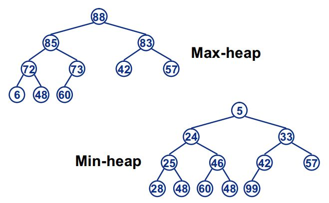
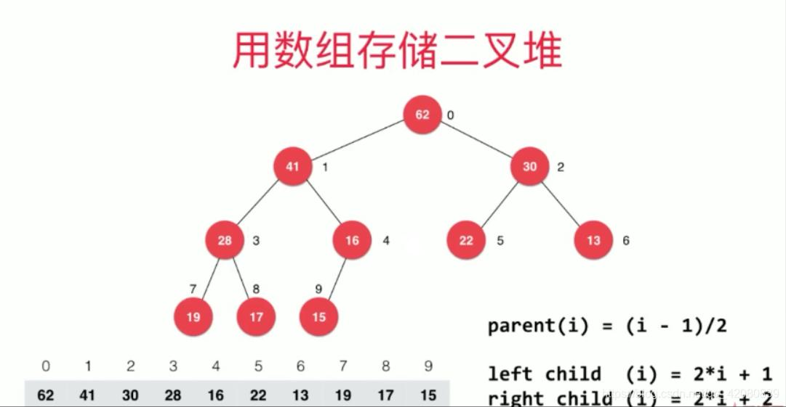
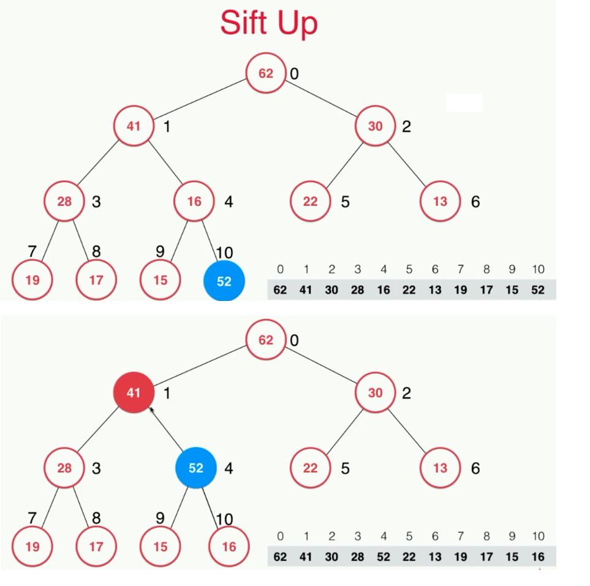

# Heap

## 最大堆/最小堆

### 特性
- 是一棵完全二叉树
满二叉树：叶子节点全都在最底层，除了叶子节点之外，每个节点都有左右两个子节点。

- 局部有序
最小堆对应的完全二叉树中所有结点的值均不大于其左右子结点的值，且一个结点与其兄弟之间没有必然的联系

<blockquote>二叉搜索树中，左子 < 父 < 右子</blockquote>

### 存储结构

- 结点i的左子结点为2xi+1, 右子结点为2xi+2
- 结点i的父节点为(i-1)/2

### 操作
- Up
#### Up

https://www.cnblogs.com/yahuian/p/11945144.html