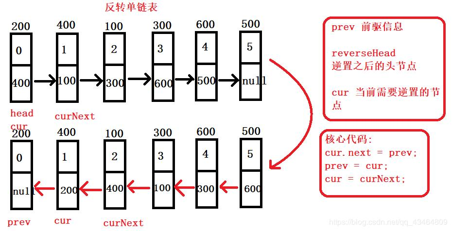
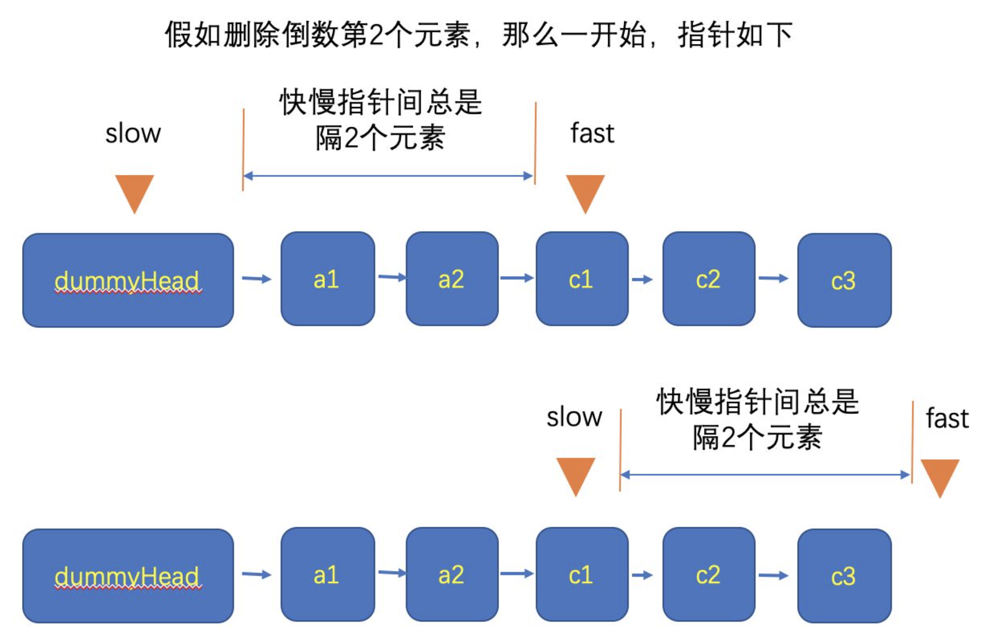

# List

### 单链表翻转

详细过程见 https://danny-jiang.blog.csdn.net/article/details/84282723

### 删除倒数第n个节点

详细过程见 https://www.cnblogs.com/ysw-go/p/11764899.html

### 找到链表的中间节点
详细过程见 https://blog.csdn.net/betonme/article/details/83279522