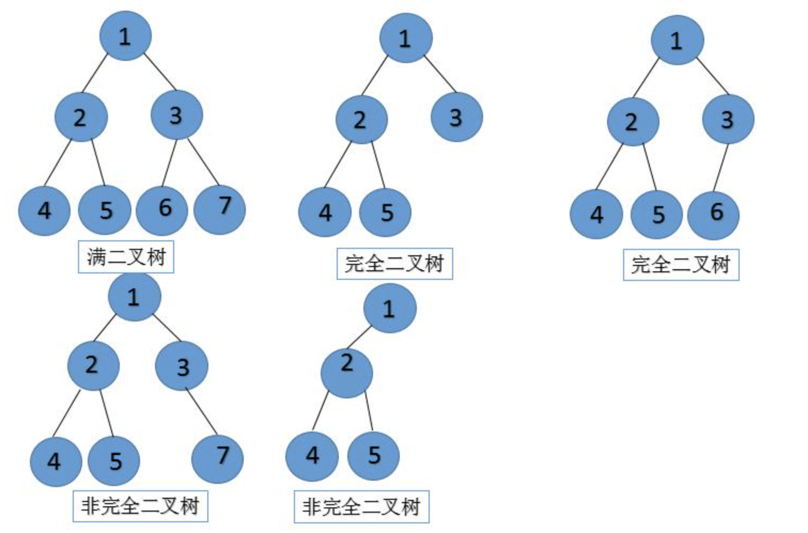
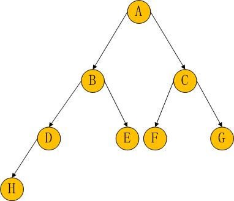

# Tree

### Tree 分类
- 满二叉树：叶子节点全都在最底层，除了叶子节点之外，每个节点都有左右两个子节点。
- 完全二叉树：叶子节点都在最底下两层，最后一层的叶子节点都靠左排列，并且除了最后一层，其他层的节点个数都要达到最大。
- 平衡二叉树：二叉树中任意一个节点的左右子树的高度相差不能大于 1。

### Loop 遍历

- 前根序遍历：先遍历根结点，然后遍历左子树，最后遍历右子树。
ABDHECFG
- 中根序遍历：先遍历左子树，然后遍历根结点，最后遍历右子树。
HDBEAFCG
- 后根序遍历：先遍历左子树，然后遍历右子树，最后遍历根节点。
HDEBFGCA

