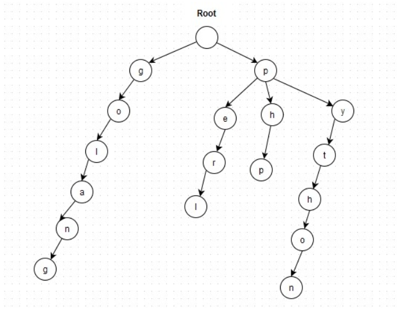

# Trie tree

Trie树，又称字典树，前缀树，是一种很常用的树结构，它被广泛用于各个方面，比如字符串检索、中文分词、求字符串最长公共前缀和字典排序等等。

字典树设计的核心思想是空间换时间，所以数据结构本身比较消耗空间。但它利用了字符串的共同前缀（Common Prefix）作为存储依据，以此来节省存储空间，并加速搜索时间。Trie 的字符串搜索时间复杂度为 O(m)，m 为最长的字符串的长度，其查询性能与集合中的字符串的数量无关。其在搜索字符串时表现出的高效，使得特别适用于构建文本搜索和词频统计等应用

### 特点：
- 根节点不包含字符，除根节点外的每一个子节点都包含一个字符。
- 从根节点到某一节点。路径上经过的字符连接起来，就是该节点对应的字符串。
- 每个节点的所有子节点包含的字符都不相同。

### 优缺点

空间换时间。

### 使用场景
字符串查找，词频统计，智能提示，敏感词过滤等。

### 来自
https://studygolang.com/articles/20609
https://studygolang.com/articles/31168
https://jishuin.proginn.com/p/763bfbd579d7