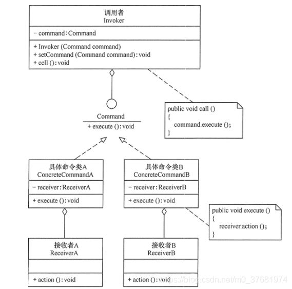

# 命令模式

命令（Command）模式的定义如下：将一个请求封装为一个对象，使发出请求的责任和执行请求的责任分割开。

这样两者之间通过命令对象进行沟通，这样方便将命令对象进行储存、传递、调用、增加与管理。

命令模式本质是把某个对象的方法调用封装到对象中，方便传递、存储、调用。

示例（e2）中把主板单中的启动(start)方法和重启(reboot)方法封装为命令对象，再传递到主机(box)对象中。于两个按钮进行绑定：
- 第一个机箱(box1)设置按钮1(button1) 为开机按钮2(button2)为重启。
- 第二个机箱(box1)设置按钮2(button2) 为开机按钮1(button1)为重启。

从而得到配置灵活性。

除了配置灵活外，使用命令模式还可以用作：

- 批处理
- 任务队列
- undo, redo

等把具体命令封装到对象中使用的场合
