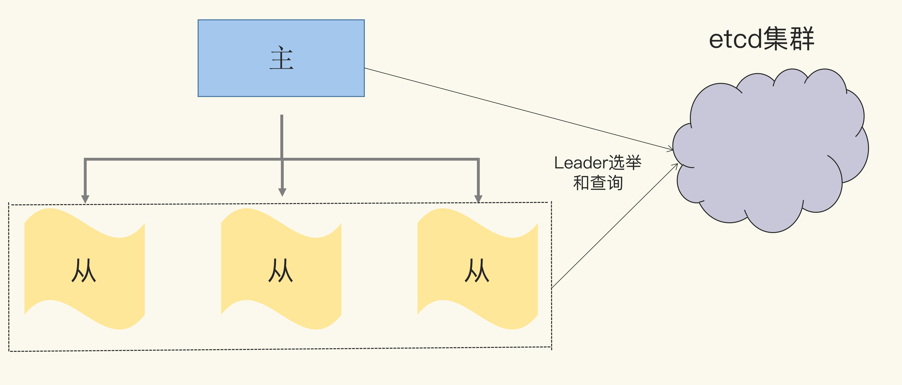
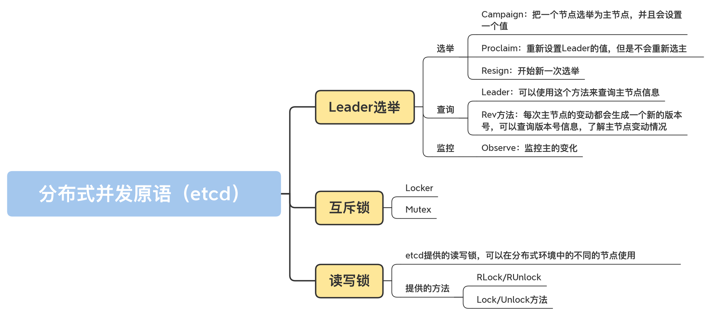

# 分布式环境中Leader选举、互斥锁和读写锁

分布式环境 控制的资源或编排的任务分布在不同进程、不同机器上。

常用来做协调工作的软件系统是 Zookeeper、etcd、Consul 之类的软件，Zookeeper 为 Java 生态群提供了丰富的分布式并发原语（通过 Curator 库），但是缺少 Go 相关的并发原语库。Consul 在提供分布式并发原语这件事儿上不是很积极，而 etcd 就提供了非常好的分布式并发原语，比如分布式互斥锁、分布式读写锁、Leader 选举，等等。所以，今天，我就以 etcd 为基础，给你介绍几种分布式并发原语。

## Leader 选举

Leader 选举常常用在主从架构的系统中。主从架构中的服务节点分为主（Leader、Master）和从（Follower、Slave）两种角色，实际节点包括 1 主 n 从，一共是 n+1 个节点。

<b>在同一时刻，系统中不能有两个主节点，否则，如果两个节点都是主，都执行写操作的话，就有可能出现数据不一致的情况，所以，我们需要一个选主机制，选择一个节点作为主节点，这个过程就是 Leader 选举。</b>

我们可以通过 etcd 基础服务来实现 leader 选举。具体点说，我们可以将 Leader 选举的逻辑交给 etcd 基础服务，这样，我们只需要把重心放在业务开发上。etcd 基础服务可以通过多节点的方式保证 7*24 服务，所以，我们也不用担心 Leader 选举不可用的问题。如下图所示：



接下来，我会给你介绍业务开发中跟 Leader 选举相关的选举、查询、Leader 变动监控等功能。

我要先提醒你一句，如果你想运行我下面讲到的测试代码，就要先部署一个 etcd 的集群，或者部署一个 etcd 节点做测试。

首先，我们来实现一个测试分布式程序的框架：它会先从命令行中读取命令，然后再执行相应的命令。你可以打开两个窗口，模拟不同的节点，分别执行不同的命令。

```go
package main

// 导入所需的库
import (
    "bufio"
    "context"
    "flag"
    "fmt"
    "log"
    "os"
    "strconv"
    "strings"

    "github.com/coreos/etcd/clientv3"
    "github.com/coreos/etcd/clientv3/concurrency"
)

// 可以设置一些参数，比如节点ID
var (
    nodeID    = flag.Int("id", 0, "node ID")
    addr      = flag.String("addr", "http://127.0.0.1:2379", "etcd addresses")
    electName = flag.String("name", "my-test-elect", "election name")
)

func main() {
    flag.Parse()

    // 将etcd的地址解析成slice of string
    endpoints := strings.Split(*addr, ",")

    // 生成一个etcd的clien
    cli, err := clientv3.New(clientv3.Config{Endpoints: endpoints})
    if err != nil {
        log.Fatal(err)
    }
    defer cli.Close()

    // 创建session,如果程序宕机导致session断掉，etcd能检测到
    session, err := concurrency.NewSession(cli)
    defer session.Close()

    // 生成一个选举对象。下面主要使用它进行选举和查询等操作
    // 另一个方法ResumeElection可以使用既有的leader初始化Election
    e1 := concurrency.NewElection(session, *electName)

    // 从命令行读取命令
    consolescanner := bufio.NewScanner(os.Stdin)
    for consolescanner.Scan() {
        action := consolescanner.Text()
        switch action {
        case "elect": // 选举命令
            go elect(e1, *electName)
        case "proclaim": // 只更新leader的value
            proclaim(e1, *electName)
        case "resign": // 辞去leader,重新选举
            resign(e1, *electName)
        case "watch": // 监控leader的变动
            go watch(e1, *electName)
        case "query": // 查询当前的leader
            query(e1, *electName)
        case "rev":
            rev(e1, *electName)
        default:
            fmt.Println("unknown action")
        }
    }
}
```

部署完以后，我们就可以开始选举了。

### 选举

如果你的业务集群还没有主节点，或者主节点宕机了，你就需要发起新一轮的选主操作，主要会用到 Campaign 和 Proclaim。如果你需要主节点放弃主的角色，让其它从节点有机会成为主节点，就可以调用 Resign 方法。

第一个方法是 Campaign。它的作用是，把一个节点选举为主节点，并且会设置一个值。它的签名如下所示：

```go
func (e *Election) Campaign(ctx context.Context, val string) error
```

需要注意的是，这是一个阻塞方法，在调用它的时候会被阻塞，直到满足下面的三个条件之一，才会取消阻塞。

- 成功当选为主；
- 此方法返回错误；
- ctx 被取消。

第二个方法是 Proclaim。它的作用是，重新设置 Leader 的值，但是不会重新选主，这个方法会返回新值设置成功或者失败的信息。方法签名如下所示：

```go
func (e *Election) Proclaim(ctx context.Context, val string) error
```

第三个方法是 Resign：开始新一次选举。这个方法会返回新的选举成功或者失败的信息。它的签名如下所示：

```go
func (e *Election) Resign(ctx context.Context) (err error)
```

这三个方法的测试代码如下。你可以使用测试程序进行测试，具体做法是，启动两个节点，执行和这三个方法相关的命令。

```go
var count int
// 选主
func elect(e1 *concurrency.Election, electName string) {
    log.Println("acampaigning for ID:", *nodeID)
    // 调用Campaign方法选主,主的值为value-<主节点ID>-<count>
    if err := e1.Campaign(context.Background(), fmt.Sprintf("value-%d-%d", *nodeID, count)); err != nil {
        log.Println(err)
    }
    log.Println("campaigned for ID:", *nodeID)
    count++
}
// 为主设置新值
func proclaim(e1 *concurrency.Election, electName string) {
    log.Println("proclaiming for ID:", *nodeID)
    // 调用Proclaim方法设置新值,新值为value-<主节点ID>-<count>
    if err := e1.Proclaim(context.Background(), fmt.Sprintf("value-%d-%d", *nodeID, count)); err != nil {
        log.Println(err)
    }
    log.Println("proclaimed for ID:", *nodeID)
    count++
}
// 重新选主，有可能另外一个节点被选为了主
func resign(e1 *concurrency.Election, electName string) {
    log.Println("resigning for ID:", *nodeID)
    // 调用Resign重新选主
    if err := e1.Resign(context.TODO()); err != nil {
        log.Println(err)
    }
    log.Println("resigned for ID:", *nodeID)
}
```

### 查询

除了选举 Leader，程序在启动的过程中，或者在运行的时候，还有可能需要查询当前的主节点是哪一个节点？主节点的值是什么？版本是多少？不光是主从节点需要查询和知道哪一个节点，在分布式系统中，还有其它一些节点也需要知道集群中的哪一个节点是主节点，哪一个节点是从节点，这样它们才能把读写请求分别发往相应的主从节点上。

etcd 提供了查询当前 Leader 的方法 Leader，如果当前还没有 Leader，就返回一个错误，你可以使用这个方法来查询主节点信息。这个方法的签名如下：

```go
func (e *Election) Leader(ctx context.Context) (*v3.GetResponse, error)
```

每次主节点的变动都会生成一个新的版本号，你还可以查询版本号信息（Rev 方法），了解主节点变动情况：

```go
func (e *Election) Rev() int64
```

你可以在测试完选主命令后，测试查询命令（query、rev），代码如下：

```go
// 查询主的信息
func query(e1 *concurrency.Election, electName string) {
    // 调用Leader返回主的信息，包括key和value等信息
    resp, err := e1.Leader(context.Background())
    if err != nil {
        log.Printf("failed to get the current leader: %v", err)
    }
    log.Println("current leader:", string(resp.Kvs[0].Key), string(resp.Kvs[0].Value))
}
// 可以直接查询主的rev信息
func rev(e1 *concurrency.Election, electName string) {
    rev := e1.Rev()
    log.Println("current rev:", rev)
}
```

### 监控

有了选举和查询方法，我们还需要一个监控方法。毕竟，如果主节点变化了，我们需要得到最新的主节点信息。

我们可以通过 Observe 来监控主的变化，它的签名如下：

```go
func (e *Election) Observe(ctx context.Context) <-chan v3.GetResponse
```

它会返回一个 chan，显示主节点的变动信息。需要注意的是，它不会返回主节点的全部历史变动信息，而是只返回最近的一条变动信息以及之后的变动信息。

它的测试代码如下：

```go
func watch(e1 *concurrency.Election, electName string) {
    ch := e1.Observe(context.TODO())

    log.Println("start to watch for ID:", *nodeID)
    for i := 0; i < 10; i++ {
        resp := <-ch
        log.Println("leader changed to", string(resp.Kvs[0].Key), string(resp.Kvs[0].Value))
    }
}
```

etcd 提供了选主的逻辑，而你要做的就是利用这些方法，让它们为你的业务服务。在使用的过程中，你还需要做一些额外的设置，比如查询当前的主节点、启动一个 goroutine 阻塞调用 Campaign 方法，等等。虽然你需要做一些额外的工作，但是跟自己实现一个分布式的选主逻辑相比，大大地减少了工作量。

## 互斥锁

不过，前面说的互斥锁都是用来保护同一进程内的共享资源的，今天，我们要掌握的是分布式环境中的互斥锁。<b>我们要重点学习下分布在不同机器中的不同进程内的 goroutine，如何利用分布式互斥锁来保护共享资源。</b>

互斥锁的应用场景和主从架构的应用场景不太一样。使用互斥锁的不同节点是没有主从这样的角色的，所有的节点都是一样的，只不过在同一时刻，只允许其中的一个节点持有锁。

下面，我们就来学习下互斥锁相关的两个原语，即 Locker 和 Mutex。

### Locker

etcd 提供了一个简单的 Locker 原语，它类似于 Go 标准库中的 sync.Locker 接口，也提供了 Lock/UnLock 的机制：

```go
func NewLocker(s *Session, pfx string) sync.Locker
```

可以看到，它的返回值是一个 sync.Locker，因为你对标准库的 Locker 已经非常了解了，而且它只有 Lock/Unlock 两个方法，所以，接下来使用这个锁就非常容易了。下面的代码是一个使用 Locker 并发原语的例子：

```go
package main

import (
    "flag"
    "log"
    "math/rand"
    "strings"
    "time"

    "github.com/coreos/etcd/clientv3"
    "github.com/coreos/etcd/clientv3/concurrency"
)

var (
    addr     = flag.String("addr", "http://127.0.0.1:2379", "etcd addresses")
    lockName = flag.String("name", "my-test-lock", "lock name")
)

func main() {
    flag.Parse()
    
    rand.Seed(time.Now().UnixNano())
    // etcd地址
    endpoints := strings.Split(*addr, ",")
    // 生成一个etcd client
    cli, err := clientv3.New(clientv3.Config{Endpoints: endpoints})
    if err != nil {
        log.Fatal(err)
    }
    defer cli.Close()
    useLock(cli) // 测试锁
}

func useLock(cli *clientv3.Client) {
    // 为锁生成session
    s1, err := concurrency.NewSession(cli)
    if err != nil {
        log.Fatal(err)
    }
    defer s1.Close()
    //得到一个分布式锁
    locker := concurrency.NewLocker(s1, *lockName)

    // 请求锁
    log.Println("acquiring lock")
    locker.Lock()
    log.Println("acquired lock")

    // 等待一段时间
    time.Sleep(time.Duration(rand.Intn(30)) * time.Second)
    locker.Unlock() // 释放锁

    log.Println("released lock")
}
```

你可以同时在两个终端中运行这个测试程序。可以看到，它们获得锁是有先后顺序的，一个节点释放了锁之后，另外一个节点才能获取到这个分布式锁。

### Mutex

事实上，刚刚说的 Locker 是基于 Mutex 实现的，只不过，Mutex 提供了查询 Mutex 的 key 的信息的功能。测试代码也类似：

```go
func useMutex(cli *clientv3.Client) {
    // 为锁生成session
    s1, err := concurrency.NewSession(cli)
    if err != nil {
        log.Fatal(err)
    }
    defer s1.Close()
    m1 := concurrency.NewMutex(s1, *lockName)

    //在请求锁之前查询key
    log.Printf("before acquiring. key: %s", m1.Key())
    // 请求锁
    log.Println("acquiring lock")
    if err := m1.Lock(context.TODO()); err != nil {
        log.Fatal(err)
    }
    log.Printf("acquired lock. key: %s", m1.Key())

    //等待一段时间
    time.Sleep(time.Duration(rand.Intn(30)) * time.Second)

    // 释放锁
    if err := m1.Unlock(context.TODO()); err != nil {
        log.Fatal(err)
    }
    log.Println("released lock")
}
```

可以看到，Mutex 并没有实现 sync.Locker 接口，它的 Lock/Unlock 方法需要提供一个 context.Context 实例做参数，这也就意味着，在请求锁的时候，你可以设置超时时间，或者主动取消请求。

### 读写锁

学完了分布式 Locker 和互斥锁 Mutex，你肯定会联想到读写锁 RWMutex。是的，etcd 也提供了分布式的读写锁。不过，互斥锁 Mutex 是在 github.com/coreos/etcd/clientv3/concurrency 包中提供的，读写锁 RWMutex 却是在 github.com/coreos/etcd/contrib/recipes 包中提供的。

etcd 提供的分布式读写锁的功能和标准库的读写锁的功能是一样的。只不过，etcd 提供的读写锁，可以在分布式环境中的不同的节点使用。它提供的方法也和标准库中的读写锁的方法一致，分别提供了 RLock/RUnlock、Lock/Unlock 方法。下面的代码是使用读写锁的例子，它从命令行中读取命令，执行读写锁的操作：

```go
package main


import (
    "bufio"
    "flag"
    "fmt"
    "log"
    "math/rand"
    "os"
    "strings"
    "time"

    "github.com/coreos/etcd/clientv3"
    "github.com/coreos/etcd/clientv3/concurrency"
    recipe "github.com/coreos/etcd/contrib/recipes"
)

var (
    addr     = flag.String("addr", "http://127.0.0.1:2379", "etcd addresses")
    lockName = flag.String("name", "my-test-lock", "lock name")
    action   = flag.String("rw", "w", "r means acquiring read lock, w means acquiring write lock")
)


func main() {
    flag.Parse()
    rand.Seed(time.Now().UnixNano())

    // 解析etcd地址
    endpoints := strings.Split(*addr, ",")

    // 创建etcd的client
    cli, err := clientv3.New(clientv3.Config{Endpoints: endpoints})
    if err != nil {
        log.Fatal(err)
    }
    defer cli.Close()
    // 创建session
    s1, err := concurrency.NewSession(cli)
    if err != nil {
        log.Fatal(err)
    }
    defer s1.Close()
    m1 := recipe.NewRWMutex(s1, *lockName)

    // 从命令行读取命令
    consolescanner := bufio.NewScanner(os.Stdin)
    for consolescanner.Scan() {
        action := consolescanner.Text()
        switch action {
        case "w": // 请求写锁
            testWriteLocker(m1)
        case "r": // 请求读锁
            testReadLocker(m1)
        default:
            fmt.Println("unknown action")
        }
    }
}

func testWriteLocker(m1 *recipe.RWMutex) {
    // 请求写锁
    log.Println("acquiring write lock")
    if err := m1.Lock(); err != nil {
        log.Fatal(err)
    }
    log.Println("acquired write lock")

    // 等待一段时间
    time.Sleep(time.Duration(rand.Intn(10)) * time.Second)

    // 释放写锁
    if err := m1.Unlock(); err != nil {
        log.Fatal(err)
    }
    log.Println("released write lock")
}

func testReadLocker(m1 *recipe.RWMutex) {
    // 请求读锁
    log.Println("acquiring read lock")
    if err := m1.RLock(); err != nil {
        log.Fatal(err)
    }
    log.Println("acquired read lock")

    // 等待一段时间
    time.Sleep(time.Duration(rand.Intn(10)) * time.Second)

    // 释放写锁
    if err := m1.RUnlock(); err != nil {
        log.Fatal(err)
    }
    log.Println("released read lock")
}
```

## 总结

自己实现分布式环境的并发原语，是相当困难的一件事，因为你需要考虑网络的延迟和异常、节点的可用性、数据的一致性等多种情况。

所以，我们可以借助 etcd 这样成熟的框架，基于它提供的分布式并发原语处理分布式的场景。需要注意的是，在使用这些分布式并发原语的时候，你需要考虑异常的情况，比如网络断掉等。同时，分布式并发原语需要网络之间的通讯，所以会比使用标准库中的并发原语耗时更长。



## 思考题
- 如果持有互斥锁或者读写锁的节点意外宕机了，它持有的锁会不会被释放？

Locker是超时解锁是通过NewSession时添加WithTTL这个SessionOption来设置的

- etcd 提供的读写锁中的读和写有没有优先级？

如果持有互斥锁或者读写锁的节点意外宕机了，从调用接口来看，与当前节点启动的session有关系，节点宕机之后，感觉应该有与该session相关的处理，比如超时机制，所以它持有的锁会被释放。
etcd 提供的读写锁，按照rwmutex的实现写锁应该比读锁优先级高，但是在分布式环境下，如此实现的话，我想会增加复杂度和出问题的几率。

