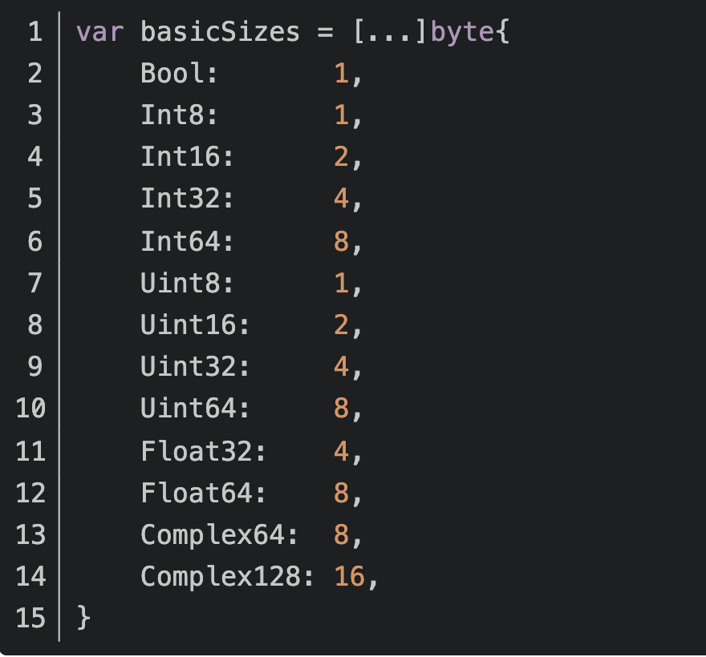
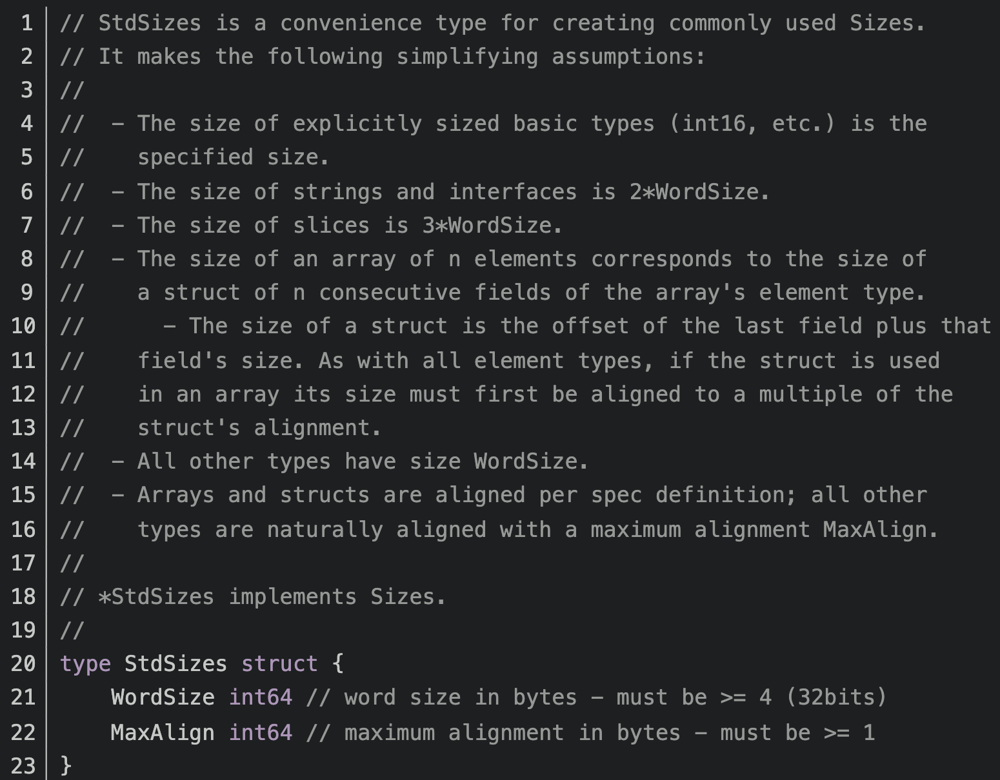

# 内存对齐
内存对齐指内存中数据的首地址是CPU单次获取数据大小的整数倍，目的是为了减少cpu读取内存次数，加速操作

## 数据类型
go底层对于数据类型的内存占用做了如下定义：基本类型和平台类型

### 基本类型

### 平台类型

### 结构体对齐规则
1. 结构体成员最大的类型字节数为m，则结构体整体对齐后的字节数应该为m的倍数，不够的在最后面填补占位。
2. 结构体某个成员的占用字节数为n, 则它的偏移地址应该是min(n,m)的整数倍

由上面的类型占用定义可知：
bool 的对齐空间的1字节
int64的对齐空间的8字节
string 的对齐空间的8*2字节

### 对齐保证
对齐保证也称为值地址对齐保证，也就是在分配变量存储位置的时候，不是随便分配的，是按照对齐保证整数倍来分配内存地址的。
1. 对于任何类型的变量x,unsafe.Alignof(x)最小为1
2. 对于结构体类型变量x,unsafe.Alignof(x)的数值是结构体中所有字段的对齐保证中的最大值( the largest ),作为结构体的对齐保证,最小为1.
3. 对于数组类型变量x, unsafe.Alignof(x)的结果和数组元素的类型的对齐保证一致.

### 内存对齐遵循的规则
变量的存储起始地址一定是对齐保证的整数倍
变量的大小是对齐保证的整数倍，所有的类型都要遵守一规则。

Go只是规定了对齐保证的基本规则,但是对于不同编译器不同的架构甚至于同一个编译器的不同版本,实现的对齐保证都会有一定的差异,了解规则即可.
