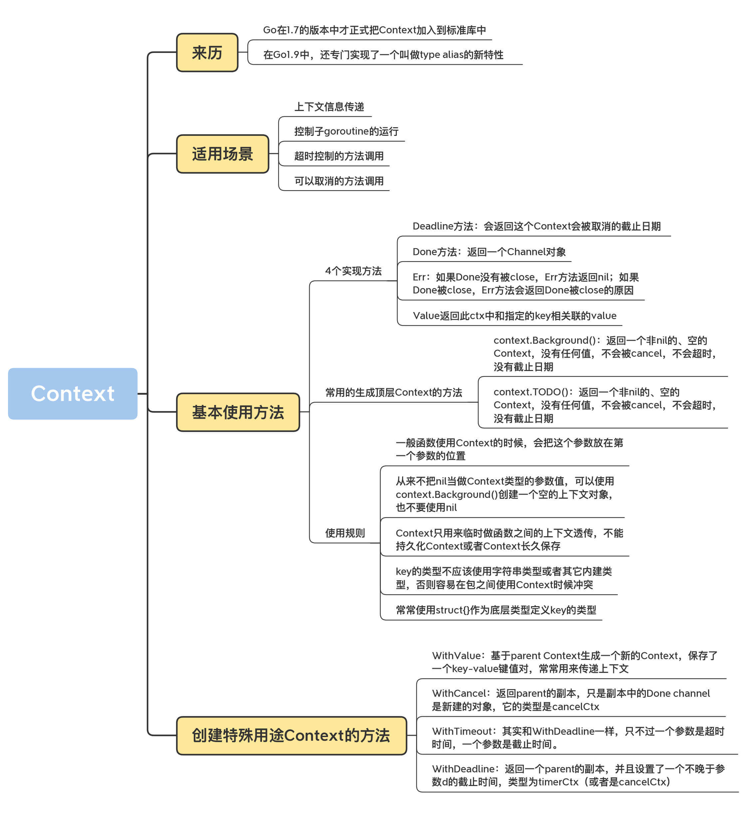

# Context

### WaitGroup
WaitGroup 和信道(channel)是常见的 2 种并发控制的方式。 如果并发启动了多个子协程，需要等待所有的子协程完成任务，WaitGroup 非常适合于这类场景，例如下面的例子：
```go
package practices

import (
	"fmt"
	"sync"
	"testing"
	"time"
)

var wg sync.WaitGroup

func doTask(n int) {
	time.Sleep(time.Duration(n))
	fmt.Printf("Task %d Done\n", n)
	wg.Done()
}

func TestVerify(t *testing.T) {
	for i := 0; i < 3; i++ {
		wg.Add(1)
		go doTask(i+1)
	}
	wg.Wait()
	fmt.Println("All Task Done")
}
```
WaitGroup 只是傻傻地等待子协程结束，但是并不能主动通知子协程退出。
假如开启了一个定时轮询的子协程，有没有什么办法，通知该子协程退出呢？这种场景下，可以使用 select+chan 的机制。
```go
package practices

import (
	"fmt"
	"testing"
	"time"
)

var stop chan bool

func DoTask(name string) {
	for {
		select {
		case <-stop:
			fmt.Println("stop", name)
			return
		default:
			fmt.Println(name, "send request")
			time.Sleep(1 * time.Second)
		}
	}
}

func TestVerifyE2(t *testing.T) {
	stop = make(chan bool)
	go DoTask("Work1")
	time.Sleep(3 * time.Second)
	stop <- true
	time.Sleep(3 * time.Second)
}
```
更复杂的场景如何做并发控制呢？比如子协程中开启了新的子协程，或者需要同时控制多个子协程。这种场景下，select+chan的方式就显得力不从心了。

## Context
Go 标准库的 Context 不仅提供了上下文传递的信息，还提供了 cancel、timeout 等其它信息

Go 语言提供了 Context 标准库可以解决这类场景的问题，Context 的作用和它的名字很像，上下文，即子协程的下上文。Context 有两个主要的功能：
- 通知子协程退出（正常退出，超时退出等）；
- 传递必要的参数。
- 控制子 goroutine 的运行；
- 超时控制的方法调用；
- 可以取消的方法调用。

### Context方法
包 context 定义了 Context 接口，Context 的具体实现包括 4 个方法，分别是 Deadline、Done、Err 和 Value，如下所示：
```go
type Context interface {
    Deadline() (deadline time.Time, ok bool)
    Done() <-chan struct{}
    Err() error
    Value(key interface{}) interface{}
}
```

### Context.WithCancel
context.WithCancel() 创建可取消的 Context 对象，即可以主动通知子协程退出。

###控制单个协程
```go
package practices

import (
	"context"
	"fmt"
	"testing"
	"time"
)

func doTaskE3(ctx context.Context, name string) {
	for {
		select {
		case <-ctx.Done():
			fmt.Println("stop", name)
			return
		default:
			fmt.Println(name, "send request")
			time.Sleep(1 * time.Second)
		}
	}
}

func TestVerifyE3(t *testing.T) {
	ctx, cancel := context.WithCancel(context.Background())
	go doTaskE3(ctx,"Work1")
	time.Sleep(3 * time.Second)
	cancel()
	time.Sleep(3 * time.Second)
}
```
- context.Backgroud() 创建根 Context，通常在 main 函数、初始化和测试代码中创建，作为顶层 Context。
- context.WithCancel(parent) 创建可取消的子 Context，同时返回函数 cancel。
- 在子协程中，使用 select 调用 <-ctx.Done() 判断是否需要退出。
- 主协程中，调用 cancel() 函数通知子协程退出

### 控制多个协程
```go
package practices

import (
	"context"
	"fmt"
	"testing"
	"time"
)

func doTaskE3(ctx context.Context, name string) {
	for {
		select {
		case <-ctx.Done():
			fmt.Println("stop", name)
			return
		default:
			fmt.Println(name, "send request")
			time.Sleep(1 * time.Second)
		}
	}
}

func TestVerifyE4(t *testing.T) {
	ctx, cancel := context.WithCancel(context.Background())
	go doTaskE3(ctx,"Work1")
	go doTaskE3(ctx,"Work2")
	time.Sleep(3 * time.Second)
	cancel()
	time.Sleep(3 * time.Second)
}

```
为每个子协程传递相同的上下文 ctx 即可，调用 cancel() 函数后该 Context 控制的所有子协程都会退出。

### Context.WithValue
如果需要往子协程中传递参数，可以使用 context.WithValue()。
```go
package practices

import (
	"context"
	"fmt"
	"testing"
	"time"
)

type Options struct {
	Interval time.Duration
}

func DoTaskE4(ctx context.Context, name string) {
	for {
		select {
		case <-ctx.Done():
			fmt.Println("stop", name)
			return
		default:
			fmt.Println(name, "send request")
			var op = ctx.Value("options").(*Options)
			time.Sleep(op.Interval * time.Second)
		}
	}
}

func TestVerifyE5(t *testing.T) {
	ctx, cancel := context.WithCancel(context.Background())
	vCtx := context.WithValue(ctx, "options", &Options{2})

	go DoTaskE4(vCtx,"Work1")
	go DoTaskE4(vCtx,"Work2")
	time.Sleep(3 * time.Second)
	cancel()
	time.Sleep(3 * time.Second)
}
```
- context.WithValue() 创建了一个基于 ctx 的子 Context，并携带了值 options。
- 在子协程中，使用 ctx.Value("options") 获取到传递的值，读取/修改该值。

### Context.WithTimeout
如果需要控制子协程的执行时间，可以使用 context.WithTimeout 创建具有超时通知机制的 Context 对象。
```go
package practices

import (
	"context"
	"fmt"
	"testing"
	"time"
)

func doTaskE5(ctx context.Context, name string) {
	for {
		select {
		case <-ctx.Done():
			fmt.Println("stop", name)
			return
		default:
			fmt.Println(name, "send request")
			time.Sleep(1 * time.Second)
		}
	}
}

func TestVerifyE6(t *testing.T) {
	ctx, cancel := context.WithTimeout(context.Background(), 2*time.Second)
	go doTaskE5(ctx, "worker1")
	go doTaskE5(ctx, "worker2")
	time.Sleep(3 * time.Second)
	fmt.Println("before cancel")
	cancel()
	time.Sleep(3 * time.Second)
}
```
因为超时时间设置为 2s，但是 main 函数中，3s 后才会调用 cancel()，因此，在调用 cancel() 函数前，子协程因为超时已经退出了。

### Context.WithDeadLine
超时退出可以控制子协程的最长执行时间，那 context.WithDeadline() 则可以控制子协程的最迟退出时间。
```go
package practices

import (
	"context"
	"fmt"
	"testing"
	"time"
)

func doTaskE6(ctx context.Context, name string) {
	for {
		select {
		case <-ctx.Done():
			fmt.Println("stop", name, ctx.Err())
			return
		default:
			fmt.Println(name, "send request")
			time.Sleep(1 * time.Second)
		}
	}
}

func TestVerifyE7(t *testing.T) {
	ctx, cancel := context.WithDeadline(context.Background(), time.Now().Add(1*time.Second))
	go doTaskE6(ctx, "worker1")
	go doTaskE6(ctx, "worker2")
	time.Sleep(3 * time.Second)
	fmt.Println("before cancel")
	cancel()
	time.Sleep(3 * time.Second)
}
```
- WithDeadline 用于设置截止时间。在这个例子中，将截止时间设置为1s后，cancel() 函数在 3s 后调用，因此子协程将在调用 cancel() 函数前结束。
- 在子协程中，可以通过 ctx.Err() 获取到子协程退出的错误原因。

### 总结
我们经常使用 Context 来取消一个 goroutine 的运行，这是 Context 最常用的场景之一，Context 也被称为 goroutine 生命周期范围（goroutine-scoped）的 Context，

把 Context 传递给 goroutine。但是，goroutine 需要尝试检查 Context 的 Done 是否关闭了：

```go

func main() {
    ctx, cancel := context.WithCancel(context.Background())

    go func() {
        defer func() {
            fmt.Println("goroutine exit")
        }()

        for {
            select {
            case <-ctx.Done():
                return
            default:
                time.Sleep(time.Second)
            }
        }
    }()

    time.Sleep(time.Second)
    cancel()
    time.Sleep(2 * time.Second)
}
```

所以，有时候，Context 并不会减少对服务器的请求负担。

如果在 Context 被 cancel 的时候，你能关闭和服务器的连接，中断和数据库服务器的通讯、停止对本地文件的读写，

那么，这样的超时处理，同时能减少对服务调用的压力，但是这依赖于你对超时的底层处理机制。


