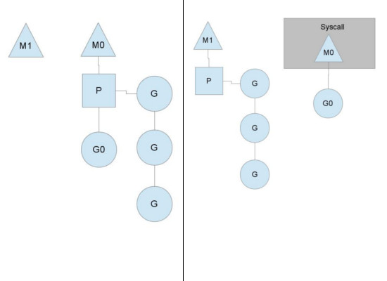

# GPM模型

在操作系统提供的内核线程之上，Go搭建了一个特有的两级线程模型。

goroutine机制实现了M : N的线程模型，goroutine机制是协程（coroutine）的一种实现，golang内置的调度器，可以让多核CPU中每个CPU执行一个协程。

### 2.2.1 调度器是如何工作的

有了上面的认识，我们可以开始真正的介绍Go的并发机制了，先用一段代码展示一下在Go语言中新建一个“线程”(Go语言中称为Goroutine)的样子：

```go
// 用go关键字加上一个函数（这里用了匿名函数）
// 调用就做到了在一个新的“线程”并发执行任务
go func() { 
    // do something in one new goroutine
}()
```

功能上等价于Java8的代码:

```java
new java.lang.Thread(() -> { 
    // do something in one new thread
}).start();
```

Go语言中支撑整个scheduler实现的主要有4个重要结构，分别是M、G、P、Sched， 前三个定义在runtime.h中，Sched定义在proc.c中。

- Sched结构就是调度器，它维护有存储M和G的队列以及调度器的一些状态信息等。
- M结构是Machine，系统线程，它由操作系统管理的，goroutine就是跑在M之上的；M是一个很大的结构，里面维护小对象内存cache（mcache）、当前执行的goroutine、随机数发生器等等非常多的信息。
- P结构是Processor，处理器，它的主要用途就是用来执行goroutine的，它维护了一个goroutine队列，即run queue。Processor是让我们从N:1调度到M:N调度的重要部分。
- G是goroutine实现的核心结构，它包含了栈，指令指针，以及其他对调度goroutine很重要的信息，例如其阻塞的channel。

<blockquote>Processor的数量是在启动时被设置为环境变量GOMAXPROCS的值，或者通过运行时调用函数GOMAXPROCS()进行设置。Processor数量固定意味着任意时刻只有GOMAXPROCS个线程在运行go代码。</blockquote>

我们分别用三角形，矩形和圆形表示Machine Processor和Goroutine。


- 单核处理器的场景下，所有goroutine运行在同一个M系统线程中，每一个M系统线程维护一个Processor，任何时刻，一个Processor中只有一个goroutine，其他goroutine在runqueue中等待。 一个goroutine运行完自己的时间片后，让出上下文，回到runqueue中。 
- 多核处理器的场景下，为了运行goroutines，每个M系统线程会持有一个Processor。


在正常情况下，scheduler会按照上面的流程进行调度，但是线程会发生阻塞等情况，看一下goroutine对线程阻塞等的处理。

### 2.2.2 线程阻塞

当正在运行的goroutine阻塞的时候，例如进行系统调用，会再创建一个系统线程（M1），当前的M线程放弃了它的Processor，P转到新的线程中去运行。



### 2.2.3 runqueue执行完成

当其中一个Processor的runqueue为空，没有goroutine可以调度。它会从另外一个上下文偷取一半的goroutine。


<blockquote>
其图中的G，P和M都是Go语言运行时系统（其中包括内存分配器，并发调度器，垃圾收集器等组件，可以想象为Java中的JVM）

抽象出来概念和数据结构对象：
G：Goroutine的简称，上面用go关键字加函数调用的代码就是创建了一个G对象，是对一个要并发执行的任务的封装，也可以称作用户态线程。属于用户级资源，对OS透明，具备轻量级，可以大量创建，上下文切换成本低等特点。

M：Machine的简称，在linux平台上是用clone系统调用创建的，其与用linux pthread库创建出来的线程本质上是一样的，都是利用系统调用创建出来的OS线程实体。M的作用就是执行G中包装的并发任务。Go运行时系统中的调度器的主要职责就是将G公平合理的安排到多个M上去执行。其属于OS资源，可创建的数量上也受限了OS，通常情况下G的数量都多于活跃的M的。

P：Processor的简称，逻辑处理器，主要作用是管理G对象（每个P都有一个G队列），并为G在M上的运行提供本地化资源。
</blockquote>

### 2.2.3.1 为何引入P

从两级线程模型来看，似乎并不需要P的参与，有G和M就可以了，那为什么要加入P这个东东呢？

其实Go语言运行时系统早期(Go1.0)的实现中并没有P的概念，Go中的调度器直接将G分配到合适的M上运行。

但这样带来了很多问题，例如，不同的G在不同的M上并发运行时可能都需向系统申请资源（如堆内存），由于资源是全局的，将会由于资源竞争造成很多系统性能损耗，为了解决类似的问题，后面的Go（Go1.1）运行时系统加入了P，让P去管理G对象，M要想运行G必须先与一个P绑定，然后才能运行该P管理的G。

这样带来的好处是，我们可以在P对象中预先申请一些系统资源（本地资源），G需要的时候先向自己的本地P申请（无需锁保护），如果不够用或没有再向全局申请，而且从全局拿的时候会多拿一部分，以供后面高效的使用。就像现在我们去政府办事情一样，先去本地政府看能搞定不，如果搞不定再去中央，从而提供办事效率。

而且由于P解耦了G和M对象，这样即使M由于被其上正在运行的G阻塞住，其余与该M关联的G也可以随着P一起迁移到别的活跃的M上继续运行，从而让G总能及时找到M并运行自己，从而提高系统的并发能力。

Go运行时系统通过构造G-P-M对象模型实现了一套用户态的并发调度系统，可以自己管理和调度自己的并发任务，所以可以说<b>Go语言原生支持并发。自己实现的调度器负责将并发任务分配到不同的内核线程上运行，然后内核调度器接管内核线程在CPU上的执行与调度。</b>


写在最后，Go运行时完整的调度系统是很复杂，很难用一篇文章描述的清楚，这里只能从宏观上介绍一下，让大家有个整体的认识。

```go
// Goroutine1
func task1() {
    go task2()
    go task3()
}
```

假如我们有一个G(Goroutine1)已经通过P被安排到了一个M上正在执行，在Goroutine1执行的过程中我们又创建两个G，这两个G会被马上放入与Goroutine1相同的P的本地G任务队列中，排队等待与该P绑定的M的执行，这是最基本的结构，很好理解。 关键问题是:

- <b>a.如何在一个多核心系统上尽量合理分配G到多个M上运行，充分利用多核，提高并发能力呢？</b>

如果我们在一个Goroutine中通过go关键字创建了大量G，这些G虽然暂时会被放在同一个队列, 但如果这时还有空闲P（系统内P的数量默认等于系统cpu核心数），Go运行时系统始终能保证至少有一个（通常也只有一个）活跃的M与空闲P绑定去各种G队列去寻找可运行的G任务，该种M称为自旋的M。一般寻找顺序为：自己绑定的P的队列，全局队列，然后其他P队列。如果自己P队列找到就拿出来开始运行，否则去全局队列看看，由于全局队列需要锁保护，如果里面有很多任务，会转移一批到本地P队列中，避免每次都去竞争锁。如果全局队列还是没有，就要开始玩狠的了，直接从其他P队列偷任务了（偷一半任务回来）。这样就保证了在还有可运行的G任务的情况下，总有与CPU核心数相等的M+P组合 在执行G任务或在执行G的路上(寻找G任务)。

- <b>b. 如果某个M在执行G的过程中被G中的系统调用阻塞了，怎么办？</b>

在这种情况下，这个M将会被内核调度器调度出CPU并处于阻塞状态，与该M关联的其他G就没有办法继续执行了，但Go运行时系统的一个监控线程(sysmon线程)能探测到这样的M，并把与该M绑定的P剥离，寻找其他空闲或新建M接管该P，然后继续运行其中的G，大致过程如下图所示。然后等到该M从阻塞状态恢复，需要重新找一个空闲P来继续执行原来的G，如果这时系统正好没有空闲的P，就把原来的G放到全局队列当中，等待其他M+P组合发掘并执行。

- <b>c. 如果某一个G在M运行时间过长，有没有办法做抢占式调度，让该M上的其他G获得一定的运行时间，以保证调度系统的公平性?</b>

我们知道linux的内核调度器主要是基于时间片和优先级做调度的。对于相同优先级的线程，内核调度器会尽量保证每个线程都能获得一定的执行时间。为了防止有些线程"饿死"的情况，内核调度器会发起抢占式调度将长期运行的线程中断并让出CPU资源，让其他线程获得执行机会。当然在Go的运行时调度器中也有类似的抢占机制，但并不能保证抢占能成功，因为Go运行时系统并没有内核调度器的中断能力，它只能通过向运行时间过长的G中设置抢占flag的方法温柔的让运行的G自己主动让出M的执行权。

说到这里就不得不提一下Goroutine在运行过程中可以动态扩展自己线程栈的能力，可以从初始的2KB大小扩展到最大1G（64bit系统上），因此在每次调用函数之前需要先计算该函数调用需要的栈空间大小，然后按需扩展（超过最大值将导致运行时异常）。Go抢占式调度的机制就是利用在判断要不要扩栈的时候顺便查看以下自己的抢占flag，决定是否继续执行，还是让出自己。

运行时系统的监控线程会计时并设置抢占flag到运行时间过长的G，然后G在有函数调用的时候会检查该抢占flag，如果已设置就将自己放入全局队列，这样该M上关联的其他G就有机会执行了。但如果正在执行的G是个很耗时的操作且没有任何函数调用(如只是for循环中的计算操作)，即使抢占flag已经被设置，该G还是将一直霸占着当前M直到执行完自己的任务。