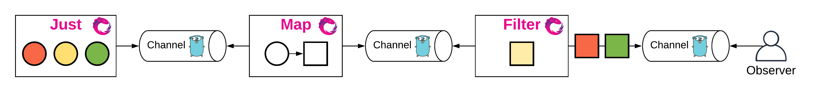

# **异步编程**

ReactiveX，简称为 Rx，是一个异步编程的 API。

与 callback（回调）、promise（JS 提供这种方式）和 deferred（Python 的 twisted 网络编程库就是使用这种方式）这些异步编程方式有所不同，Rx 是基于事件流的。

这里的事件可以是系统中产生或变化的任何东西，在代码中我们一般用对象表示。

在 Rx 中，事件流被称为 Observable（可观察的）。事件流需要被 Observer（观察者）处理才有意义。想象一下，我们日常作为一个 Observer，一个重要的工作就是观察 BUG 的事件流。

### **RxGo**

Rx 仅仅只是一个 API 规范的定义。Rx 有多种编程语言实现，RxJava/RxJS/Rx.NET/RxClojure/RxSwift。

RxGo 是 Rx 的 Go 语言实现。借助于 Go 语言简洁的语法和强大的并发支持（goroutine、channel），Rx 与 Go 语言的结合非常完美。

### **pipelines**

pipelines (官方博客：https://blog.golang.org/pipelines)是 Go 基础的并发编程模型。其中包含，fan-in——多个 goroutine 产生数据，一个goroutine 处理数据，fan-out——一个 goroutine 产生数据，多个 goroutine 处理数据，fan-inout——多个 goroutine 产生数据，多个 goroutine 处理数据。它们都是通过 channel 连接。RxGo 的实现就是基于 pipelines 的理念，并且提供了方便易用的包装和强大的扩展。\

### 处理流程

- 首先使用Just创建一个仅有若干固定数据的 Observable；
- 使用Map()方法执行转换（将圆形转为方形）；
- 使用Filter()方法执行过滤（过滤掉黄色的方形）。

from https://darjun.github.io/2020/10/11/godailylib/rxgo/