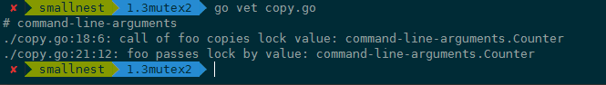

## Mutex 错误"坑"场景

### Copy 已使用的 Mutex

第二种误用是 Copy 已使用的 Mutex。在正式分析这个错误之前，我先交代一个小知识点，那就是 Package sync 的同步原语在使用后是不能复制的。我们知道 Mutex 是最常用的一个同步原语，那它也是不能复制的。为什么呢？

原因在于，Mutex 是一个有状态的对象，它的 state 字段记录这个锁的状态。如果你要复制一个已经加锁的 Mutex 给一个新的变量，那么新的刚初始化的变量居然被加锁了，这显然不符合你的期望，因为你期望的是一个零值的 Mutex。关键是在并发环境下，你根本不知道要复制的 Mutex 状态是什么，因为要复制的 Mutex 是由其它 goroutine 并发访问的，状态可能总是在变化。

```go
type Counter struct {
    sync.Mutex
    Count int
}


func main() {
    var c Counter
    c.Lock()
    defer c.Unlock()
    c.Count++
    foo(c) // 复制锁
}

// 这里Counter的参数是通过复制的方式传入的
func foo(c Counter) {
    c.Lock()
    defer c.Unlock()
    fmt.Println("in foo")
}
```

第 12 行在调用 foo 函数的时候，调用者会复制 Mutex 变量 c 作为 foo 函数的参数，不幸的是，复制之前已经使用了这个锁，这就导致，复制的 Counter 是一个带状态 Counter。

怎么办呢？Go 在运行时，有死锁的检查机制（checkdead() 方法），它能够发现死锁的 goroutine。这个例子中因为复制了一个使用了的 Mutex，导致锁无法使用，程序处于死锁的状态。程序运行的时候，死锁检查机制能够发现这种死锁情况并输出错误信息，如下图中错误信息以及错误堆栈：


你肯定不想运行的时候才发现这个因为复制 Mutex 导致的死锁问题，那么你怎么能够及时发现问题呢？可以使用 vet 工具，把检查写在 Makefile 文件中，在持续集成的时候跑一跑，这样可以及时发现问题，及时修复。我们可以使用 go vet 检查这个 Go 文件：你肯定不想运行的时候才发现这个因为复制 Mutex 导致的死锁问题，那么你怎么能够及时发现问题呢？可以使用 vet 工具，把检查写在 Makefile 文件中，在持续集成的时候跑一跑，这样可以及时发现问题，及时修复。我们可以使用 go vet 检查这个 Go 文件：



那么，vet 工具是怎么发现 Mutex 复制使用问题的呢？我带你简单分析一下。

检查是通过copylock分析器静态分析实现的。这个分析器会分析函数调用、range 遍历、复制、声明、函数返回值等位置，有没有锁的值 copy 的情景，以此来判断有没有问题。可以说，只要是实现了 Locker 接口，就会被分析。我们看到，下面的代码就是确定什么类型会被分析，其实就是实现了 Lock/Unlock 两个方法的 Locker 接口

### 重入

当一个线程获取锁时，如果没有其它线程拥有这个锁，那么，这个线程就成功获取到这个锁。之后，如果其它线程再请求这个锁，就会处于阻塞等待的状态。但是，如果拥有这把锁的线程再请求这把锁的话，不会阻塞，而是成功返回，所以叫可重入锁（有时候也叫做递归锁）。只要你拥有这把锁，你可以可着劲儿地调用，比如通过递归实现一些算法，调用者不会阻塞或者死锁。

了解了可重入锁的概念，那我们来看 Mutex 使用的错误场景。划重点了：<b>Mutex 不是可重入的锁。</b>

想想也不奇怪，因为 Mutex 的实现中没有记录哪个 goroutine 拥有这把锁。理论上，任何 goroutine 都可以随意地 Unlock 这把锁，所以没办法计算重入条件，毕竟，“臣妾做不到啊”！

所以，一旦误用 Mutex 的重入，就会导致报错。下面是一个误用 Mutex 的重入例子：

```go
func foo(l sync.Locker) {
    fmt.Println("in foo")
    l.Lock()
    bar(l)
    l.Unlock()
}


func bar(l sync.Locker) {
    l.Lock()
    fmt.Println("in bar")
    l.Unlock()
}


func main() {
    l := &sync.Mutex{}
    foo(l)
}
```

写完这个 Mutex 重入的例子后，运行一下，你会发现类似下面的错误。程序一直在请求锁，但是一直没有办法获取到锁，结果就是 Go 运行时发现死锁了，没有其它地方能够释放锁让程序运行下去，你通过下面的错误堆栈信息就能定位到哪一行阻塞请求锁：


学到这里，你可能要问了，虽然标准库 Mutex 不是可重入锁，但是如果我就是想要实现一个可重入锁，可以吗？

可以，那我们就自己实现一个。这里的关键就是，实现的锁要能记住当前是哪个 goroutine 持有这个锁。我来提供两个方案。

- 方案一：通过 hacker 的方式获取到 goroutine id，记录下获取锁的 goroutine id，它可以实现 Locker 接口。
- 方案二：调用 Lock/Unlock 方法时，由 goroutine 提供一个 token，用来标识它自己，而不是我们通过 hacker 的方式获取到 goroutine id，但是，这样一来，就不满足 Locker 接口了。

#### 方案一：goroutine id

简单方式，就是通过 runtime.Stack 方法获取栈帧信息，栈帧信息里包含 goroutine id。你可以看看上面 panic 时候的贴图，goroutine id 明明白白地显示在那里。runtime.Stack 方法可以获取当前的 goroutine 信息，第二个参数为 true 会输出所有的 goroutine 信息，信息的格式如下：

```go
goroutine 1 [running]:
main.main()
        ....../main.go:19 +0xb1
```

了解了简单方式，接下来我们来看 hacker 的方式，这也是我们方案一采取的方式。

首先，我们获取运行时的 g 指针，反解出对应的 g 的结构。每个运行的 goroutine 结构的 g 指针保存在当前 goroutine 的一个叫做 TLS 对象中。

- 第一步：我们先获取到 TLS 对象；
- 第二步：再从 TLS 中获取 goroutine 结构的 g 指针；
- 第三步：再从 g 指针中取出 goroutine id。

需要注意的是，不同 Go 版本的 goroutine 的结构可能不同，所以需要根据 Go 的不同版本进行调整。当然了，如果想要搞清楚各个版本的 goroutine 结构差异，所涉及的内容又过于底层而且复杂，学习成本太高。怎么办呢？我们可以重点关注一些库。我们没有必要重复发明轮子，直接使用第三方的库来获取 goroutine id 就可以了。

好消息是现在已经有很多成熟的方法了，可以支持多个 Go 版本的 goroutine id，给你推荐一个常用的库：petermattis/goid。

知道了如何获取 goroutine id，接下来就是最后的关键一步了，我们实现一个可以使用的可重入锁：

```go

// RecursiveMutex 包装一个Mutex,实现可重入
type RecursiveMutex struct {
    sync.Mutex
    owner     int64 // 当前持有锁的goroutine id
    recursion int32 // 这个goroutine 重入的次数
}

func (m *RecursiveMutex) Lock() {
    gid := goid.Get()
    // 如果当前持有锁的goroutine就是这次调用的goroutine,说明是重入
    if atomic.LoadInt64(&m.owner) == gid {
        m.recursion++
        return
    }
    m.Mutex.Lock()
    // 获得锁的goroutine第一次调用，记录下它的goroutine id,调用次数加1
    atomic.StoreInt64(&m.owner, gid)
    m.recursion = 1
}

func (m *RecursiveMutex) Unlock() {
    gid := goid.Get()
    // 非持有锁的goroutine尝试释放锁，错误的使用
    if atomic.LoadInt64(&m.owner) != gid {
        panic(fmt.Sprintf("wrong the owner(%d): %d!", m.owner, gid))
    }
    // 调用次数减1
    m.recursion--
    if m.recursion != 0 { // 如果这个goroutine还没有完全释放，则直接返回
        return
    }
    // 此goroutine最后一次调用，需要释放锁
    atomic.StoreInt64(&m.owner, -1)
    m.Mutex.Unlock()
}
```

#### 方案二：token

方案一是用 goroutine id 做 goroutine 的标识，我们也可以让 goroutine 自己来提供标识。不管怎么说，Go 开发者不期望你利用 goroutine id 做一些不确定的东西，所以，他们没有暴露获取 goroutine id 的方法。

下面的代码是第二种方案。调用者自己提供一个 token，获取锁的时候把这个 token 传入，释放锁的时候也需要把这个 token 传入。通过用户传入的 token 替换方案一中 goroutine id，其它逻辑和方案一一致。

```go
// Token方式的递归锁
type TokenRecursiveMutex struct {
    sync.Mutex
    token     int64
    recursion int32
}

// 请求锁，需要传入token
func (m *TokenRecursiveMutex) Lock(token int64) {
    if atomic.LoadInt64(&m.token) == token { //如果传入的token和持有锁的token一致，说明是递归调用
        m.recursion++
        return
    }
    m.Mutex.Lock() // 传入的token不一致，说明不是递归调用
    // 抢到锁之后记录这个token
    atomic.StoreInt64(&m.token, token)
    m.recursion = 1
}

// 释放锁
func (m *TokenRecursiveMutex) Unlock(token int64) {
    if atomic.LoadInt64(&m.token) != token { // 释放其它token持有的锁
        panic(fmt.Sprintf("wrong the owner(%d): %d!", m.token, token))
    }
    m.recursion-- // 当前持有这个锁的token释放锁
    if m.recursion != 0 { // 还没有回退到最初的递归调用
        return
    }
    atomic.StoreInt64(&m.token, 0) // 没有递归调用了，释放锁
    m.Mutex.Unlock()
}

```

### 死锁

接下来，我们来看第四种错误场景：死锁。

我们来分析一下死锁产生的必要条件。如果你想避免死锁，只要破坏这四个条件中的一个或者几个，就可以了。

- 互斥： 至少一个资源是被排他性独享的，其他线程必须处于等待状态，直到资源被释放；
- 持有和等待：goroutine 持有一个资源，并且还在请求其它 goroutine 持有的资源，也就是咱们常说的“吃着碗里，看着锅里”的意思。
- 不可剥夺：资源只能由持有它的 goroutine 来释放。
- 环路等待：一般来说，存在一组等待进程，P={P1，P2，…，PN}，P1 等待 P2 持有的资源，P2 等待 P3 持有的资源，依此类推，最后是 PN 等待 P1 持有的资源，这就形成了一个环路等待的死结。


