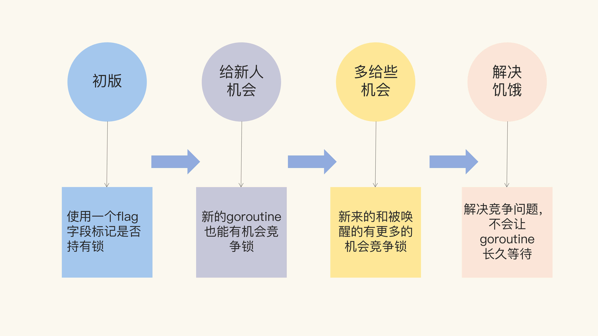
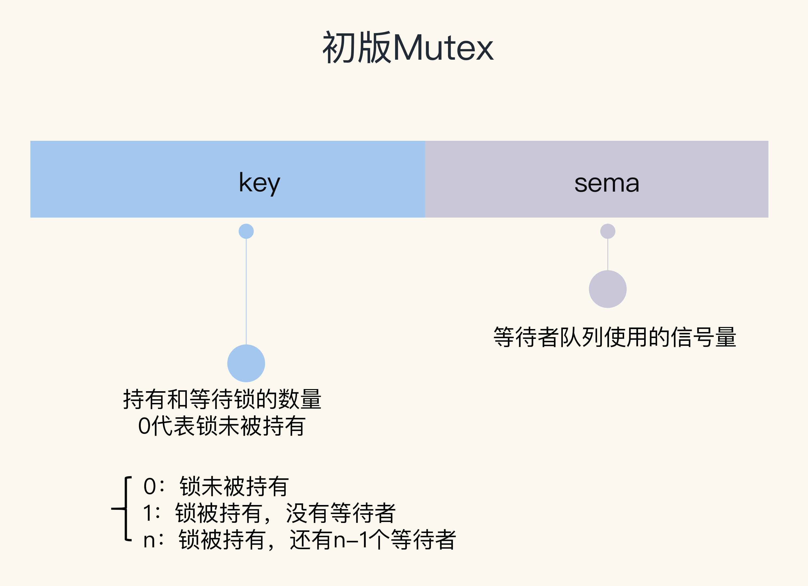
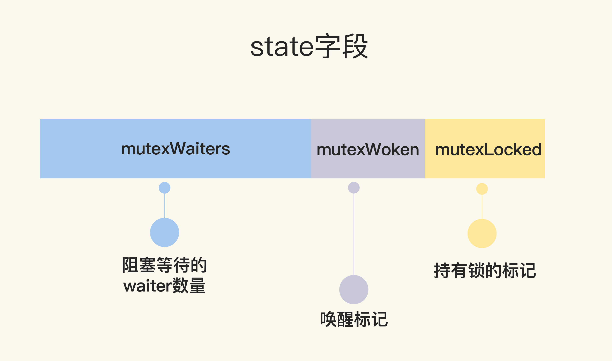
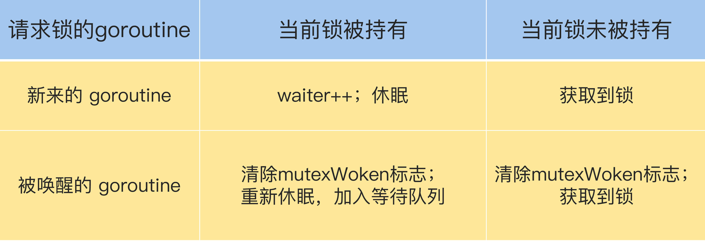

## Mutex 内部实现

- “初版”的 Mutex 使用一个 flag 来表示锁是否被持有，实现比较简单；
- 后来照顾到新来的 goroutine，所以会让新的 goroutine 也尽可能地先获取到锁，这是第二个阶段，我把它叫作“给新人机会”；
- 那么，接下来就是第三阶段“多给些机会”，照顾新来的和被唤醒的 goroutine；
- 但是这样会带来饥饿问题，所以目前又加入了饥饿的解决方案，也就是第四阶段“解决饥饿”。



### 初版的互斥锁

可以通过一个 flag 变量，标记当前的锁是否被某个 goroutine 持有。如果这个 flag 的值是 1，就代表锁已经被持有，那么，其它竞争的 goroutine 只能等待；如果这个 flag 的值是 0，就可以通过 CAS（compare-and-swap，或者 compare-and-set）将这个 flag 设置为 1，标识锁被当前的这个 goroutine 持有了。

实际上，Russ Cox 在 2008 年提交的第一版 Mutex 就是这样实现的。

```go
   // CAS操作，当时还没有抽象出atomic包
    func cas(val *int32, old, new int32) bool
    func semacquire(*int32)
    func semrelease(*int32)
    // 互斥锁的结构，包含两个字段
    type Mutex struct {
        key  int32 // 锁是否被持有的标识
        sema int32 // 信号量专用，用以阻塞/唤醒goroutine
    }
    
    // 保证成功在val上增加delta的值
    func xadd(val *int32, delta int32) (new int32) {
        for {
            v := *val
            if cas(val, v, v+delta) {
                return v + delta
            }
        }
        panic("unreached")
    }
    
    // 请求锁
    func (m *Mutex) Lock() {
        if xadd(&m.key, 1) == 1 { //标识加1，如果等于1，成功获取到锁
            return
        }
        semacquire(&m.sema) // 否则阻塞等待
    }
    
    func (m *Mutex) Unlock() {
        if xadd(&m.key, -1) == 0 { // 将标识减去1，如果等于0，则没有其它等待者
            return
        }
        semrelease(&m.sema) // 唤醒其它阻塞的goroutine
    }    
```

这里呢，我先简单补充介绍下刚刚提到的 CAS。

CAS 指令将给定的值和一个内存地址中的值进行比较，如果它们是同一个值，就使用新值替换内存地址中的值，这个操作是原子性的。

那啥是原子性呢？如果你还不太理解这个概念，那么在这里只需要明确一点就行了，那就是原子性保证这个指令总是基于最新的值进行计算，如果同时有其它线程已经修改了这个值，那么，CAS 会返回失败。

<b>CAS 是实现互斥锁和同步原语的基础，我们很有必要掌握它。</b>

Mutex 结构体包含两个字段：
- 字段 key：是一个 flag，用来标识这个排外锁是否被某个 goroutine 所持有，如果 key 大于等于 1，说明这个排外锁已经被持有；
- 字段 sema：是个信号量变量，用来控制等待 goroutine 的阻塞休眠和唤醒。



调用 Lock 请求锁的时候，通过 xadd 方法进行 CAS 操作（第 24 行），xadd 方法通过循环执行 CAS 操作直到成功，保证对 key 加 1 的操作成功完成。如果比较幸运，锁没有被别的 goroutine 持有，那么，Lock 方法成功地将 key 设置为 1，这个 goroutine 就持有了这个锁；如果锁已经被别的 goroutine 持有了，那么，当前的 goroutine 会把 key 加 1，而且还会调用 semacquire 方法（第 27 行），使用信号量将自己休眠，等锁释放的时候，信号量会将它唤醒。

持有锁的 goroutine 调用 Unlock 释放锁时，它会将 key 减 1（第 31 行）。如果当前没有其它等待这个锁的 goroutine，这个方法就返回了。但是，如果还有等待此锁的其它 goroutine，那么，它会调用 semrelease 方法（第 34 行），利用信号量唤醒等待锁的其它 goroutine 中的一个。

<b>Unlock 方法可以被任意的 goroutine 调用释放锁，即使是没持有这个互斥锁的 goroutine，也可以进行这个操作。这是因为，Mutex 本身并没有包含持有这把锁的 goroutine 的信息，所以，Unlock 也不会对此进行检查。Mutex 的这个设计一直保持至今。</b>

你看，其它 goroutine 可以强制释放锁，这是一个非常危险的操作，因为在临界区的 goroutine 可能不知道锁已经被释放了，还会继续执行临界区的业务操作，这可能会带来意想不到的结果，因为这个 goroutine 还以为自己持有锁呢，有可能导致 data race 问题。

所以，我们在使用 Mutex 的时候，必须要保证 goroutine 尽可能不去释放自己未持有的锁，一定要遵循“谁申请，谁释放”的原则。在真实的实践中，我们使用互斥锁的时候，很少在一个方法中单独申请锁，而在另外一个方法中单独释放锁，一般都会在同一个方法中获取锁和释放锁。

以前，我们经常会基于性能的考虑，及时释放掉锁，所以在一些 if-else 分支中加上释放锁的代码，代码看起来很臃肿。而且，在重构的时候，也很容易因为误删或者是漏掉而出现死锁的现象。

```go
type Foo struct {
    mu    sync.Mutex
    count int
}

func (f *Foo) Bar() {
    f.mu.Lock()

    if f.count < 1000 {
        f.count += 3
        f.mu.Unlock() // 此处释放锁
        return
    }

    f.count++
    f.mu.Unlock() // 此处释放锁
    return
}
```

从 1.14 版本起，Go 对 defer 做了优化，采用更有效的内联方式，取代之前的生成 defer 对象到 defer chain 中，defer 对耗时的影响微乎其微了，所以基本上修改成下面简洁的写法也没问题：

```go
func (f *Foo) Bar() {
    f.mu.Lock()
    defer f.mu.Unlock()


    if f.count < 1000 {
        f.count += 3
        return
    }


    f.count++
    return
}
```

但是，如果临界区只是方法中的一部分，为了尽快释放锁，还是应该第一时间调用 Unlock，而不是一直等到方法返回时才释放。

但是，初版的 Mutex 实现有一个问题：请求锁的 goroutine 会排队等待获取互斥锁。虽然这貌似很公平，但是从性能上来看，却不是最优的。因为如果我们能够把锁交给正在占用 CPU 时间片的 goroutine 的话，那就不需要做上下文的切换，在高并发的情况下，可能会有更好的性能。

<b>cas和非公平锁的目的都是为了减少线程的上下文的切换</b>

### 给新人机会

Go 开发者在 2011 年 6 月 30 日的 commit 中对 Mutex 做了一次大的调整，调整后的 Mutex 实现如下：

```go
   type Mutex struct {
        state int32
        sema  uint32
    }


    const (
        mutexLocked = 1 << iota // mutex is locked
        mutexWoken
        mutexWaiterShift = iota
    )
```

虽然 Mutex 结构体还是包含两个字段，但是第一个字段已经改成了 state，它的含义也不一样了。



state 是一个复合型的字段，一个字段包含多个意义，这样可以通过尽可能少的内存来实现互斥锁。这个字段的第一位（最小的一位）来表示这个锁是否被持有，第二位代表是否有唤醒的 goroutine，剩余的位数代表的是等待此锁的 goroutine 数。所以，state 这一个字段被分成了三部分，代表三个数据。

请求锁的方法 Lock 也变得复杂了。复杂之处不仅仅在于对字段 state 的操作难以理解，而且代码逻辑也变得相当复杂。

```go
   func (m *Mutex) Lock() {
        // Fast path: 幸运case，能够直接获取到锁
        if atomic.CompareAndSwapInt32(&m.state, 0, mutexLocked) {
            return
        }

        awoke := false
        for {
            old := m.state
            new := old | mutexLocked // 新状态加锁
            if old&mutexLocked != 0 {
                new = old + 1<<mutexWaiterShift //等待者数量加一
            }
            if awoke {
                // goroutine是被唤醒的，
                // 新状态清除唤醒标志
                new &^= mutexWoken
            }
            if atomic.CompareAndSwapInt32(&m.state, old, new) {//设置新状态
                if old&mutexLocked == 0 { // 锁原状态未加锁
                    break
                }
                runtime.Semacquire(&m.sema) // 请求信号量
                awoke = true
            }
        }
    }
```

首先是通过 CAS 检测 state 字段中的标志（第 3 行），如果没有 goroutine 持有锁，也没有等待持有锁的 gorutine，那么，当前的 goroutine 就很幸运，可以直接获得锁，这也是注释中的 Fast path 的意思。

如果不够幸运，state 不是零值，那么就通过一个循环进行检查。接下来的第 7 行到第 26 行这段代码虽然只有几行，但是理解起来却要费一番功夫，因为涉及到对 state 不同标志位的操作。这里的位操作以及操作后的结果和数值比较，并没有明确的解释，有时候你需要根据后续的处理进行推断。所以说，如果你充分理解了这段代码，那么对最新版的 Mutex 也会比较容易掌握了，因为你已经清楚了这些位操作的含义。

我们先前知道，如果想要获取锁的 goroutine 没有机会获取到锁，就会进行休眠，但是在锁释放唤醒之后，它并不能像先前一样直接获取到锁，还是要和正在请求锁的 goroutine 进行竞争。这会给后来请求锁的 goroutine 一个机会，也让 CPU 中正在执行的 goroutine 有更多的机会获取到锁，在一定程度上提高了程序的性能。

for 循环是不断尝试获取锁，如果获取不到，就通过 runtime.Semacquire(&m.sema) 休眠，休眠醒来之后 awoke 置为 true，尝试争抢锁。

代码中的第 10 行将当前的 flag 设置为加锁状态，如果能成功地通过 CAS 把这个新值赋予 state（第 19 行和第 20 行），就代表抢夺锁的操作成功了。

不过，需要注意的是，如果成功地设置了 state 的值，但是之前的 state 是有锁的状态，那么，state 只是清除 mutexWoken 标志或者增加一个 waiter 而已。

请求锁的 goroutine 有两类，
- 一类是新来请求锁的 goroutine，
- 另一类是被唤醒的等待请求锁的 goroutine。

锁的状态也有两种：加锁和未加锁。我用一张表格，来说明一下 goroutine 不同来源不同状态下的处理逻辑。



```go
func (m *Mutex) Unlock() {
    // Fast path: drop lock bit.
    new := atomic.AddInt32(&m.state, -mutexLocked) //去掉锁标志
    if (new+mutexLocked)&mutexLocked == 0 { //本来就没有加锁
        panic("sync: unlock of unlocked mutex")
    }

    old := new
    for {
        if old>>mutexWaiterShift == 0 || old&(mutexLocked|mutexWoken) != 0 { // 没有等待者，或者有唤醒的waiter，或者锁原来已加锁
            return
        }
        new = (old - 1<<mutexWaiterShift) | mutexWoken // 新状态，准备唤醒goroutine，并设置唤醒标志
        if atomic.CompareAndSwapInt32(&m.state, old, new) {
            runtime.Semrelease(&m.sema)
            return
        }
        old = m.state
    }
}
```

第 3 行是尝试将持有锁的标识设置为未加锁的状态，这是通过减 1 而不是将标志位置零的方式实现。第 4 到 6 行还会检测原来锁的状态是否已经未加锁的状态，如果是 Unlock 一个未加锁的 Mutex 会直接 panic。

不过，即使将加锁置为未加锁的状态，这个方法也不能直接返回，还需要一些额外的操作，因为还可能有一些等待这个锁的 goroutine（有时候我也把它们称之为 waiter）需要通过信号量的方式唤醒它们中的一个。所以接下来的逻辑有两种情况。

第一种情况，如果没有其它的 waiter，说明对这个锁的竞争的 goroutine 只有一个，那就可以直接返回了；如果这个时候有唤醒的 goroutine，或者是又被别人加了锁，那么，无需我们操劳，其它 goroutine 自己干得都很好，当前的这个 goroutine 就可以放心返回了。

<b>相对于初版的设计，这次的改动主要就是，新来的 goroutine 也有机会先获取到锁，甚至一个 goroutine 可能连续获取到锁，打破了先来先得的逻辑。但是，代码复杂度也显而易见。</>

### 多给些机会

在 2015 年 2 月的改动中，如果新来的 goroutine 或者是被唤醒的 goroutine 首次获取不到锁，它们就会通过自旋（spin，通过循环不断尝试，spin 的逻辑是在runtime 实现的）的方式，尝试检查锁是否被释放。在尝试一定的自旋次数后，再执行原来的逻辑。

```go
func (m *Mutex) Lock() {
    // Fast path: 幸运之路，正好获取到锁
    if atomic.CompareAndSwapInt32(&m.state, 0, mutexLocked) {
        return
    }

    awoke := false
    iter := 0
    for { // 不管是新来的请求锁的goroutine, 还是被唤醒的goroutine，都不断尝试请求锁
        old := m.state // 先保存当前锁的状态
        new := old | mutexLocked // 新状态设置加锁标志
        if old&mutexLocked != 0 { // 锁还没被释放
            if runtime_canSpin(iter) { // 还可以自旋
                if !awoke && old&mutexWoken == 0 && old>>mutexWaiterShift != 0 &&
                    atomic.CompareAndSwapInt32(&m.state, old, old|mutexWoken) {
                    awoke = true
                }
                runtime_doSpin()
                iter++
                continue // 自旋，再次尝试请求锁
            }
            new = old + 1<<mutexWaiterShift
        }
        if awoke { // 唤醒状态
            if new&mutexWoken == 0 {
                panic("sync: inconsistent mutex state")
            }
            new &^= mutexWoken // 新状态清除唤醒标记
        }
        if atomic.CompareAndSwapInt32(&m.state, old, new) {
            if old&mutexLocked == 0 { // 旧状态锁已释放，新状态成功持有了锁，直接返回
                break
            }
            runtime_Semacquire(&m.sema) // 阻塞等待
            awoke = true // 被唤醒
            iter = 0
        }
    }
}
```

如果可以 spin 的话，第 9 行的 for 循环会重新检查锁是否释放。对于临界区代码执行非常短的场景来说，这是一个非常好的优化。因为临界区的代码耗时很短，锁很快就能释放，而抢夺锁的 goroutine 不用通过休眠唤醒方式等待调度，直接 spin 几次，可能就获得了锁。

这里也可以证明为什么应该把自旋的goroutine当成唤醒的goroutine；这样就相当于我在自旋过程中不会再唤醒FIFO中的goroutine，可以避免唤醒的goroutine加剧锁的冲突。

### 解决饥饿

经过几次优化，Mutex 的代码越来越复杂，应对高并发争抢锁的场景也更加公平。但是你有没有想过，因为新来的 goroutine 也参与竞争，有可能每次都会被新来的 goroutine 抢到获取锁的机会，在极端情况下，等待中的 goroutine 可能会一直获取不到锁，这就是饥饿问题。

当极端情况下，如web服务中并发请求过多的时候，原本在等待队列等待锁的go程可能会因为新来的go程过多导致饿死。但是由于自旋机制的存在，会使得这个几率降低

说到这儿，我突然想到了最近看到的一种叫做鹳的鸟。如果鹳妈妈寻找食物很艰难，找到的食物只够一个幼鸟吃的，鹳妈妈就会把食物给最强壮的一只，这样一来，饥饿弱小的幼鸟总是得不到食物吃，最后就会被啄出巢去。

先前版本的 Mutex 遇到的也是同样的困境，“悲惨”的 goroutine 总是得不到锁。

Mutex 不能容忍这种事情发生。所以，2016 年 Go 1.9 中 Mutex 增加了饥饿模式，让锁变得更公平，不公平的等待时间限制在 1 毫秒，并且修复了一个大 Bug：总是把唤醒的 goroutine 放在等待队列的尾部，会导致更加不公平的等待时间。

之后，2018 年，Go 开发者将 fast path 和 slow path 拆成独立的方法，以便内联，提高性能。2019 年也有一个 Mutex 的优化，虽然没有对 Mutex 做修改，但是，对于 Mutex 唤醒后持有锁的那个 waiter，调度器可以有更高的优先级去执行，这已经是很细致的性能优化了。

为了避免代码过多，这里只列出当前的 Mutex 实现。想要理解当前的 Mutex，我们需要好好泡一杯茶，仔细地品一品了。

当然，现在的 Mutex 代码已经复杂得接近不可读的状态了，而且代码也非常长，删减后占了几乎三页纸。但是，作为第一个要详细介绍的同步原语，我还是希望能更清楚地剖析 Mutex 的实现，向你展示它的演化和为了一个貌似很小的 feature 不得不将代码变得非常复杂的原因。

当然，你也可以暂时略过这一段，以后慢慢品，只需要记住，<b>Mutex 绝不容忍一个 goroutine 被落下，永远没有机会获取锁。不抛弃不放弃是它的宗旨，而且它也尽可能地让等待较长的 goroutine 更有机会获取到锁。</b>

```go
type Mutex struct {
    state int32
    sema  uint32
}

const (
    mutexLocked = 1 << iota // mutex is locked
    mutexWoken
    mutexStarving // 从state字段中分出一个饥饿标记
    mutexWaiterShift = iota

    starvationThresholdNs = 1e6
)

func (m *Mutex) Lock() {
    // Fast path: 幸运之路，一下就获取到了锁
    if atomic.CompareAndSwapInt32(&m.state, 0, mutexLocked) {
        return
    }
    // Slow path：缓慢之路，尝试自旋竞争或饥饿状态下饥饿goroutine竞争
    m.lockSlow()
}

func (m *Mutex) lockSlow() {
    var waitStartTime int64
    starving := false // 此goroutine的饥饿标记
    awoke := false // 唤醒标记
    iter := 0 // 自旋次数
    old := m.state // 当前的锁的状态
    for {
        // 锁是非饥饿状态，锁还没被释放，尝试自旋
        if old&(mutexLocked|mutexStarving) == mutexLocked && runtime_canSpin(iter) {
            if !awoke && old&mutexWoken == 0 && old>>mutexWaiterShift != 0 &&
                atomic.CompareAndSwapInt32(&m.state, old, old|mutexWoken) {
                awoke = true
            }
            runtime_doSpin()
            iter++
            old = m.state // 再次获取锁的状态，之后会检查是否锁被释放了
            continue
        }
        new := old
        if old&mutexStarving == 0 {
            new |= mutexLocked // 非饥饿状态，加锁
        }
        if old&(mutexLocked|mutexStarving) != 0 {
            new += 1 << mutexWaiterShift // waiter数量加1
        }
        if starving && old&mutexLocked != 0 {
            new |= mutexStarving // 设置饥饿状态
        }
        if awoke {
            if new&mutexWoken == 0 {
                throw("sync: inconsistent mutex state")
            }
            new &^= mutexWoken // 新状态清除唤醒标记
        }
        // 成功设置新状态
        if atomic.CompareAndSwapInt32(&m.state, old, new) {
            // 原来锁的状态已释放，并且不是饥饿状态，正常请求到了锁，返回
            if old&(mutexLocked|mutexStarving) == 0 {
                break // locked the mutex with CAS
            }
            // 处理饥饿状态

            // 如果以前就在队列里面，加入到队列头
            queueLifo := waitStartTime != 0
            if waitStartTime == 0 {
                waitStartTime = runtime_nanotime()
            }
            // 阻塞等待
            runtime_SemacquireMutex(&m.sema, queueLifo, 1)
            // 唤醒之后检查锁是否应该处于饥饿状态
            starving = starving || runtime_nanotime()-waitStartTime > starvationThresholdNs
            old = m.state
            // 如果锁已经处于饥饿状态，直接抢到锁，返回
            if old&mutexStarving != 0 {
                if old&(mutexLocked|mutexWoken) != 0 || old>>mutexWaiterShift == 0 {
                    throw("sync: inconsistent mutex state")
                }
                // 有点绕，加锁并且将waiter数减1
                delta := int32(mutexLocked - 1<<mutexWaiterShift)
                if !starving || old>>mutexWaiterShift == 1 {
                    delta -= mutexStarving // 最后一个waiter或者已经不饥饿了，清除饥饿标记
                }
                atomic.AddInt32(&m.state, delta)
                break
            }
            awoke = true
            iter = 0
        } else {
            old = m.state
        }
    }
}

func (m *Mutex) Unlock() {
    // Fast path: drop lock bit.
    new := atomic.AddInt32(&m.state, -mutexLocked)
    if new != 0 {
        m.unlockSlow(new)
    }
}

func (m *Mutex) unlockSlow(new int32) {
    if (new+mutexLocked)&mutexLocked == 0 {
        throw("sync: unlock of unlocked mutex")
    }
    if new&mutexStarving == 0 {
        old := new
        for {
            if old>>mutexWaiterShift == 0 || old&(mutexLocked|mutexWoken|mutexStarving) != 0 {
                return
            }
            new = (old - 1<<mutexWaiterShift) | mutexWoken
            if atomic.CompareAndSwapInt32(&m.state, old, new) {
                runtime_Semrelease(&m.sema, false, 1)
                return
            }
            old = m.state
        }
    } else {
        runtime_Semrelease(&m.sema, true, 1)
    }
}
```

跟之前的实现相比，当前的 Mutex 最重要的变化，就是增加饥饿模式。第 12 行将饥饿模式的最大等待时间阈值设置成了 1 毫秒，这就意味着，一旦等待者等待的时间超过了这个阈值，Mutex 的处理就有可能进入饥饿模式，优先让等待者先获取到锁，新来的同学主动谦让一下，给老同志一些机会。

通过加入饥饿模式，可以避免把机会全都留给新来的 goroutine，保证了请求锁的 goroutine 获取锁的公平性，对于我们使用锁的业务代码来说，不会有业务一直等待锁不被处理。

#### 饥饿模式和正常模式

Mutex 可能处于两种操作模式下：正常模式和饥饿模式。

请求锁时调用的 Lock 方法中一开始是 fast path，这是一个幸运的场景，当前的 goroutine 幸运地获得了锁，没有竞争，直接返回，否则就进入了 lockSlow 方法。这样的设计，方便编译器对 Lock 方法进行内联，你也可以在程序开发中应用这个技巧。

正常模式下，waiter 都是进入先入先出队列，被唤醒的 waiter 并不会直接持有锁，而是要和新来的 goroutine 进行竞争。新来的 goroutine 有先天的优势，它们正在 CPU 中运行，可能它们的数量还不少，所以，在高并发情况下，被唤醒的 waiter 可能比较悲剧地获取不到锁，这时，它会被插入到队列的前面。如果 waiter 获取不到锁的时间超过阈值 1 毫秒，那么，这个 Mutex 就进入到了饥饿模式。

在饥饿模式下，Mutex 的拥有者将直接把锁交给队列最前面的 waiter。新来的 goroutine 不会尝试获取锁，即使看起来锁没有被持有，它也不会去抢，也不会 spin，它会乖乖地加入到等待队列的尾部。

如果拥有 Mutex 的 waiter 发现下面两种情况的其中之一，它就会把这个 Mutex 转换成正常模式:

- 此 waiter 已经是队列中的最后一个 waiter 了，没有其它的等待锁的 goroutine 了；
- 此 waiter 的等待时间小于 1 毫秒。

正常模式拥有更好的性能，因为即使有等待抢锁的 waiter，goroutine 也可以连续多次获取到锁。

饥饿模式是对公平性和性能的一种平衡，它避免了某些 goroutine 长时间的等待锁。在饥饿模式下，优先对待的是那些一直在等待的 waiter。

## 总结

“罗马不是一天建成的”，Mutex 的设计也是从简单设计到复杂处理逐渐演变的。初版的 Mutex 设计非常简洁，充分展示了 Go 创始者的简单、简洁的设计哲学。但是，随着大家的使用，逐渐暴露出一些缺陷，为了弥补这些缺陷，Mutex 不得不越来越复杂。

有一点值得我们学习的，同时也体现了 Go 创始者的哲学，就是他们强调 GO 语言和标准库的稳定性，新版本要向下兼容，用新的版本总能编译老的代码。Go 语言从出生到现在已经 10 多年了，这个 Mutex 对外的接口却没有变化，依然向下兼容，即使现在 Go 出了两个版本，每个版本也会向下兼容，保持 Go 语言的稳定性，你也能领悟他们软件开发和设计的思想。

还有一点，你也可以观察到，为了一个程序 20% 的特性，你可能需要添加 80% 的代码，这也是程序越来越复杂的原因。所以，最开始的时候，如果能够有一个清晰而且易于扩展的设计，未来增加新特性时，也会更加方便。

#### 问题

- 目前 Mutex 的 state 字段有几个意义，这几个意义分别是由哪些字段表示的？ 和第四个阶段的讲解基本一致：前三个bit分别为mutexLocked、mutexWoken、mutexStarving，剩余bit表示mutexWaiter
- 等待一个 Mutex 的 goroutine 数最大是多少？是否能满足现实的需求？
     单从程序来看，可以支持 1<<(32-3) -1 ，约 0.5 Billion个
     其中32为state的类型int32，3位waiter字段的shift
     考虑到实际goroutine初始化的空间为2K，0.5Billin*2K达到了1TB，单从内存空间来说已经要求极高了，当前的设计肯定可以满足了。

- 1、目前 Mutex 的 state 字段有几个意义，这几个意义分别是由哪些字段表示的？
  state有四个字段：
  - mutexLocked 占1bit，持有锁标记
  - mutexWoken 占1bit，唤醒标记
  - mutexStarving 占1bit，饥饿标记
  - mutexWaiters 阻塞等待的waiter数量

- 2、等待一个 Mutex 的 goroutine 数最大是多少？是否能满足现实的需求？
  32-3=29位=2^29=536 870 912


