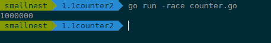

# 锁-mutex

使用互斥锁，限定临界区只能同时由一个线程持有。

根据 2019 年第一篇全面分析 Go 并发 Bug 的论文Understanding Real-World Concurrency Bugs in Go，Mutex 是使用最广泛的同步原语（Synchronization primitives，有人也叫做并发原语。

### 同步原语（Synchronization primitives） 使用场景
- 共享资源。并发地读写共享资源，会出现数据竞争（data race）的问题，所以需要 Mutex、RWMutex 这样的并发原语来保护。
- 任务编排。需要 goroutine 按照一定的规律执行，而 goroutine 之间有相互等待或者依赖的顺序关系，我们常常使用 WaitGroup 或者 Channel 来实现。
- 消息传递。信息交流以及不同的 goroutine 之间的线程安全的数据交流，常常使用 Channel 来实现。

### Mutex 的基本使用方法

在 Go 的标准库中，package sync 提供了锁相关的一系列同步原语，这个 package 还定义了一个 Locker 的接口，Mutex 就实现了这个接口。

```go
type Locker interface {
    Lock()
    Unlock()
}
```

Go 定义的锁接口的方法集很简单，就是请求锁（Lock）和释放锁（Unlock）这两个方法，秉承了 Go 语言一贯的简洁风格。

简单来说，<b>互斥锁 Mutex 就提供两个方法 Lock 和 Unlock：进入临界区之前调用 Lock 方法，退出临界区的时候调用 Unlock 方法：</b>

```go
  func(m *Mutex)Lock()
  func(m *Mutex)Unlock()
```

<b>当一个 goroutine 通过调用 Lock 方法获得了这个锁的拥有权后， 其它请求锁的 goroutine 就会阻塞在 Lock 方法的调用上，直到锁被释放并且自己获取到了这个锁的拥有权。</b>

看一个并发访问场景中不使用锁的例子，看看实现起来会出现什么状况

```go
package bad

import (
	"fmt"
	"sync"
	"testing"
)

func TestVerifyV1(t *testing.T) {
	var count = 0
	// 使用WaitGroup等待10个goroutine完成
	var sg sync.WaitGroup
	sg.Add(10)

	for i := 0; i < 10; i++ {
		go func() {
			defer sg.Done()
			// 对变量count执行10次加1
			for j := 0; j < 10000; j++ {
				count++
			}
		}()
	}

	// 等待10个goroutine完成
	sg.Wait()

	fmt.Println(count)
}

/**
在这个例子中，我们创建了 10 个 goroutine，同时不断地对一个变量（count）进行加 1 操作，
每个 goroutine 负责执行 10 万次的加 1 操作，
我们期望的最后计数的结果是 10 * 100000 = 1000000 (一百万)。
 */
```

但是，每次运行，你都可能得到不同的结果，基本上不会得到理想中的一百万的结果。


为什么呢

其实，这是因为，count++ 不是一个原子操作，它至少包含几个步骤，比如读取变量 count 的当前值，对这个值加 1，把结果再保存到 count 中。因为不是原子操作，就可能有并发的问题。

```go
 // count++操作的汇编代码
    MOVQ    "".count(SB), AX
    LEAQ    1(AX), CX
    MOVQ    CX, "".count(SB)
```

针对这个问题，Go 提供了一个检测并发访问共享资源是否有问题的工具： <b>race detector</b>，它可以帮助我们自动发现程序有没有 data race 的问题。

<b>Go race detector 是基于 Google 的 C/C++ sanitizers 技术实现的</b>，编译器通过探测所有的内存访问，加入代码能监视对这些内存地址的访问（读还是写）。在代码运行的时候，race detector 就能监控到对共享变量的非同步访问，出现 race 的时候，就会打印出警告信息。

#### go race 工具使用

在编译（compile）、测试（test）或者运行（run）Go 代码的时候，加上 race 参数，就有可能发现并发问题。比如在上面的例子中，我们可以加上 race 参数运行，检测一下是不是有并发问题。如果你 go run -race counter.go，就会输出警告信息。


这个警告不但会告诉你有并发问题，而且还会告诉你哪个 goroutine 在哪一行对哪个变量有写操作，同时，哪个 goroutine 在哪一行对哪个变量有读操作，就是这些并发的读写访问，引起了 data race。

例子中的 goroutine 10 对内存地址 0x00c000126010 有读的操作（counter.go 文件第 16 行），同时，goroutine 7 对内存地址 0x00c000126010 有写的操作（counter.go 文件第 16 行）。而且还可能有多个 goroutine 在同时进行读写，所以，警告信息可能会很长。

而且，把开启了 race 的程序部署在线上，还是比较影响性能的。运行 <b>go tool compile -race -S counter.go</b>，可以查看计数器例子的代码，重点关注一下 count++ 前后的编译后的代码：

```go
0x002a 00042 (counter.go:13)    CALL    runtime.racefuncenter(SB)
       ......
        0x0061 00097 (counter.go:14)    JMP     173
        0x0063 00099 (counter.go:15)    MOVQ    AX, "".j+8(SP)
        0x0068 00104 (counter.go:16)    PCDATA  $0, $1
        0x0068 00104 (counter.go:16)    MOVQ    "".&count+128(SP), AX
        0x0070 00112 (counter.go:16)    PCDATA  $0, $0
        0x0070 00112 (counter.go:16)    MOVQ    AX, (SP)
        0x0074 00116 (counter.go:16)    CALL    runtime.raceread(SB)
        0x0079 00121 (counter.go:16)    PCDATA  $0, $1
        0x0079 00121 (counter.go:16)    MOVQ    "".&count+128(SP), AX
        0x0081 00129 (counter.go:16)    MOVQ    (AX), CX
        0x0084 00132 (counter.go:16)    MOVQ    CX, ""..autotmp_8+16(SP)
        0x0089 00137 (counter.go:16)    PCDATA  $0, $0
        0x0089 00137 (counter.go:16)    MOVQ    AX, (SP)
        0x008d 00141 (counter.go:16)    CALL    runtime.racewrite(SB)
        0x0092 00146 (counter.go:16)    MOVQ    ""..autotmp_8+16(SP), AX
       ......
        0x00b6 00182 (counter.go:18)    CALL    runtime.deferreturn(SB)
        0x00bb 00187 (counter.go:18)    CALL    runtime.racefuncexit(SB)
        0x00c0 00192 (counter.go:18)    MOVQ    104(SP), BP
        0x00c5 00197 (counter.go:18)    ADDQ    $112, SP
```

在编译的代码中，增加了 runtime.racefuncenter、runtime.raceread、runtime.racewrite、runtime.racefuncexit 等检测 data race 的方法。通过这些插入的指令，Go race detector 工具就能够成功地检测出 data race 问题了。

#### 利用mutex 解决data race问题

我们知道，这里的共享资源是 count 变量，临界区是 count++，只要在临界区前面获取锁，在离开临界区的时候释放锁，就能完美地解决 data race 的问题了。

```go
package good

import (
	"fmt"
	"sync"
	"testing"
)

func TestVerifyV2(t *testing.T) {
	var count = 0

	// 使用WaitGroup等待10个goroutine完成
	var wg = &sync.WaitGroup{}
	wg.Add(10)

	var mutex = &sync.Mutex{}

	for i := 0; i < 10; i++ {
		go func() {
			defer wg.Done()
			// 对变量count执行10次加1
			for j := 0; j < 100000; j++ {
				mutex.Lock()
				count++
				mutex.Unlock()
			}
		}()
	}
	// 等待10个goroutine完成
	wg.Wait()
	fmt.Println(count)
}

```

如果你再运行一下程序，就会发现，data race 警告没有了，系统干脆地输出了 1000000：



这里有一点需要注意：Mutex 的零值是还没有 goroutine 等待的未加锁的状态，所以你不需要额外的初始化，直接声明变量（如 var mu sync.Mutex）即可。

有时候，我们还可以采用嵌入字段的方式。通过嵌入字段，你可以在这个 struct 上直接调用 Lock/Unlock 方法。

```go
package good

import (
	"fmt"
	"sync"
	"testing"
)

type Counter struct {
	sync.Mutex
	Count uint64
}

func TestVerifyV3(t *testing.T) {
	var counter = &Counter{}

	var wg = &sync.WaitGroup{}
	wg.Add(10)

	for i := 0; i < 10; i++ {
		go func() {
			defer wg.Done()
			for j := 0; j < 100000; j++ {
				counter.Lock()
				counter.Count++
				counter.Unlock()
			}
		}()
	}
	wg.Wait()

	fmt.Println(counter.Count)
}
```

甚至，你还可以把获取锁、释放锁、计数加一的逻辑封装成一个方法，对外不需要暴露锁等逻辑：

```go
package good

import (
	"fmt"
	"sync"
	"testing"
)

func TestVerifyV4(t *testing.T) {
	var counterV4 = &CounterV4{}

	var wg = &sync.WaitGroup{}
	wg.Add(10)

	for i := 0; i < 10; i++ {
		go func() {
			defer wg.Done()
			for j := 0; j < 100000; j++ {
				counterV4.Incr()
			}
		}()
	}
	wg.Wait()
	fmt.Println(counterV4.Count())
}

type CounterV4 struct {
	mu    sync.Mutex
	count uint64
}

func (c *CounterV4) Incr() {
	c.mu.Lock()
	c.count++
	c.mu.Unlock()
}

func (c *CounterV4) Count() uint64 {
	c.mu.Lock()
	defer c.mu.Unlock()
	return c.count
}
```

#### mutex 内部模式(任务队列、运行模式-饥饿、正常)

等待的goroutine们是以FIFO排队的

- 1）当Mutex处于正常模式时，若此时没有新goroutine与队头goroutine竞争，则队头goroutine获得。若有新goroutine竞争大概率新goroutine获得。
- 2）当队头goroutine竞争锁失败1ms后，它会将Mutex调整为饥饿模式。进入饥饿模式后，锁的所有权会直接从解锁goroutine移交给队头goroutine，此时新来的goroutine直接放入队尾。
- 3）当一个goroutine获取锁后，如果发现自己满足下列条件中的任何一个#1它是队列中最后一个#2它等待锁的时间少于1ms，则将锁切换回正常模式

