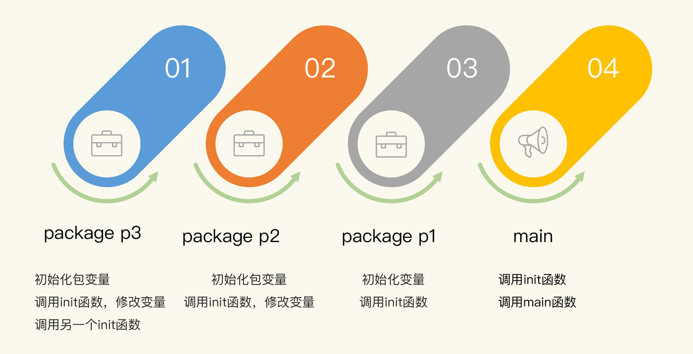
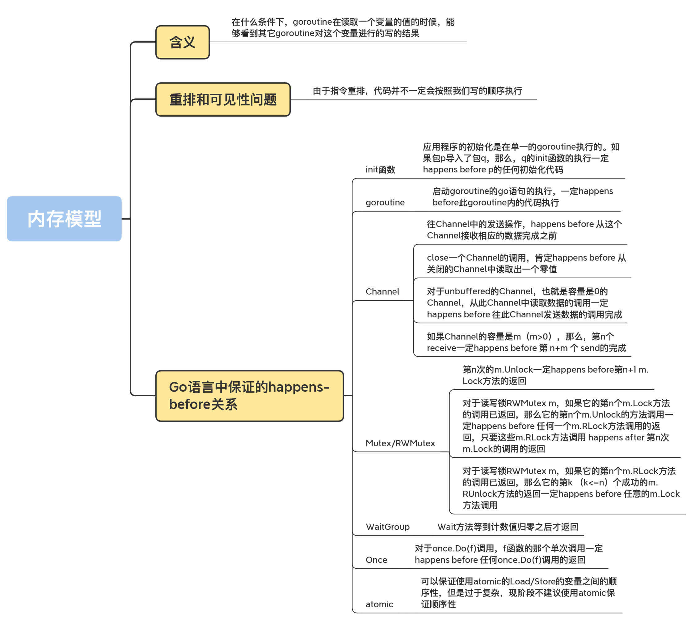

# 内存模型

它描述的是并发环境中多 goroutine 读相同变量的时候，变量的可见性条件。

具体点说，就是指，在什么条件下，goroutine 在读取一个变量的值的时候，能够看到其它 goroutine 对这个变量进行的写的结果。

### 内存模型背景

由于 CPU 指令重排和多级 Cache 的存在，保证多核访问同一个变量这件事儿变得非常复杂。

毕竟，不同 CPU 架构（x86/amd64、ARM、Power 等）的处理方式也不一样，再加上编译器的优化也可能对指令进行重排，

所以编程语言需要一个规范，来明确多线程同时访问同一个变量的可见性和顺序（ Russ Cox 在麻省理工学院 6.824 分布式系统 Distributed Systems 课程 的一课，专门介绍了相关的知识）。

在编程语言中，这个规范被叫做内存模型。

### 编程语言的内存模型

内存模型呢？在我看来，主要是两个目的。

- 向广大的程序员提供一种保证，以便他们在做设计和开发程序时，面对同一个数据同时被多个 goroutine 访问的情况，可以做一些串行化访问的控制，比如使用 Channel 或者 sync 包和 sync/atomic 包中的并发原语。
- 允许编译器和硬件对程序做一些优化。这一点其实主要是为编译器开发者提供的保证，这样可以方便他们对 Go 的编译器做优化。

#### 重排和可见性的问题

<b>由于指令重排，代码并不一定会按照你写的顺序执行。</b>

具体的例子，重排以及多核 CPU 并发执行导致程序的运行和代码的书写顺序不一样的情况。

```go

var a, b int

func f() {
  a = 1 // w之前的写操作
  b = 2 // 写操作w
}

func g() {
  print(b) // 读操作r
  print(a) // ???
}

func main() {
  go f() //g1
  g() //g2
}
```

可以看到，第 9 行是要打印 b 的值。需要注意的是，即使这里打印出的值是 2，但是依然可能在打印 a 的值时，打印出初始值 0，而不是 1。这是因为，程序运行的时候，<b>不能保证 g2 看到的 a 和 b 的赋值有先后关系。</b>

再来看一个类似的例子。

```go

var a string
var done bool

func setup() {
  a = "hello, world"
  done = true
}

func main() {
  go setup()
  for !done {
  }
  print(a)
}
```

在这段代码中，主 goroutine main 即使观察到 done 变成 true 了，最后读取到的 a 的值仍然可能为空。

更糟糕的情况是，main 根本就观察不到另一个 goroutine 对 done 的写操作，这就会导致 main 程序一直被 hang 住。甚至可能还会出现半初始化的情况，比如：

```go

type T struct {
  msg string
}

var g *T

func setup() {
  t := new(T)
  t.msg = "hello, world"
  g = t
}

func main() {
  go setup()
  for g == nil {
  }
  print(g.msg)
}
```

即使 main goroutine 观察到 g 不为 nil，也可能打印出空的 msg（第 17 行）。

看到这里，你可能要说了，我都运行这个程序几百万次了，怎么也没有观察到这种现象？我可以这么告诉你，能不能观察到和提供保证（guarantee）是两码事儿。由于 <b>CPU 架构和 Go 编译器的不同</b>，即使你运行程序时没有遇到这些现象，也不代表 Go 可以 100% 保证不会出现这些问题。

刚刚说了，程序在运行的时候，两个操作的顺序可能不会得到保证，那该怎么办呢？接下来，我要带你了解一下 Go 内存模型中很重要的一个概念：happens-before，这是用来描述两个时间的顺序关系的。如果某些操作能提供 happens-before 关系，那么，我们就可以 100% 保证它们之间的顺序。

#### happens-before

在一个 goroutine 内部，程序的执行顺序和它们的代码指定的顺序是一样的，即使编译器或者 CPU 重排了读写顺序，从行为上来看，也和代码指定的顺序一样。

我们来看一个例子。在下面的代码中，即使编译器或者 CPU 对 a、b、c 的初始化进行了重排，但是打印结果依然能保证是 1、2、3，而不会出现 1、0、0 或 1、0、1 等情况。

```go
func foo() {
    var a = 1
    var b = 2
    var c = 3

    println(a)
    println(b)
    println(c)
}
```

但是，对于另一个 goroutine 来说，重排却会产生非常大的影响。

因为 Go 只保证 goroutine 内部重排对读写的顺序没有影响，比如刚刚我们在讲“可见性”问题时提到的三个例子，那该怎么办呢？这就要用到 happens-before 关系了。

如果两个 action（read 或者 write）有明确的 happens-before 关系，你就可以确定它们之间的执行顺序（或者是行为表现上的顺序）。

Go 内存模型通过 happens-before 定义两个事件（读、写 action）的顺序： 
- 如果事件 e1 happens before 事件 e2，那么，我们就可以说事件 e2 在事件 e1 之后发生（happens after）。
- 如果 e1 不是 happens before e2， 同时也不 happens after e2，那么，我们就可以说事件 e1 和 e2 是同时发生的。

如果要保证对“变量 v 的读操作 r”能够观察到一个对“变量 v 的写操作 w”，并且 r 只能观察到 w 对变量 v 的写，没有其它对 v 的写操作，也就是说，我们要保证 r 绝对能观察到 w 操作的结果，那么就需要同时满足两个条件：

- w happens before r；
- 其它对 v 的写操作（w2、w3、w4, ......） 要么 happens before w，要么 happens after r，绝对不会和 w、r 同时发生，或者是在它们之间发生。

你可能会说，这是很显然的事情啊，但我要和你说的是，这是一个非常严格、严谨的数学定义。

对于单个的 goroutine 来说，它有一个特殊的 happens-before 关系，Go 内存模型中是这么讲的：

<blockquote>Within a single goroutine, the happens-before order is the order expressed by the program.</blockquote>

它的意思是，在单个的 goroutine 内部， happens-before 的关系和代码编写的顺序是一致的。

在 goroutine 内部对一个局部变量 v 的读，一定能观察到最近一次对这个局部变量 v 的写。

如果要保证多个 goroutine 之间对一个共享变量的读写顺序，在 Go 语言中，可以使用并发原语为读写操作建立 happens-before 关系，这样就可以保证顺序了。

说到这儿，我想先给你补充三个 Go 语言中和内存模型有关的小知识，掌握了这些，你就能更好地理解下面的内容。

- 在 Go 语言中，对变量进行零值的初始化就是一个写操作
- 如果对超过机器 word（64bit、32bit 或者其它）大小的值进行读写，那么，就可以看作是对拆成 word 大小的几个读写无序进行。
- Go 并不提供直接的 CPU 屏障（CPU fence）来提示编译器或者 CPU 保证顺序性，而是使用不同架构的内存屏障指令来实现统一的并发原语。

### Go 语言中保证的 happens-before 关系

应用程序的初始化是在单一的 goroutine 执行的。如果包 p 导入了包 q，那么，q 的 init 函数的执行一定 happens before p 的任何初始化代码。

这里有一个特殊情况需要你记住：<b>main 函数一定在导入的包的 init 函数之后执行。</b>

包级别的变量在同一个文件中是按照声明顺序逐个初始化的，除非初始化它的时候依赖其它的变量。同一个包下的多个文件，会按照文件名的排列顺序进行初始化。这个顺序被定义在Go 语言规范中，而不是 Go 的内存模型规范中。你可以看看下面的例子中各个变量的值：

```go
var (
  a = c + b  // == 9
  b = f()    // == 4
  c = f()    // == 5
  d = 3      // == 5 全部初始化完成后
)

func f() int {
  d++
  return d
}
```

具体怎么对这些变量进行初始化呢？<b>Go 采用的是依赖分析技术</b>。不过，依赖分析技术保证的顺序只是针对同一包下的变量，而且，只有引用关系是本包变量、函数和非接口的方法，才能保证它们的顺序性。

同一个包下可以有多个 init 函数，甚至一个文件中也可以包含多个相同签名的 init 函数。

刚刚讲的这些都是不同包的 init 函数执行顺序，下面我举一个具体的例子，把这些内容串起来，你一看就明白了。

这个例子是一个 main 程序，它依赖包 p1，包 p1 依赖包 p2，包 p2 依赖 p3。



为了追踪初始化过程，并输出有意义的日志，我定义了一个辅助方法，打印出日志并返回一个用来初始化的整数值：

```go
func Trace(t string, v int) int {
    fmt.Println(t, ":", v)
    return v
}
```

包 p3 包含两个文件，分别定义了一个 init 函数。第一个文件中定义了两个变量，这两个变量的值还会在 init 函数中进行修改。

我们来分别看下包 p3 的这两个文件：

```go
// lib1.go in p3

var V1_p3 = trace.Trace("init v1_p3", 3)
var V2_p3 = trace.Trace("init v2_p3", 3)


func init() {
    fmt.Println("init func in p3")
    V1_p3 = 300
    V2_p3 = 300
}
```

```go
// lib2.go in p3

func init() {
    fmt.Println("another init func in p3")
}
```

下面再来看看包 p2。包 p2 定义了变量和 init 函数。第一个变量初始化为 2，并在 init 函数中更改为 200。第二个变量是复制的 p3.V2_p3。

```go
var V1_p2 = trace.Trace("init v1_p2", 2)
var V2_p2 = trace.Trace("init v2_p2", p3.V2_p3)

func init() {
    fmt.Println("init func in p2")
    V1_p2 = 200
}
```

#### goroutine

首先，我们需要明确一个规则：<b>启动 goroutine 的 go 语句的执行，一定 happens before 此 goroutine 内的代码执行。</b>

根据这个规则，我们就可以知道，如果 go 语句传入的参数是一个函数执行的结果，那么，这个函数一定先于 goroutine 内部的代码被执行。

我们来看一个例子。在下面的代码中，第 8 行 a 的赋值和第 9 行的 go 语句是在同一个 goroutine 中执行的，所以，在主 goroutine 看来，第 8 行肯定 happens before 第 9 行，又由于刚才的保证，第 9 行子 goroutine 的启动 happens before 第 4 行的变量输出，那么，我们就可以推断出，第 8 行 happens before 第 4 行。也就是说，在第 4 行打印 a 的值的时候，肯定会打印出“hello world”。

```go
var a string

func f() {
  print(a)
}

func hello() {
  a = "hello, world"
  go f()
}
```

刚刚说的是启动 goroutine 的情况，goroutine 退出的时候，是没有任何 happens-before 保证的。所以，如果你想观察某个 goroutine 的执行效果，你需要使用同步机制建立 happens-before 关系，比如 Mutex 或者 Channel。接下来，我会讲 Channel 的 happens-before 的关系保证。

#### Channel

Channel 是 goroutine 同步交流的主要方法。往一个 Channel 中发送一条数据，通常对应着另一个 goroutine 从这个 Channel 中接收一条数据。

通用的 Channel happens-before 关系保证有 4 条规则，我分别来介绍下。

- 第 1 条规则是，往 Channel 中的发送操作，happens before 从该 Channel 接收相应数据的动作完成之前，即第 n 个 send 一定 happens before 第 n 个 receive 的完成。

```go
var ch = make(chan struct{}, 10) // buffered或者unbuffered
var s string

func f() {
  s = "hello, world"
  ch <- struct{}{}
}

func main() {
  go f()
  <-ch
  print(s)
}
```

在这个例子中，s 的初始化（第 5 行）happens before 往 ch 中发送数据， 往 ch 发送数据 happens before 从 ch 中读取出一条数据（第 11 行），第 12 行打印 s 的值 happens after 第 11 行，所以，打印的结果肯定是初始化后的 s 的值“hello world”。

- 第 2 条规则是，close 一个 Channel 的调用，肯定 happens before 从关闭的 Channel 中读取出一个零值。

还是拿刚刚的这个例子来说，如果你把第 6 行替换成 close(ch)，也能保证同样的执行顺序。因为第 11 行从关闭的 ch 中读取出零值后，第 6 行肯定被调用了。

- 第 3 条规则是，对于 unbuffered 的 Channel，也就是容量是 0 的 Channel，从此 Channel 中读取数据的调用一定 happens before 往此 Channel 发送数据的调用完成。

所以，在上面的这个例子中呢，如果想保持同样的执行顺序，也可以写成这样：

```go
var ch = make(chan int)
var s string

func f() {
  s = "hello, world"
  <-ch
}

func main() {
  go f()
  ch <- struct{}{}
  print(s)
}
```

如果第 11 行发送语句执行成功（完毕），那么根据这个规则，第 6 行（接收）的调用肯定发生了（执行完成不完成不重要，重要的是这一句“肯定执行了”），那么 s 也肯定初始化了，所以一定会打印出“hello world”。

这一条比较晦涩，但是，因为 Channel 是 unbuffered 的 Channel，所以这个规则也成立。

- 第 4 条规则是，如果 Channel 的容量是 m（m>0），那么，第 n 个 receive 一定 happens before 第 n+m 个 send 的完成。

前一条规则是针对 unbuffered channel 的，这里给出了更广泛的针对 buffered channel 的保证。利用这个规则，我们可以实现信号量（Semaphore）的并发原语。Channel 的容量相当于可用的资源，发送一条数据相当于请求信号量，接收一条数据相当于释放信号。关于信号量这个并发原语，我会在下一讲专门给你介绍一下，这里你只需要知道它可以控制多个资源的并发访问，就可以了。

#### Mutex/RWMutex

对于互斥锁 Mutex m 或者读写锁 RWMutex m，有 3 条 happens-before 关系的保证。

- 1.0 第 n 次的 m.Unlock 一定 happens before 第 n+1 m.Lock 方法的返回；
- 2.0 对于读写锁 RWMutex m，如果它的第 n 个 m.Lock 方法的调用已返回，那么它的第 n 个 m.Unlock 的方法调用一定 happens before 任何一个 m.RLock 方法调用的返回，只要这些 m.RLock 方法调用 happens after 第 n 次 m.Lock 的调用的返回。这就可以保证，只有释放了持有的写锁，那些等待的读请求才能请求到读锁。
- 3.0 对于读写锁 RWMutex m，如果它的第 n 个 m.RLock 方法的调用已返回，那么它的第 k （k<=n）个成功的 m.RUnlock 方法的返回一定 happens before 任意的 m.RUnlockLock 方法调用，只要这些 m.Lock 方法调用 happens after 第 n 次 m.RLock。

读写锁的保证有点绕，我再带你看看官方的描述：

<blockquote>

对于读写锁 l 的 l.RLock 方法调用，如果存在一个 n，这次的 l.RLock 调用 happens after 第 n 次的 l.Unlock，那么，和这个 RLock 相对应的 l.RUnlock 一定 happens before 第 n+1 次 l.Lock。意思是，读写锁的 Lock 必须等待既有的读锁释放后才能获取到。

</blockquote>

我再举个例子。在下面的代码中，第 6 行第一次的 Unlock 一定 happens before 第二次的 Lock（第 12 行），所以这也能保证正确地打印出“hello world”。

```go

var mu sync.Mutex
var s string

func foo() {
  s = "hello, world"
  mu.Unlock()
}

func main() {
  mu.Lock()
  go foo()
  mu.Lock()
  print(s)
```

#### WaitGroup

对于一个 WaitGroup 实例 wg，在某个时刻 t0 时，它的计数值已经不是零了，假如 t0 时刻之后调用了一系列的 wg.Add(n) 或者 wg.Done()，并且只有最后一次调用 wg 的计数值变为了 0，那么，可以保证这些 wg.Add 或者 wg.Done() 一定 happens before t0 时刻之后调用的 wg.Wait 方法的返回。

这个保证的通俗说法，<b>就是 Wait 方法等到计数值归零之后才返回。</b>

#### Once

我们在第 8 讲学过 Once 了，相信你已经很熟悉它的功能了。它提供的保证是：对于 once.Do(f) 调用，f 函数的那个单次调用一定 happens before 任何 once.Do(f) 调用的返回。换句话说，就是函数 f 一定会在 Do 方法返回之前执行。

```go
var s string
var once sync.Once

func foo() {
  s = "hello, world"
}

func twoprint() {
  once.Do(foo)
  print(s)
}
```

第 5 行的执行一定 happens before 第 9 行的返回，所以执行到第 10 行的时候，sd 已经初始化了，所以会正确地打印“hello world”。

#### atomic

其实，Go 内存模型的官方文档并没有明确给出 atomic 的保证，有一个相关的 issue go# 5045记录了相关的讨论。光看 issue 号，就知道这个讨论由来已久了。Russ Cox 想让 atomic 有一个弱保证，这样可以为以后留下充足的可扩展空间，所以，Go 内存模型规范上并没有严格的定义。

对于 Go 1.15 的官方实现来说，可以保证使用 atomic 的 Load/Store 的变量之间的顺序性。

依照 Ian Lance Taylor 的说法，Go 核心开发组的成员几乎没有关注这个方向上的研究，因为这个问题太复杂，有很多问题需要去研究，所以，现阶段还是不要使用 atomic 来保证顺序性。

```go
func main() {
  var a, b int32 = 0, 0

  go func() {
    atomic.StoreInt32(&a, 1)
    atomic.StoreInt32(&b, 1)
  }()

  for atomic.LoadInt32(&b) == 0{
    runtime.Gosched()
  }
    fmt.Println(atomic.LoadInt32(&a))
}
```

### 总结

<blockquote>
If you must read the rest of this document to understand the behavior of your program, you are being too clever.

Don't be clever.
</blockquote>

你通过学习这节课来理解你的程序的行为是聪明的，但是，不要自作聪明。




