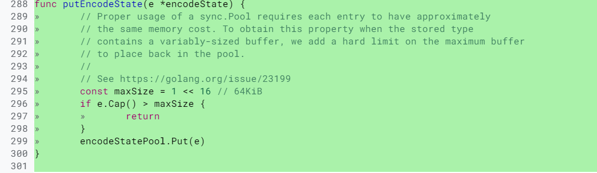
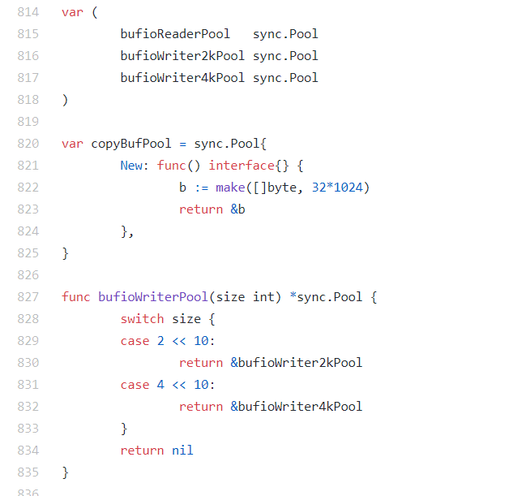
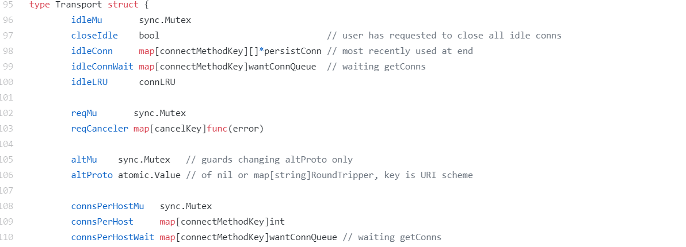

## sync.pool 扩展阅读

聊聊容易踩的两个坑，分别是内存泄漏和内存浪费。

### sync.Pool 的坑-内存泄露

```go

var buffers = sync.Pool{
  New: func() interface{} { 
    return new(bytes.Buffer)
  },
}

func GetBuffer() *bytes.Buffer {
  return buffers.Get().(*bytes.Buffer)
}

func PutBuffer(buf *bytes.Buffer) {
  buf.Reset()
  buffers.Put(buf)
}
```

取出来的 bytes.Buffer 在使用的时候，我们可以往这个元素中增加大量的 byte 数据，这会导致底层的 byte slice 的容量可能会变得很大。

这个时候，即使 Reset 再放回到池子中，这些 byte slice 的容量不会改变，所占的空间依然很大。

而且，因为 Pool 回收的机制，这些大的 Buffer 可能不被回收，而是会一直占用很大的空间，这属于内存泄漏的问题。

即使是 Go 的标准库，在内存泄漏这个问题上也栽了几次坑，比如 issue 23199、@dsnet提供了一个简单的可重现的例子，

演示了内存泄漏的问题。再比如 encoding、json 中类似的问题：将容量已经变得很大的 Buffer 再放回 Pool 中，导致内存泄漏。

后来在元素放回时，增加了检查逻辑，改成放回的超过一定大小的 buffer，就直接丢弃掉，不再放到池子中，如下所示：



在使用 sync.Pool 回收 buffer 的时候，一定要检查回收的对象的大小。如果 buffer 太大，就不要回收了，否则就太浪费了。

### sync.Pool 的坑-内存浪费

就是池子中的 buffer 都比较大，但在实际使用的时候，很多时候只需要一个小的 buffer，这也是一种浪费现象。

要做到物尽其用，尽可能不浪费的话，我们可以将 buffer 池分成几层。

首先，小于 512 byte 的元素的 buffer 占一个池子；

其次，小于 1K byte 大小的元素占一个池子；

再次，小于 4K byte 大小的元素占一个池子。这样分成几个池子以后，就可以根据需要，到所需大小的池子中获取 buffer 了。

在标准库 net/http/server.go中的代码中，就提供了 2K 和 4K 两个 writer 的池子。你可以看看下面这段代码：



YouTube 开源的知名项目 vitess 中提供了bucketpool的实现，它提供了更加通用的多层 buffer 池。

你在使用的时候，只需要指定池子的最大和最小尺寸，vitess 就会自动计算出合适的池子数。

而且，当你调用 Get 方法的时候，只需要传入你要获取的 buffer 的大小，就可以了。下面这段代码就描述了这个过程，你可以看看：


### 第三方库

- 1.bytebufferpool

这是 fasthttp 作者 valyala 提供的一个 buffer 池，基本功能和 sync.Pool 相同。

它的底层也是使用 sync.Pool 实现的，包括会检测最大的 buffer，超过最大尺寸的 buffer，就会被丢弃。

- 2.oxtoacart/bpool

bpool 最大的特色就是能够保持池子中元素的数量，一旦 Put 的数量多于它的阈值，就会自动丢弃，而 sync.Pool 是一个没有限制的池子，只要 Put 就会收进去。

bpool 是基于 Channel 实现的，不像 sync.Pool 为了提高性能而做了很多优化，所以，在性能上比不过 sync.Pool。不过，它提供了限制 Pool 容量的功能，所以，如果你想控制 Pool 的容量的话，可以考虑这个库。

这也是比较常用的 buffer 池，它提供了以下几种类型的 buffer。
  - bpool.BufferPool： 提供一个固定元素数量的 buffer 池，元素类型是 bytes.Buffer，如果超过这个数量，Put 的时候就丢弃，如果池中的元素都被取光了，会新建一个返回。Put 回去的时候，不会检测 buffer 的大小。
  - bpool.BytesPool：提供一个固定元素数量的 byte slice 池，元素类型是 byte slice。Put 回去的时候不检测 slice 的大小。
  - bpool.SizedBufferPool： 提供一个固定元素数量的 buffer 池，如果超过这个数量，Put 的时候就丢弃，如果池中的元素都被取光了，会新建一个返回。Put 回去的时候，会检测 buffer 的大小，超过指定的大小的话，就会创建一个新的满足条件的 buffer 放回去。

#### 连接池

事实上，我们很少会使用 sync.Pool 去池化连接对象，原因就在于，sync.Pool 会无通知地在某个时候就把连接移除垃圾回收掉了，

而我们的场景是需要长久保持这个连接，所以，我们一般会使用其它方法来池化连接，比如接下来我要讲到的几种需要保持长连接的 Pool。

##### 标准库中的 http client 池

标准库的 http.Client 是一个 http client 的库，可以用它来访问 web 服务器。

为了提高性能，这个 Client 的实现也是通过池的方法来缓存一定数量的连接，以便后续重用这些连接。

http.Client 实现连接池的代码是在 Transport 类型中，它使用 idleConn 保存持久化的可重用的长连接：



##### TCP 连接池

最常用的一个 TCP 连接池是 fatih 开发的fatih/pool，

虽然这个项目已经被 fatih 归档（Archived），不再维护了，但是因为它相当稳定了， 我们可以开箱即用。即使你有一些特殊的需求，也可以 fork 它，然后自己再做修改。

它的使用套路如下：

````go

// 工厂模式，提供创建连接的工厂方法
factory    := func() (net.Conn, error) { return net.Dial("tcp", "127.0.0.1:4000") }

// 创建一个tcp池，提供初始容量和最大容量以及工厂方法
p, err := pool.NewChannelPool(5, 30, factory)

// 获取一个连接
conn, err := p.Get()

// Close并不会真正关闭这个连接，而是把它放回池子，所以你不必显式地Put这个对象到池子中
conn.Close()

// 通过调用MarkUnusable, Close的时候就会真正关闭底层的tcp的连接了
if pc, ok := conn.(*pool.PoolConn); ok {
  pc.MarkUnusable()
  pc.Close()
}

// 关闭池子就会关闭=池子中的所有的tcp连接
p.Close()

// 当前池子中的连接的数量
current := p.Len()
````

虽然我一直在说 TCP，但是它管理的是更通用的 net.Conn，不局限于 TCP 连接。

它通过把 net.Conn 包装成 PoolConn，实现了拦截 net.Conn 的 Close 方法，避免了真正地关闭底层连接，而是把这个连接放回到池中：

```go

    type PoolConn struct {
    net.Conn
    mu       sync.RWMutex
    c        *channelPool
    unusable bool
  }
  
    //拦截Close
  func (p *PoolConn) Close() error {
    p.mu.RLock()
    defer p.mu.RUnlock()
  
    if p.unusable {
      if p.Conn != nil {
        return p.Conn.Close()
      }
      return nil
    }
    return p.c.put(p.Conn)
  }
```

它的 Pool 是通过 Channel 实现的，空闲的连接放入到 Channel 中，这也是 Channel 的一个应用场景：

```go

    type channelPool struct {
    // 存储连接池的channel
    mu    sync.RWMutex
    conns chan net.Conn
  

    // net.Conn 的产生器
    factory Factory
  }
```

##### 数据库连接池

标准库 sql.DB 还提供了一个通用的数据库的连接池，通过 MaxOpenConns 和 MaxIdleConns 控制最大的连接数和最大的 idle 的连接数。

默认的 MaxIdleConns 是 2，这个数对于数据库相关的应用来说太小了，我们一般都会调整它。

DB 的 freeConn 保存了 idle 的连接，这样，当我们获取数据库连接的时候，它就会优先尝试从 freeConn 获取已有的连接（conn）。

##### Memcached Client 连接池

Brad Fitzpatrick 是知名缓存库 Memcached 的原作者，前 Go 团队成员。

gomemcache是他使用 Go 开发的 Memchaced 的客户端，其中也用了连接池的方式池化 Memcached 的连接。接下来让我们看看它的连接池的实现。

gomemcache Client 有一个 freeconn 的字段，用来保存空闲的连接。

当一个请求使用完之后，它会调用 putFreeConn 放回到池子中，请求的时候，调用 getFreeConn 优先查询 freeConn 中是否有可用的连接。

它采用 Mutex+Slice 实现 Pool：

```go

   // 放回一个待重用的连接
   func (c *Client) putFreeConn(addr net.Addr, cn *conn) {
    c.lk.Lock()
    defer c.lk.Unlock()
    if c.freeconn == nil { // 如果对象为空，创建一个map对象
      c.freeconn = make(map[string][]*conn)
    }
    freelist := c.freeconn[addr.String()] //得到此地址的连接列表
    if len(freelist) >= c.maxIdleConns() {//如果连接已满,关闭，不再放入
      cn.nc.Close()
      return
    }
    c.freeconn[addr.String()] = append(freelist, cn) // 加入到空闲列表中
  }
  
    // 得到一个空闲连接
  func (c *Client) getFreeConn(addr net.Addr) (cn *conn, ok bool) {
    c.lk.Lock()
    defer c.lk.Unlock()
    if c.freeconn == nil { 
      return nil, false
    }
    freelist, ok := c.freeconn[addr.String()]
    if !ok || len(freelist) == 0 { // 没有此地址的空闲列表，或者列表为空
      return nil, false
    }
    cn = freelist[len(freelist)-1] // 取出尾部的空闲连接
    c.freeconn[addr.String()] = freelist[:len(freelist)-1]
    return cn, true
  }

```

##### Worker Pool

你已经知道，goroutine 是一个很轻量级的“纤程”，在一个服务器上可以创建十几万甚至几十万的 goroutine。但是“可以”和“合适”之间还是有区别的，你会在应用中让几十万的 goroutine 一直跑吗？基本上是不会的。

一个 goroutine 初始的栈大小是 2048 个字节，并且在需要的时候可以扩展到 1GB（具体的内容你可以课下看看代码中的配置：不同的架构最大数会不同），

所以，大量的 goroutine 还是很耗资源的。

同时，大量的 goroutine 对于调度和垃圾回收的耗时还是会有影响的，因此，goroutine 并不是越多越好。

有的时候，我们就会创建一个 Worker Pool 来减少 goroutine 的使用。

比如，我们实现一个 TCP 服务器，如果每一个连接都要由一个独立的 goroutine 去处理的话，在大量连接的情况下，就会创建大量的 goroutine，

这个时候，我们就可以创建一个固定数量的 goroutine（Worker），由这一组 Worker 去处理连接，比如 fasthttp 中的Worker Pool。


大部分的 Worker Pool 都是通过 Channel 来缓存任务的，因为 Channel 能够比较方便地实现并发的保护，有的是多个 Worker 共享同一个任务 Channel，

有些是每个 Worker 都有一个独立的 Channel。


综合下来，精挑细选，我给你推荐三款易用的 Worker Pool，这三个 Worker Pool 的 API 设计简单，

也比较相似，易于和项目集成，而且提供的功能也是我们常用的功能

- gammazero/workerpool：gammazero/workerpool 可以无限制地提交任务，提供了更便利的 Submit 和 SubmitWait 方法提交任务，还可以提供当前的 worker 数和任务数以及关闭 Pool 的功能。
- ivpusic/grpool：grpool 创建 Pool 的时候需要提供 Worker 的数量和等待执行的任务的最大数量，任务的提交是直接往 Channel 放入任务。
- dpaks/goworkers：dpaks/goworkers 提供了更便利的 Submit 方法提交任务以及 Worker 数、任务数等查询方法、关闭 Pool 的方法。它的任务的执行结果需要在 ResultChan 和 ErrChan 中去获取，没有提供阻塞的方法，但是它可以在初始化的时候设置 Worker 的数量和任务数。

类似的 Worker Pool 的实现非常多，比如还有panjf2000/ants、Jeffail/tunny 、benmanns/goworker、go-playground/pool、Sherifabdlnaby/gpool等第三方库。pond也是一个非常不错的 Worker Pool，关注度目前不是很高，但是功能非常齐全。