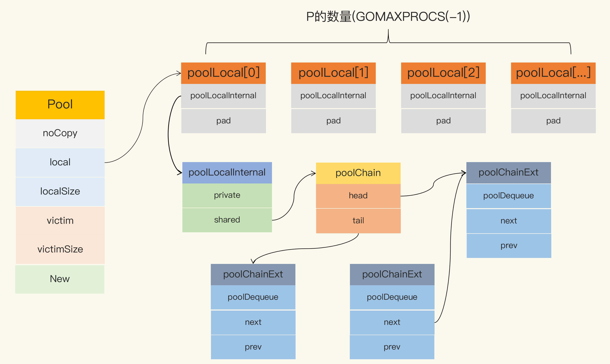

## sync.Pool实现原理

### sync.pool实现的数据结构



Go 1.13 之前的 sync.Pool 的实现有 2 大问题：

- 1. 每次 GC 都会回收创建的对象。

如果缓存元素数量太多，就会导致 STW 耗时变长；缓存元素都被回收后，会导致 Get 命中率下降，Get 方法不得不新创建很多对象。

- 2. 底层实现使用了 Mutex，对这个锁并发请求竞争激烈的时候，会导致性能的下降。

Go 对 Pool 的优化就是避免使用锁，同时将加锁的 queue 改成 lock-free 的 queue 的实现，给即将移除的元素再多一次“复活”的机会。

Pool 最重要的两个字段是 local 和 victim，因为它们两个主要用来存储空闲的元素。

弄清楚这两个字段的处理逻辑，你就能完全掌握 sync.Pool 的实现了。下面我们来看看这两个字段的关系。

每次垃圾回收的时候，Pool 会把 victim 中的对象移除，然后把 local 的数据给 victim，这样的话，local 就会被清空，

而 victim 就像一个垃圾分拣站，里面的东西可能会被当做垃圾丢弃了，但是里面有用的东西也可能被捡回来重新使用。

victim 中的元素如果被 Get 取走，那么这个元素就很幸运，因为它又“活”过来了。

但是，如果这个时候 Get 的并发不是很大，元素没有被 Get 取走，那么就会被移除掉，因为没有别人引用它的话，就会被垃圾回收掉。

#### 垃圾回收时 

下面的代码是垃圾回收时 sync.Pool 的处理逻辑：

```go

func poolCleanup() {
    // 丢弃当前victim, STW所以不用加锁
    for _, p := range oldPools {
        p.victim = nil
        p.victimSize = 0
    }

    // 将local复制给victim, 并将原local置为nil
    for _, p := range allPools {
        p.victim = p.local
        p.victimSize = p.localSize
        p.local = nil
        p.localSize = 0
    }

    oldPools, allPools = allPools, nil
}
```

在这段代码中，你需要关注一下 local 字段，因为所有当前主要的空闲可用的元素都存放在 local 字段中，

请求元素时也是优先从 local 字段中查找可用的元素。local 字段包含一个 poolLocalInternal 字段，并提供 CPU 缓存对齐，从而避免 false sharing。

而 poolLocalInternal 也包含两个字段：private 和 shared。

- private，代表一个缓存的元素，而且只能由相应的一个 P 存取。因为一个 P 同时只能执行一个 goroutine，所以不会有并发的问题。 
- shared，可以由任意的 P 访问，但是只有本地的 P 才能 pushHead/popHead，其它 P 可以 popTail，相当于只有一个本地的 P 作为生产者（Producer），多个 P 作为消费者（Consumer），它是使用一个 local-free 的 queue 列表实现的。

#### Get方法
```go

func (p *Pool) Get() interface{} {
    // 把当前goroutine固定在当前的P上
    l, pid := p.pin()
    x := l.private // 优先从local的private字段取，快速
    l.private = nil
    if x == nil {
        // 从当前的local.shared弹出一个，注意是从head读取并移除
        x, _ = l.shared.popHead()
        if x == nil { // 如果没有，则去偷一个
            x = p.getSlow(pid) 
        }
    }
    runtime_procUnpin()
    // 如果没有获取到，尝试使用New函数生成一个新的
    if x == nil && p.New != nil {
        x = p.New()
    }
    return x
}
```

首先，从本地的 private 字段中获取可用元素，因为没有锁，获取元素的过程会非常快，

如果没有获取到，就尝试从本地的 shared 获取一个，

如果还没有，会使用 getSlow 方法去其它的 shared 中“偷”一个。最后，如果没有获取到，就尝试使用 New 函数创建一个新的。

在 vintim 中查询可用元素的逻辑还是一样的，先从对应的 victim 的 private 查找，如果查不到，就再从其它 victim 的 shared 中查找。

##### getSlow 方法的主要逻辑

```go

func (p *Pool) getSlow(pid int) interface{} {

    size := atomic.LoadUintptr(&p.localSize)
    locals := p.local                       
    // 从其它proc中尝试偷取一个元素
    for i := 0; i < int(size); i++ {
        l := indexLocal(locals, (pid+i+1)%int(size))
        if x, _ := l.shared.popTail(); x != nil {
            return x
        }
    }

    // 如果其它proc也没有可用元素，那么尝试从vintim中获取
    size = atomic.LoadUintptr(&p.victimSize)
    if uintptr(pid) >= size {
        return nil
    }
    locals = p.victim
    l := indexLocal(locals, pid)
    if x := l.private; x != nil { // 同样的逻辑，先从vintim中的local private获取
        l.private = nil
        return x
    }
    for i := 0; i < int(size); i++ { // 从vintim其它proc尝试偷取
        l := indexLocal(locals, (pid+i)%int(size))
        if x, _ := l.shared.popTail(); x != nil {
            return x
        }
    }

    // 如果victim中都没有，则把这个victim标记为空，以后的查找可以快速跳过了
    atomic.StoreUintptr(&p.victimSize, 0)

    return nil
}
```

### Put 方法

```go

func (p *Pool) Put(x interface{}) {
    if x == nil { // nil值直接丢弃
        return
    }
    l, _ := p.pin()
    if l.private == nil { // 如果本地private没有值，直接设置这个值即可
        l.private = x
        x = nil
    }
    if x != nil { // 否则加入到本地队列中
        l.shared.pushHead(x)
    }
    runtime_procUnpin()
}
```