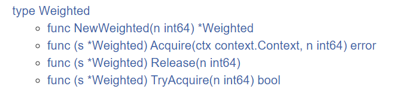
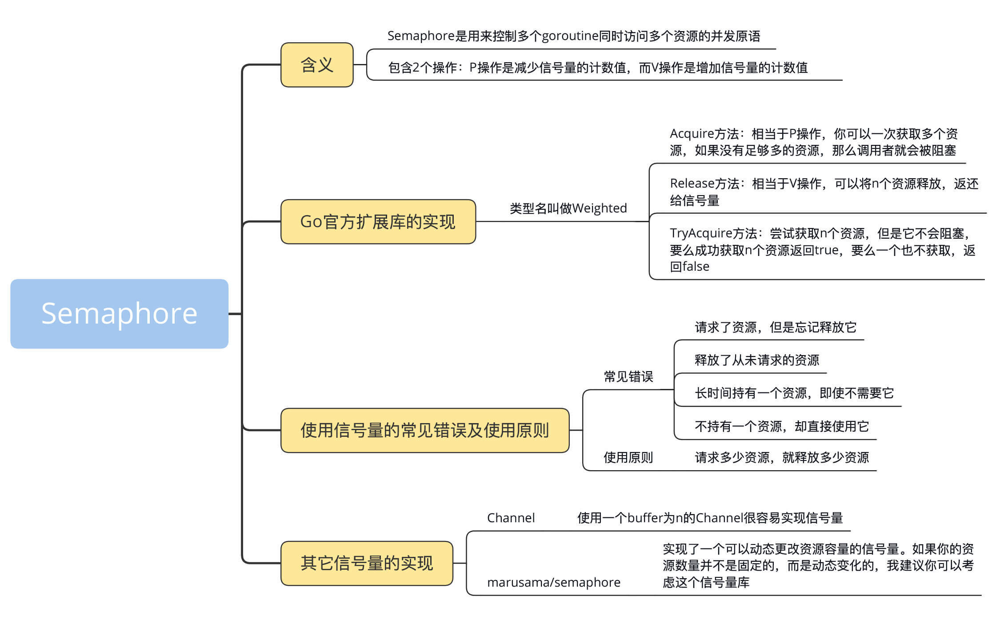

# 信号量（Semaphore）

信号量（Semaphore）是用来控制多个 goroutine 同时访问多个资源的并发原语。

## 信号量是什么？都有什么操作？

信号量的概念是荷兰计算机科学家 Edsger Dijkstra 在 1963 年左右提出来的，广泛应用在不同的操作系统中。在系统中，会给每一个进程一个信号量，代表每个进程目前的状态。未得到控制权的进程，会在特定的地方被迫停下来，等待可以继续进行的信号到来。

最简单的信号量就是一个变量加一些并发控制的能力，这个变量是 0 到 n 之间的一个数值。当 goroutine 完成对此信号量的等待（wait）时，该计数值就减 1，当 goroutine 完成对此信号量的释放（release）时，该计数值就加 1。当计数值为 0 的时候，goroutine 调用 wait 等待该信号量是不会成功的，除非计数器又大于 0，等待的 goroutine 才有可能成功返回。

一个生活中的例子，来帮你进一步理解信号量。

举个例子，图书馆新购买了 10 本《Go 并发编程的独家秘籍》，有 1 万个学生都想读这本书，“僧多粥少”。所以，图书馆管理员先会让这 1 万个同学进行登记，按照登记的顺序，借阅此书。如果书全部被借走，那么，其他想看此书的同学就需要等待，如果有人还书了，图书馆管理员就会通知下一位同学来借阅这本书。这里的资源是《Go 并发编程的独家秘籍》这十本书，想读此书的同学就是 goroutine，图书管理员就是信号量。

### P/V 操作

Dijkstra 在他的论文中为信号量定义了两个操作 P 和 V。P 操作（descrease、wait、acquire）是减少信号量的计数值，而 V 操作（increase、signal、release）是增加信号量的计数值。

使用伪代码表示如下（中括号代表原子操作）：

```go
function V(semaphore S, integer I):
    [S ← S + I]

function P(semaphore S, integer I):
    repeat:
        [if S ≥ I:
        S ← S − I
        break]
```

可以看到，初始化信号量 S 有一个指定数量（n）的资源，它就像是一个有 n 个资源的池子。P 操作相当于请求资源，如果资源可用，就立即返回；如果没有资源或者不够，那么，它可以不断尝试或者阻塞等待。V 操作会释放自己持有的资源，把资源返还给信号量。信号量的值除了初始化的操作以外，只能由 P/V 操作改变。

现在，我们来总结下信号量的实现。

- 初始化信号量：设定初始的资源的数量。
- P 操作：将信号量的计数值减去 1，如果新值已经为负，那么调用者会被阻塞并加入到等待队列中。否则，调用者会继续执行，并且获得一个资源。
- V 操作：将信号量的计数值加 1，如果先前的计数值为负，就说明有等待的 P 操作的调用者。它会从等待队列中取出一个等待的调用者，唤醒它，让它继续执行。

就是信号量和互斥锁的区别与联系，这有助于我们掌握接下来的内容。

其实，信号量可以分为计数信号量（counting semaphore）和二进位信号量（binary semaphore）。刚刚所说的图书馆借书的例子就是一个计数信号量，它的计数可以是任意一个整数。在特殊的情况下，如果计数值只能是 0 或者 1，那么，这个信号量就是二进位信号量，提供了互斥的功能（要么是 0，要么是 1），所以，有时候互斥锁也会使用二进位信号量来实现。

我们一般用信号量保护一组资源，比如数据库连接池、一组客户端的连接、几个打印机资源，等等。如果信号量蜕变成二进位信号量，那么，它的 P/V 就和互斥锁的 Lock/Unlock 一样了。

### Go 官方扩展库的实现

在运行时，Go 内部使用信号量来控制 goroutine 的阻塞和唤醒。

```go
type Mutex struct {
    state int32
    sema  uint32
}
```

信号量的 P/V 操作是通过函数实现的：

```go
func runtime_Semacquire(s *uint32)
func runtime_SemacquireMutex(s *uint32, lifo bool, skipframes int)
func runtime_Semrelease(s *uint32, handoff bool, skipframes int)
```

遗憾的是，它是 Go 运行时内部使用的，并没有封装暴露成一个对外的信号量并发原语，原则上我们没有办法使用。不过没关系，Go 在它的扩展包中提供了信号量semaphore，不过这个信号量的类型名并不叫 Semaphore，而是叫 Weighted。

之所以叫做 Weighted，我想，应该是因为可以在初始化创建这个信号量的时候设置权重（初始化的资源数），其实我觉得叫 Semaphore 或许会更好。



我们来分析下这个信号量的几个实现方法。

- Acquire 方法：相当于 P 操作，你可以一次获取多个资源，如果没有足够多的资源，调用者就会被阻塞。它的第一个参数是 Context，这就意味着，你可以通过 Context 增加超时或者 cancel 的机制。如果是正常获取了资源，就返回 nil；否则，就返回 ctx.Err()，信号量不改变。
- Release 方法：相当于 V 操作，可以将 n 个资源释放，返还给信号量。
- TryAcquire 方法：尝试获取 n 个资源，但是它不会阻塞，要么成功获取 n 个资源，返回 true，要么一个也不获取，返回 false。

我们创建和 CPU 核数一样多的 Worker，让它们去处理一个 4 倍数量的整数 slice。每个 Worker 一次只能处理一个整数，处理完之后，才能处理下一个。

当然，这个问题的解决方案有很多种，这一次我们使用信号量，代码如下：

```go
var (
    maxWorkers = runtime.GOMAXPROCS(0)                    // worker数量
    sema       = semaphore.NewWeighted(int64(maxWorkers)) //信号量
    task       = make([]int, maxWorkers*4)                // 任务数，是worker的四倍
)

func main() {
    ctx := context.Background()

    for i := range task {
        // 如果没有worker可用，会阻塞在这里，直到某个worker被释放
        if err := sema.Acquire(ctx, 1); err != nil {
            break
        }

        // 启动worker goroutine
        go func(i int) {
            defer sema.Release(1)
            time.Sleep(100 * time.Millisecond) // 模拟一个耗时操作
            task[i] = i + 1
        }(i)
    }

    // 请求所有的worker,这样能确保前面的worker都执行完
    if err := sema.Acquire(ctx, int64(maxWorkers)); err != nil {
        log.Printf("获取所有的worker失败: %v", err)
    }

    fmt.Println(task)
}
```

在这段代码中，main goroutine 相当于一个 dispatcher，负责任务的分发。它先请求信号量，如果获取成功，就会启动一个 goroutine 去处理计算，然后，这个 goroutine 会释放这个信号量（有意思的是，信号量的获取是在 main goroutine，信号量的释放是在 worker goroutine 中），如果获取不成功，就等到有信号量可以使用的时候，再去获取。

需要提醒你的是，其实，在这个例子中，还有一个值得我们学习的知识点，就是最后的那一段处理（第 25 行）。<b>如果在实际应用中，你想等所有的 Worker 都执行完，就可以获取最大计数值的信号量。</b>

Go 扩展库中的信号量是使用互斥锁 +List 实现的。互斥锁实现其它字段的保护，而 List 实现了一个等待队列，等待者的通知是通过 Channel 的通知机制实现的。

### 使用信号量的常见错误

在使用信号量时，最常见的几个错误如下：

- 请求了资源，但是忘记释放它；
- 释放了从未请求的资源；
- 长时间持有一个资源，即使不需要它；
- 不持有一个资源，却直接使用它。

不过，即使你规避了这些坑，在同时使用多种资源，不同的信号量控制不同的资源的时候，也可能会出现死锁现象，比如哲学家就餐问题。

就 Go 扩展库实现的信号量来说，在调用 Release 方法的时候，你可以传递任意的整数。但是，如果你传递一个比请求到的数量大的错误的数值，程序就会 panic。如果传递一个负数，会导致资源永久被持有。如果你请求的资源数比最大的资源数还大，那么，调用者可能永远被阻塞。

所以，使用信号量遵循的原则就是请求多少资源，就释放多少资源。你一定要注意，必须使用正确的方法传递整数，不要“耍小聪明”，而且，请求的资源数一定不要超过最大资源数。

### 其它信号量的实现

除了官方扩展库的实现，实际上，我们还有很多方法实现信号量，比较典型的就是使用 Channel 来实现。

根据之前的 Channel 类型的介绍以及 Go 内存模型的定义，你应该能想到，使用一个 buffer 为 n 的 Channel 很容易实现信号量，比如下面的代码，我们就是使用 chan struct{}类型来实现的。

在初始化这个信号量的时候，我们设置它的初始容量，代表有多少个资源可以使用。它使用 Lock 和 Unlock 方法实现请求资源和释放资源，正好实现了 Locker 接口。

```go
  // Semaphore 数据结构，并且还实现了Locker接口
  type semaphore struct {
    sync.Locker
    ch chan struct{}
  }
  
  // 创建一个新的信号量
  func NewSemaphore(capacity int) sync.Locker {
    if capacity <= 0 {
      capacity = 1 // 容量为1就变成了一个互斥锁
    }
    return &semaphore{ch: make(chan struct{}, capacity)}
  }
  
  // 请求一个资源
  func (s *semaphore) Lock() {
    s.ch <- struct{}{}
  }
  
  // 释放资源
  func (s *semaphore) Unlock() {
    <-s.ch
  }
```
当然，你还可以自己扩展一些方法，比如在请求资源的时候使用 Context 参数（Acquire(ctx)）、实现 TryLock 等功能。

看到这里，你可能会问，这个信号量的实现看起来非常简单，而且也能应对大部分的信号量的场景，为什么官方扩展库的信号量的实现不采用这种方法呢？其实，具体是什么原因，我也不知道，但是我必须要强调的是，官方的实现方式有这样一个功能：<b>它可以一次请求多个资源，这是通过 Channel 实现的信号量所不具备的。</b>

除了 Channel，marusama/semaphore也实现了一个可以动态更改资源容量的信号量，也是一个非常有特色的实现。如果你的资源数量并不是固定的，而是动态变化的，我建议你考虑一下这个信号量库。

### 总结

不管怎样，信号量这个并发原语在多资源共享的并发控制的场景中被广泛使用，有时候也会被 Channel 类型所取代，因为一个 buffered chan 也可以代表 n 个资源。

但是，官方扩展的信号量也有它的优势，就是可以一次获取多个资源。在批量获取资源的场景中，我建议你尝试使用官方扩展的信号量。




