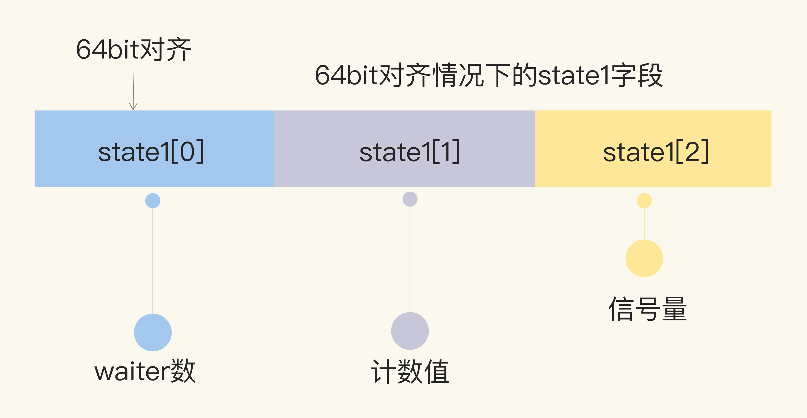
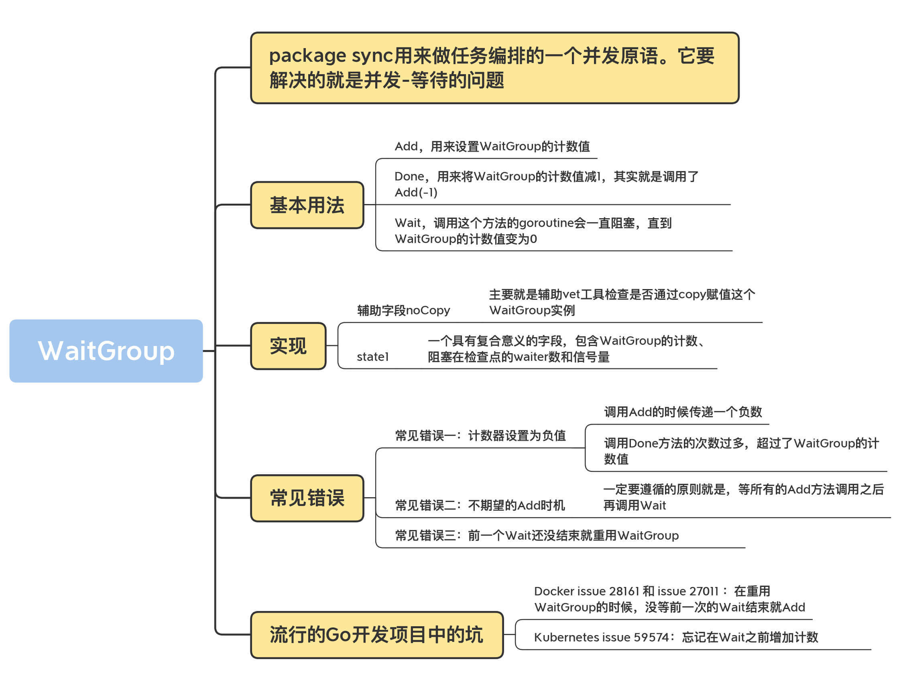

## WaitGroup

WaitGroup 的数据结构包括了一个 noCopy 的辅助字段，一个 state1 记录 WaitGroup 状态的数组。

- noCopy 的辅助字段，主要就是辅助 vet 工具检查是否通过 copy 赋值这个 WaitGroup 实例。我会在后面和你详细分析这个字段；
- state1，一个具有复合意义的字段，包含 WaitGroup 的计数、阻塞在检查点的 waiter 数和信号量。

WaitGroup 的数据结构定义以及 state 信息的获取方法如下：

```go

type WaitGroup struct {
    // 避免复制使用的一个技巧，可以告诉vet工具违反了复制使用的规则
    noCopy noCopy
    // 64bit(8bytes)的值分成两段，高32bit是计数值，低32bit是waiter的计数
    // 另外32bit是用作信号量的
    // 因为64bit值的原子操作需要64bit对齐，但是32bit编译器不支持，所以数组中的元素在不同的架构中不一样，具体处理看下面的方法
    // 总之，会找到对齐的那64bit作为state，其余的32bit做信号量
    state1 [3]uint32
}


// 得到state的地址和信号量的地址
func (wg *WaitGroup) state() (statep *uint64, semap *uint32) {
    if uintptr(unsafe.Pointer(&wg.state1))%8 == 0 {
        // 如果地址是64bit对齐的，数组前两个元素做state，后一个元素做信号量
        return (*uint64)(unsafe.Pointer(&wg.state1)), &wg.state1[2]
    } else {
        // 如果地址是32bit对齐的，数组后两个元素用来做state，它可以用来做64bit的原子操作，第一个元素32bit用来做信号量
        return (*uint64)(unsafe.Pointer(&wg.state1[1])), &wg.state1[0]
    }
}
```

因为对 64 位整数的原子操作要求整数的地址是 64 位对齐的，所以针对 64 位和 32 位环境的 state 字段的组成是不一样的。

在 64 位环境下，state1 的第一个元素是 waiter 数，第二个元素是 WaitGroup 的计数值，第三个元素是信号量。


在 32 位环境下，如果 state1 不是 64 位对齐的地址，那么 state1 的第一个元素是信号量，后两个元素分别是 waiter 数和计数值。


我们继续深入源码，看一下 Add、Done 和 Wait 这三个方法的实现。

我先为你梳理下 Add 方法的逻辑。Add 方法主要操作的是 state 的计数部分。你可以为计数值增加一个 delta 值，内部通过原子操作把这个值加到计数值上。

需要注意的是，这个 delta 也可以是个负数，相当于为计数值减去一个值，

Done 方法内部其实就是通过 Add(-1) 实现的。

```go
func (wg *WaitGroup) Add(delta int) {
statep, semap := wg.state()
// 高32bit是计数值v，所以把delta左移32，增加到计数上
state := atomic.AddUint64(statep, uint64(delta)<<32)
v := int32(state >> 32) // 当前计数值
w := uint32(state) // waiter count

if v > 0 || w == 0 {
    return
}

// 如果计数值v为0并且waiter的数量w不为0，那么state的值就是waiter的数量
// 将waiter的数量设置为0，因为计数值v也是0,所以它们俩的组合*statep直接设置为0即可。此时需要并唤醒所有的waiter
*statep = 0
for ; w != 0; w-- {
    runtime_Semrelease(semap, false, 0)
}
}


// Done方法实际就是计数器减1
func (wg *WaitGroup) Done() {
    wg.Add(-1)
}
```

Wait 方法的实现逻辑是：不断检查 state 的值。如果其中的计数值变为了 0，那么说明所有的任务已完成，调用者不必再等待，直接返回。

如果计数值大于 0，说明此时还有任务没完成，那么调用者就变成了等待者，需要加入 waiter 队列，并且阻塞住自己。

其主干实现代码如下：

```go

func (wg *WaitGroup) Wait() {
    statep, semap := wg.state()
    
    for {
        state := atomic.LoadUint64(statep)
        v := int32(state >> 32) // 当前计数值
        w := uint32(state) // waiter的数量
        if v == 0 {
            // 如果计数值为0, 调用这个方法的goroutine不必再等待，继续执行它后面的逻辑即可
            return
        }
        // 否则把waiter数量加1。期间可能有并发调用Wait的情况，所以最外层使用了一个for循环
        if atomic.CompareAndSwapUint64(statep, state, state+1) {
            // 阻塞休眠等待
            runtime_Semacquire(semap)
            // 被唤醒，不再阻塞，返回
            return
        }
    }
}
```

#### 总结
- 不重用 WaitGroup。新建一个 WaitGroup 不会带来多大的资源开销，重用反而更容易出错。
- 保证所有的 Add 方法调用都在 Wait 之前。
- 不传递负数给 Add 方法，只通过 Done 来给计数值减 1。
- 不做多余的 Done 方法调用，保证 Add 的计数值和 Done 方法调用的数量是一样的。
- 不遗漏 Done 方法的调用，否则会导致 Wait hang 住无法返回。

#### 知识地图
