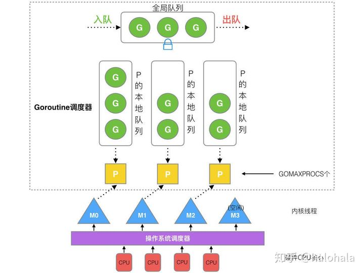
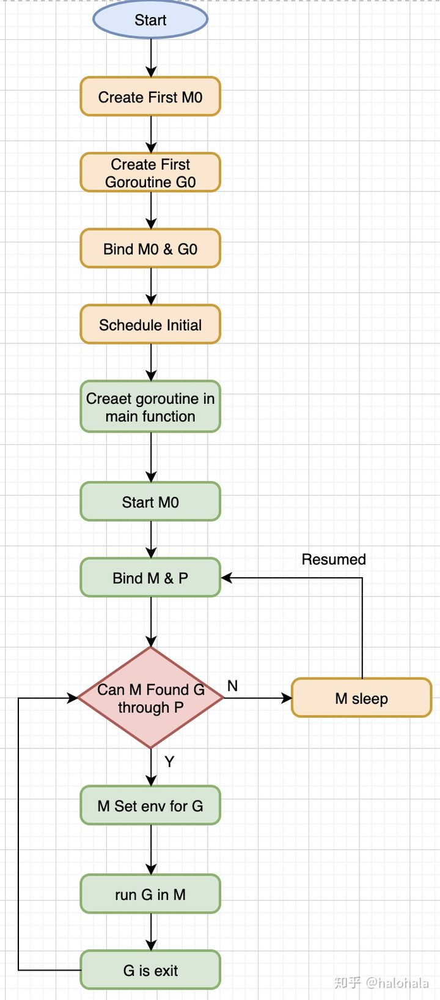

# Golang调度器的GMP模型

### 并发&并行
- 并发(concurrent): 逻辑上处理同时的任务的能力 
- 并行(parallel): 物理上同一时间处理不同任务

一般来说，并发对应在单个处理器，通过串行的时间片分配（time slice）来执行任务。 而并发，对应多个处理器，来执行不同的任务。

Golang中，执行多个任务时，Goroutine会创建不同的线程，也会将任务单元分配给其他线程来执行，这像是并发和并行的结合，能够最大化执行效率。

## Go调度器组成

### G
G是Goroutine的缩写，相当于操作系统的进程控制块(process control block)。
它包含：函数执行的指令和参数，任务对象，线程上下文切换，字段保护，和字段的寄存器。

下面代码来自runtime/runtime2.go,可以看到，每个Goroutine都有一个不导出的goid。

```go
type g struct {

    m            *m      // current m; offset known to arm liblink
    sched        gobuf
    ...
    param        unsafe.Pointer // passed parameter on wakeup
    goid         int64
    ...
    vdsoSP uintptr // SP for traceback while in VDSO call (0 if not in call)
    vdsoPC uintptr // PC for traceback while in VDSO call
}
```

不同版本的Go语言，Goroutine的栈空间的默认值不一样。下面代码来自runtime/proc.go。

```go
const (
    _StackMin = 2048
)
// Create a new g in state _Grunnable, starting at fn, with narg bytes
// of arguments starting at argp. callerpc is the address of the go
// statement that created this. The caller is responsible for adding
// the new g to the scheduler.
//
// This must run on the system stack because it's the continuation of
// newproc, which cannot split the stack.
//
//go:systemstack
func newproc1(fn *funcval, argp unsafe.Pointer, narg int32, callergp *g, callerpc uintptr) *g {
    _g_ := getg()

    if fn == nil {
        _g_.m.throwing = -1 // do not dump full stacks
        throw("go of nil func value")
    }
    acquirem() // disable preemption because it can be holding p in a local var
    siz := narg
    siz = (siz + 7) &^ 7

    // We could allocate a larger initial stack if necessary.
    // Not worth it: this is almost always an error.
    // 4*sizeof(uintreg): extra space added below
    // sizeof(uintreg): caller's LR (arm) or return address (x86, in gostartcall).
    if siz >= _StackMin-4*sys.RegSize-sys.RegSize {
        throw("newproc: function arguments too large for new goroutine")
    }
    ...
}
```

### M

M是一个线程，每个M都有一个线程的栈。如果没有给线程的栈分配内存，操作系统会给线程的栈分配默认的内存。

当线程的栈制定，M.stack->G.stack, M的PC寄存器会执行G提供的函数。

```go
type m struct {    
    /*
    g0的线程栈与M相关
    */
    g0       *g
    Curg *g //M 现在绑定的G

    // SP, PC registers for on-site protection and on-site recovery
    vdsoSP uintptr
    vdsoPC uintptr
    ...
}
```

### P

P(处理器，Processor)是一个抽象的概念，不是物理上的CPU。当一个P有任务，需要创建或者唤醒一个系统线程去处理它队列中的任务。

P决定同时执行的任务的数量，GOMAXPROCS限制系统线程执行用户层面的任务的数量。

```go
// GOMAXPROCS sets the maximum number of CPUs that can be executing
// simultaneously and returns the previous setting. If n < 1, it does not
// change the current setting.
// The number of logical CPUs on the local machine can be queried with NumCPU.
// This call will go away when the scheduler improves.
func GOMAXPROCS(n int) int {
    if GOARCH == "wasm" && n > 1 {
        n = 1 // WebAssembly has no threads yet, so only one CPU is possible.
    }

    lock(&sched.lock)
    ret := int(gomaxprocs)
    unlock(&sched.lock)
    if n <= 0 || n == ret {
        return ret
    }

    stopTheWorldGC("GOMAXPROCS")

    // newprocs will be processed by startTheWorld
    newprocs = int32(n)

    startTheWorldGC()
    return ret
}
```

## Go调度器的调度过程

首先创建一个G对象，然后G被保存在P的本地队列或者全局队列（global queue）。 

这时P会唤醒一个M。P按照它的执行顺序继续执行任务。M寻找一个空闲的P，如果找得到，将G移动到它自己。

然后M执行一个调度循环：调用G对象->执行->清理线程->继续寻找Goroutine。

在M的执行过程中，上下文切换随时发生。当切换发生，任务的执行现场需要被保护，这样在下一次调度执行可以进行现场恢复。M的栈保存在G对象，只有现场恢复需要的寄存器(SP,PC等)，需要被保存到G对象。

如果G对象还没有被执行，M可以将G重新放到P的调度队列，等待下一次的调度执行。当调度执行时，M可以通过G的vdsoSP, vdsoPC 寄存器进行现场恢复。

- P队列 P有2种类型的队列：
  - 本地队列：本地的队列是无锁的，没有数据竞争问题，处理速度比较高。
  - 全局队列：是用来平衡不同的P的任务数量，所有的M共享P的全局队列。
- 线程清理 G的调度是为了实现P/M的绑定，所以线程清理就是释放P上的G，让其他的G能够被调度
  - 主动释放(active release)：典型的例子是，执行G任务时，发生了系统调用(system call)，这时M会处于阻塞（Block）状态。调度器会设置一个超时时间，来释放P。
  - 被动释放(passive release)：如果系统调用发生，监控程序需要扫描处于阻塞状态的P/M。 这时，超时之后，P资源会回收，程序被安排给队列中的其他G任务。

### 调度示意图



P的数量由GOMAXPROCS环境变量，或者runtime中GOMAXPROCS()函数决定的。

M的数量在runtime/debug包的SetMaxThreads()决定。如果当前的M阻塞，就会新建一个新的线程。

M的数量和P的数量没有关系。如果当前的M阻塞，P的goroutine会运行在其他的M上，或者新建一个M。

所以可能出现有很多个M，只有1个P的情况。

### 调度策略
调度策略是为了尽可能地复用线程，避免频繁地创建，销毁线程。有2中策略： 

- Work Stealing: 当没有运行的G时，从其他P的队列上获得G 

- Hand Off: 当M阻塞时，将P转移到其他空闲的M。

全局的Goroutine队列，当Work Stealing失败，M可以从这个队列获取G任务。

#### 抢占式调度(Preemptive scheduling)

考虑到有大量的G任务时，为了让每个G任务都有时间运行，runtime.main会创建一个额外的M，来运行sysmon函数。抢占(preemption)在sysmon中实现。

sysmon会进入一个无限循环，第一轮休眠20us，然后休眠时间倍乘，最后每次休眠时间达到10ms。

sysmon有netpoll, retake(抢占),forcegc, scavenge heap等其他处理。

```go
// Always runs without a P, so write barriers are not allowed.
//
//go:nowritebarrierrec
func sysmon() {
    lock(&sched.lock)
    sched.nmsys++
    checkdead()
    unlock(&sched.lock)

    lasttrace := int64(0)
    idle := 0 // how many cycles in succession we had not wokeup somebody
    delay := uint32(0)
    for {
        if idle == 0 { // start with 20us sleep...
            delay = 20
        } else if idle > 50 { // start doubling the sleep after 1ms...
            delay *= 2
        }
        if delay > 10*1000 { // up to 10ms
            delay = 10 * 1000
        }
        usleep(delay)
        now := nanotime()
        next, _ := timeSleepUntil()
        ...
        if atomic.Load(&scavenge.sysmonWake) != 0 {
            // Kick the scavenger awake if someone requested it.
            wakeScavenger()
        }
        // retake P's blocked in syscalls
        // and preempt long running G's
        if retake(now) != 0 {
            idle = 0
        } else {
            idle++
        }
        // check if we need to force a GC
        if t := (gcTrigger{kind: gcTriggerTime, now: now}); t.test() && atomic.Load(&forcegc.idle) != 0 {
            lock(&forcegc.lock)
            forcegc.idle = 0
            var list gList
            list.push(forcegc.g)
            injectglist(&list)
            unlock(&forcegc.lock)
        }
        ...
        unlock(&sched.sysmonlock)
    }
}
```

##### go func(){}之后


- 1. go func(){}创建一个新的goroutine
- 2. G保存在P的本地队列，如果本地队列满了，保存在全局队列
- 3. G在M上运行，每个M绑定一个P。如果P的本地队列没有G，M会从其他P的本地队列，挥着G的全局队列，窃取G
- 4. 当M阻塞时，会将M从P解除。把G运行在其他空闲的M或者创建新的M。
- 5. 当M恢复时，会尝试获得一个空闲的P。如果没有P空闲，M会休眠，G会放到全局队列。

#### 生命周期


M0: M0是首先创建的线程。它就像系统初始化，启动第一个G，然后变成普通的M。
G0: 当M创建时，G0就创建了。G0用来调度其他的G。每个M都有自己的G0。当系统调用或者goroutine调度，G0的内存栈就会被占用。

看下面的例子，

```go
package main
import "fmt"

func main() {
    fmt.Println("Hello world")
}
```

上面代码的流程图： 
- 1. runtime创建M0，G0然后绑定他们 
- 2. 调度器初始化：初始化M0，栈，垃圾回收，创建初始的长度为GOMAXPROCS的P列表 
- 3. runtime.main创建代码的main.main，创建主gorourine,然后放到P的本地队列 
- 4. 启动M0, M0绑定P 
- 5. 根据goroutine的栈和调度信息，M0设置运行环境 
- 6. 在M中运行G 
- 7. G退出，runtime.main调用defer,panic,最后调用runtime.exit


