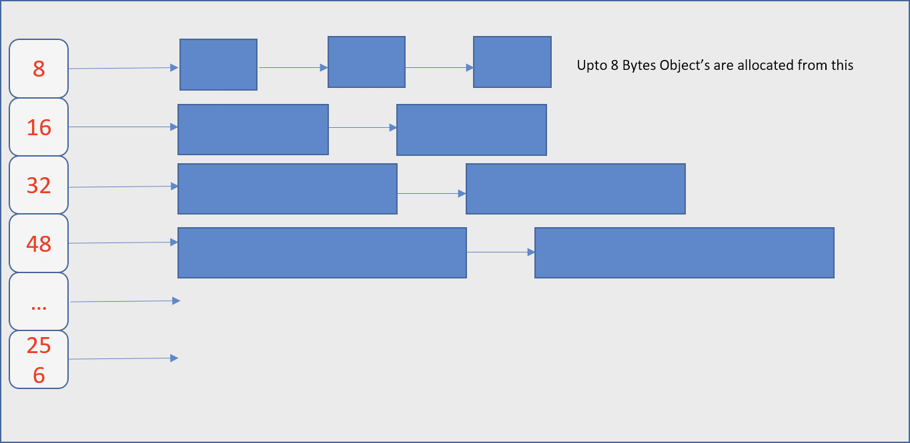
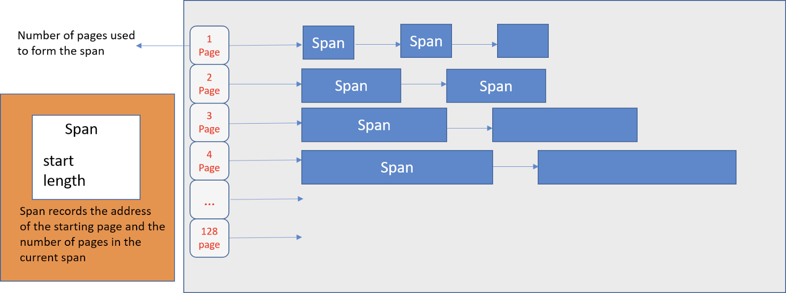
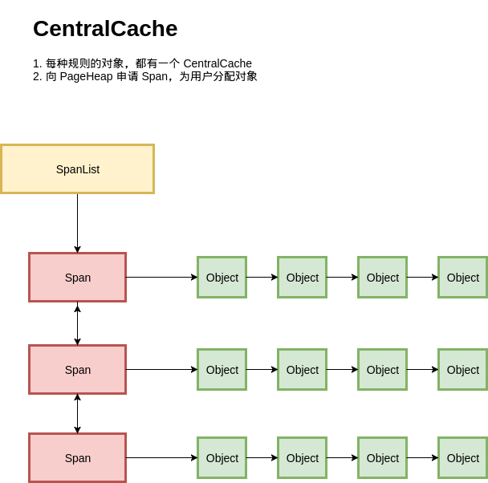
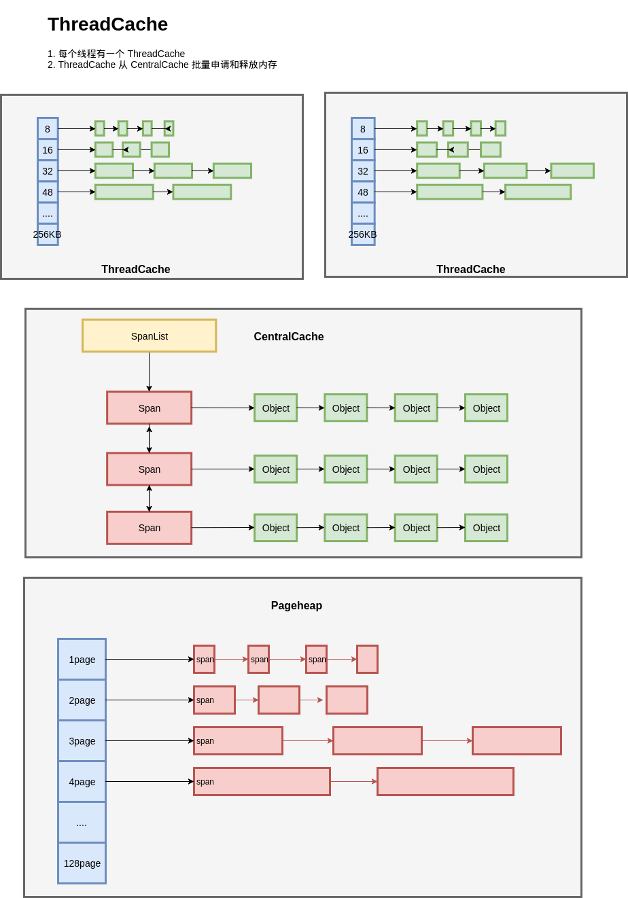

# 内存分配器

## 一. 简介
不同于 c 语言使用 malloc 和 free 来主动管理内存，

golang 让程序员避免了这一切繁杂的操作，它通过 escape analysis 来分配内存，通过 garbage collection（gc）来回收内存，本文主要介绍内存分配部分的工作。

## 二.详细解释 

### 2.1 golang 内存分配时机

程序有两种内存，一种是堆栈(stack)，一种是堆（heap），所有的堆内数据都被 GC 管理。

我们要明白什么时候程序会分配内存，在某些语言中是程序员主动申请的，在 go 语言中则依赖 escape analysis，越多的值在堆栈，程序运行越快（存取速度比堆要快，仅次于直接位于 CPU 中的寄存器），以下是内存分配的一些时机

1. goloang 只会把函数中确定不在函数结束后使用的变量放到堆栈，否则就会放到堆：一个值可能在构造该值的函数之后被引用-->变量上传

```go
package main

func main(){
	n:=answer()
	println(*n/2)
}

func answer() *int{
	x:=42
	return &x
}
// 使用命令 go build -gcflags="-m -l"得到结果
// ./main.go:10:2: moved to heap: x
``` 
- 2.编译器确定值太大而无法放入堆栈
- 3.编译器在编译的时候无法得知这个值的具体大小

ps:将变量下传，变量还会留在堆栈中
```go
type Reader interface{
   Read(p []byte) (n int,err error)
}
//better than 
type Reader interface{
   Read(n int) (b []byte,err error)
}
//因为从上面传参数下去用的是堆栈，从下面往上传，则会escape到堆，导致程序更慢
```

### 2.2 golang 内存分配方式

#### 2.2.1 TCMalloc

学习 go 语言的内存分配方式之前，我们先来看看另一个内存分配器-->TCMalloc，全称Thread-Caching Malloc。

TCMalloc 有两个重要组成部分：线程内存（thread cache）和页堆(page heap)

##### 2.2.1.1 线程内存
每一个内存页都被分为多个固定分配大小规格的空闲列表（free list） 用于减少碎片化。这样每一个线程都可以获得一个用于无锁分配小对象的缓存，这样可以让并行程序分配小对象（<=32KB）非常高效。



如图所示，第一行就是长度为 8 字节的内存块，在 thread cache 内最大的为 256 字节的内存块

##### 2.2.1.2 页堆
TCMalloc 管理的堆由一组页组成（page 一般大小为 4kb），一组连续的页面被表示为 span。

当分配的对象大于 32KB，将使用页堆（Page Heap）进行内存分配，分配对象时，大的对象直接分配 Span，小的对象从 Span 中分配。



当没有足够的空间分配小对象则会到页堆获取内存。如果页堆页没有足够的内存，则页堆会向操作系统申请更多的内存。

##### 2.2.1.3 内存分配器

将基于 Page 的对象分配，和 Page 本身的管理串联



每种规格的对象，都从不同的 Span 进行分配；

每种规则的对象都有一个独立的内存分配单元：CentralCache。在一个 CentralCache 内存，我们用链表把所有 Span 组织起来，每次需要分配时就找一个 Span 从中分配一个 Object；当没有空闲的 Span 时，就从 PageHeap 申请 Span。

##### 2.2.1.4 总结

最终我们得到结构图如下：



TCMalloc 针对不同的对象分配采用了不同的形式

每个线程都一个线程局部的 ThreadCache，按照不同的规格，维护了对象的链表；

- 如果 ThreadCache 的对象不够了，就从 CentralCache 进行批量分配；
- 如果 CentralCache 依然没有，就从 PageHeap 申请 Span；
- 如果 PageHeap 没有合适的 Page，就只能从操作系统申请了。

在释放内存的时候，ThreadCache 依然遵循批量释放的策略，

- 对象积累到一定程度就释放给 CentralCache； 
- CentralCache 发现一个 Span 的内存完全释放了，就可以把这个 Span 归还给 PageHeap； 
- PageHeap 发现一批连续的 Page 都释放了，就可以归还给操作系统。

由此，TCMalloc 的核心思路即：

把内存分为多级管理，从而降低锁的粒度。 它将可用的堆内存采用二级分配的方式进行管理：每个线程都会自行维护一个独立的内存池，进行内存分配时优先从该内存池中分配，当内存池不足时才会向全局内存池申请，以避免不同线程对全局内存池的频繁竞争。


