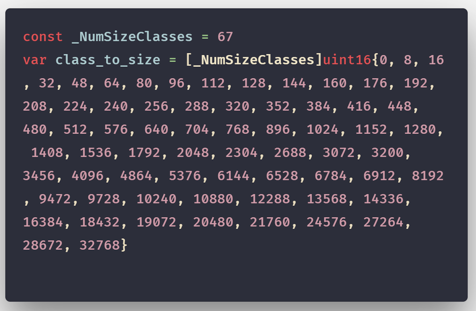
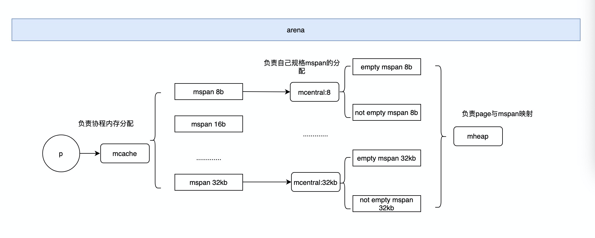
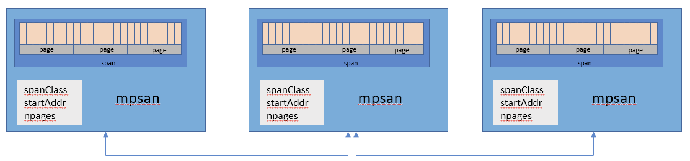
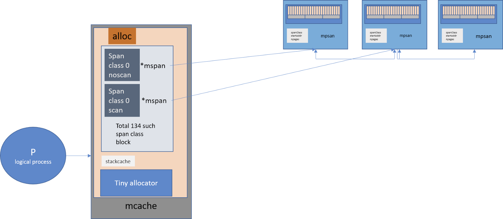
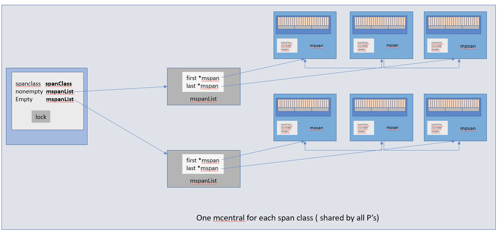
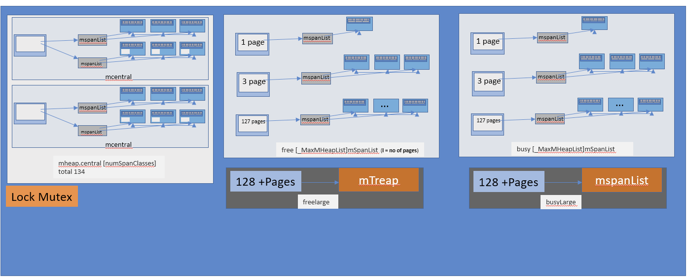

## Go 内存分配器结构

### 1.0.1 初始化

Go 在程序启动的时候，会先向操作系统申请一块内存（注意这时还只是一段虚拟的地址空间，并不会真正地分配内存），切成小块后自己进行管理。

申请到的内存块被分配了三个区域，在 X64 上分别是 512MB，16GB，512GB 大小。


arena区域就是我们所谓的堆区，Go 动态分配的内存都是在这个区域，它把内存分割成8KB大小的页，一些页组合起来称为mspan。

bitmap区域标识arena区域哪些地址保存了对象，并且用4bit标志位表示对象是否包含指针、GC标记信息。

bitmap中一个byte大小的内存对应arena区域中 4 个指针大小（指针大小为 8B ）的内存，所以bitmap区域的大小是512GB/(4*8B)=16GB。

spans区域存放mspan（也就是一些arena分割的页组合起来的内存管理基本单元，后文会再讲）的指针，每个指针对应一页，所以spans区域的大小就是512GB/8KB*8B=512MB。

除以 8KB 是计算arena区域的页数，而最后乘以 8 是计算spans区域所有指针的大小。

创建mspan的时候，按页填充对应的spans区域，在回收object时，根据地址很容易就能找到它所属的mspan。

spans区域存放mspan（也就是一些arena分割的页组合起来的内存管理基本单元，后文会再讲）的指针，每个指针对应一页，所以spans区域的大小就是512GB/8KB*8B=512MB。

除以 8KB 是计算arena区域的页数，而最后乘以 8 是计算spans区域所有指针的大小。

创建mspan的时候，按页填充对应的spans区域，在回收object时，根据地址很容易就能找到它所属的mspan。

go 初始化的时候会将内存页分为如下 67 个不同大小的内存块，最大到 32kb



### 1.0.2 结构及流程总览



Go 的内存分配器在分配对象时，根据对象的大小， 分成三类：小对象（小于等于 16B）、一般对象（大于 16B，小于等于 32KB）、大对象（大于 32KB）。

大体上的分配流程：
- 1.32KB 的对象，直接从 mheap 上分配；
- 2.<=16B 的对象使用 mcache 的 tiny 分配器分配；
- 3.(16B,32KB] 的对象，首先计算对象的规格大小，然后使用 mcache 中相应规格大小的 mspan 分配；
- 4.如果 mcache 没有相应规格大小的 mspan，则向 mcentral 申请
- 5.如果 mcentral 没有相应规格大小的 mspan，则向 mheap 申请
- 6.如果 mheap 中也没有合适大小的 mspan，则向操作系统申请

### 1.0.3 自底向上名词解释

#### 1.0.3.1 内存管理单元

mspan:Go 中内存管理的基本单元，是由一片连续的 8KB 的页组成的大块内存。

是一个包含起始地址、mspan 规格、页的数量等内容的双端链表,mspan 由一组连续的页组成，按照一定大小划分成object。

结构图



#### 1.0.3.2 内存管理单元

mcache:Go 像 TCMalloc 一样为每一个 逻辑处理器（P）（Logical Processors） 提供一个本地线程缓存（Local Thread Cache）称作 mcache，

所以如果 Goroutine 需要内存可以直接从 mcache 中获取，由于在同一时间只有一个 Goroutine 运行在 逻辑处理器（P）（Logical Processors） 上，所以中间不需要任何锁的参与。

对于每一种大小规格都有两个类型：
- scan -- 包含指针的对象。
- noscan -- 不包含指针的对象。

采用这种方法的好处之一就是进行垃圾回收时 noscan 对象无需进一步扫描是否引用其他活跃的对象。 （<=16B 的对象使用 mcache 的 tiny 分配器分配）

结构体

```go
//path: /usr/local/go/src/runtime/mcache.go

type mcache struct {
    alloc [numSpanClasses]*mspan
}

numSpanClasses = _NumSizeClasses << 1
```

结构图



central(mcentral)：为所有mcache提供切分好的mspan资源。

每个central保存一种特定大小的全局mspan列表，包括已分配出去的和未分配出去的。

每个mcentral对应一种mspan，而mspan的种类导致它分割的object大小不同。当工作线程的mcache中没有合适（也就是特定大小的）的mspan时就会从mcentral获取。

mcentral被所有的工作线程共同享有，存在多个 Goroutine 竞争的情况，因此会消耗锁资源

```go
//path: /usr/local/go/src/runtime/mcentral.go

type mcentral struct {
    // 互斥锁
    lock mutex 
    // 规格
    sizeclass int32 
    // 尚有空闲object的mspan链表
    nonempty mSpanList 
    // 没有空闲object的mspan链表，或者是已被mcache取走的msapn链表
    empty mSpanList 
    // 已累计分配的对象个数
    nmalloc uint64 
}
```

结构图



mheap: 代表 Go 程序持有的所有堆空间，Go 程序使用一个mheap的全局对象_mheap来管理堆内存。

当mcentral没有空闲的mspan时，会向mheap申请。 

而mheap没有资源时，会向操作系统申请新内存。

mheap主要用于大对象的内存分配，以及管理未切割的mspan，用于给mcentral切割成小对象。

同时我们也看到，mheap中含有所有规格的mcentral，

所以，当一个mcache从mcentral申请mspan时，只需要在独立的mcentral中使用锁，并不会影响申请其他规格的mspan。

```go
//path: /usr/local/go/src/runtime/mheap.go

type mheap struct {
    lock mutex
    // spans: 指向mspans区域，用于映射mspan和page的关系
    spans []*mspan 
    // 指向bitmap首地址，bitmap是从高地址向低地址增长的
    bitmap uintptr 

    // 指示arena区首地址
    arena_start uintptr 
    // 指示arena区已使用地址位置
    arena_used  uintptr 
    // 指示arena区末地址
    arena_end   uintptr 

    central [67*2]struct {
        mcentral mcentral
        pad [sys.CacheLineSize - unsafe.Sizeof(mcentral{})%sys.CacheLineSize]byte
    }
}
```

结构图：



arena：golang 中所有堆区的统称，以 x64 为例子就是 512GB 的虚拟地址空间。

之后目标
1.go 语言的垃圾回收
2.进程调度，线程调度，协程调度
3.虚拟内存 

<blockquote>
https://xie.infoq.cn/article/e760c46349bd7b443e38ac332
</blockquote>

