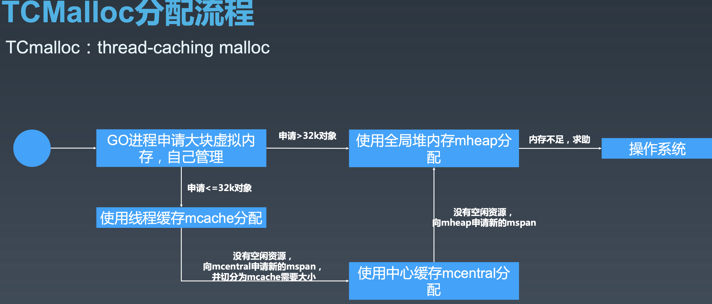
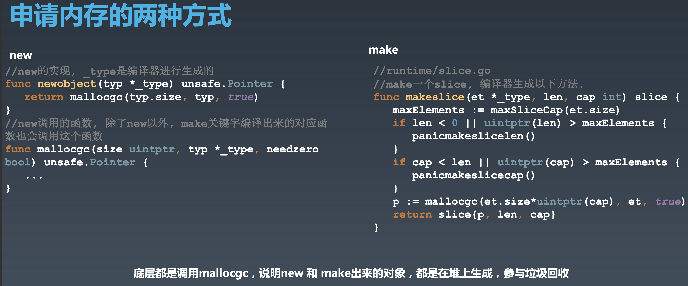

#内存分配

### 内存分配器(优秀)的特点
- 分配速度快
- 节省空间
- 碎片少

###内存分配算法


####分配过程


####分配过程-new/make


####内存操作(new/make)
```go
func TestVerifyV4(t *testing.T) {
	s1 := new([]int)
	fmt.Println(s1)
	fmt.Printf("%p\n", s1)

	s2 := make([]int, 10)
	s2[1] = 1
	fmt.Println(s2)
	fmt.Printf("%p\n",&s2)
}
```
####内存操作(unsafe.Pointer/uintptr)

```go
import (
	"fmt"
	"testing"
	"unsafe"
)

func TestVerifyV5(t *testing.T) {
	foo := &Foo{1,2}
	// 类型
	fmt.Println(foo)
	// 地址
	fmt.Println(&foo)
	// 值
	fmt.Println(*foo)

	base := uintptr(unsafe.Pointer(foo))
	offset := unsafe.Offsetof(foo.A)
	ptr := unsafe.Pointer(base + offset)
	*(*int)(ptr) = 4
	fmt.Println(foo)
}

type Foo struct {
	A int
	B int
}

```


