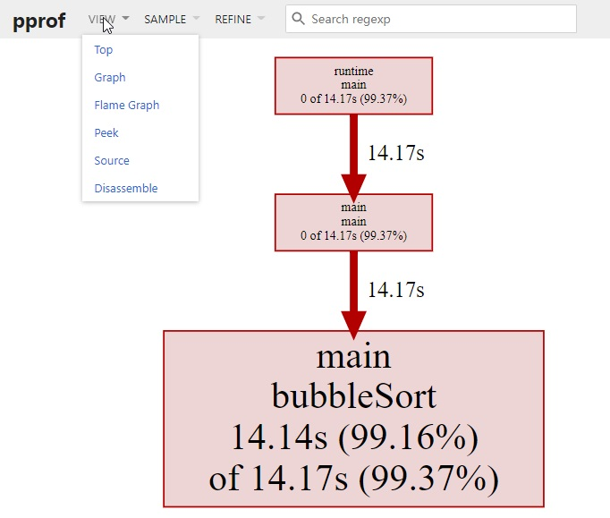
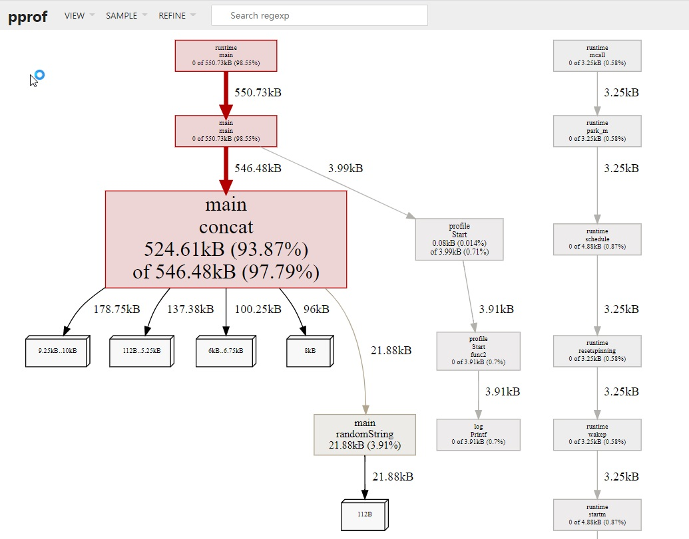

# pprof 性能分析

## 概述

benchmark(基准测试) 可以度量某个函数或方法的性能，也就是说，如果我们知道性能的瓶颈点在哪里，benchmark 是一个非常好的方式。

pprof 就是用来解决这个问题的。pprof 包含两部分：

- 编译到程序中的 runtime/pprof 包
- 性能剖析工具 go tool pprof

## 1.性能分析类型

### 1.1 CPU 性能分析

CPU 性能分析(CPU profiling) 是最常见的性能分析类型。

启动 CPU 分析时，运行时(runtime) 将每隔 10ms 中断一次，记录此时正在运行的协程(goroutines) 的堆栈信息。

程序运行结束后，可以分析记录的数据找到最热代码路径(hottest code paths)。

<blockquote>
Compiler hot paths are code execution paths in the compiler in which most of the execution time is spent, and which are potentially executed very often.

What’s the meaning of “hot codepath”
</blockquote>

一个函数在性能分析数据中出现的次数越多，说明执行该函数的代码路径(code path)花费的时间占总运行时间的比重越大。

### 1.2 Mem 性能分析

内存性能分析(Memory profiling) 记录堆内存分配时的堆栈信息，忽略栈内存分配信息。

内存性能分析启用时，默认每1000次采样1次，这个比例是可以调整的。因为内存性能分析是基于采样的，因此基于内存分析数据来判断程序所有的内存使用情况是很困难的。

### 1.3 阻塞性能分析

阻塞性能分析(block profiling) 是 Go 特有的。

阻塞性能分析用来记录一个协程等待一个共享资源花费的时间。在判断程序的并发瓶颈时会很有用。阻塞的场景包括：

- 在没有缓冲区的信道上发送或接收数据；
- 从空的信道上接收数据，或发送数据到满的信道上；
- 尝试获得一个已经被其他协程锁住的排它锁；

一般情况下，当所有的 CPU 和内存瓶颈解决后，才会考虑这一类分析。

### 1.4 锁性能分析

锁性能分析(mutex profiling) 与阻塞分析类似，但专注于因为锁竞争导致的等待或延时。

# 2 CPU 性能分析

<blockquote>
记录性能数据会对程序的性能产生影响，建议一次只记录一类数据。
</blockquote>

### 2.1 生成 profile

Go 的运行时性能分析接口都位于 runtime/pprof 包中。只需要调用 runtime/pprof 库即可得到我们想要的数据。

假设我们实现了这么一个程序，随机生成了 5 组数据，并且使用冒泡排序法排序。

```go
package main

import (
	"math/rand"
	"os"
	"runtime/pprof"
	"time"
)

func generate(n int) []int {
	rand.Seed(time.Now().UnixNano())
	nums := make([]int, 0)
	for i := 0; i < n; i++ {
		nums = append(nums, rand.Int())
	}
	return nums
}
func bubbleSort(nums []int) {
	for i := 0; i < len(nums); i++ {
		for j := 1; j < len(nums)-i; j++ {
			if nums[j] < nums[j-1] {
				nums[j], nums[j-1] = nums[j-1], nums[j]
			}
		}
	}
}

func main() {
	pprof.StartCPUProfile(os.Stdout)
	defer pprof.StopCPUProfile()
	n := 10
	for i := 0; i < 5; i++ {
		nums := generate(n)
		bubbleSort(nums)
		n *= 10
	}
}
```

为了简单，直接将数据输出到标准输出 os.Stdout。运行该程序，将输出定向到文件 cpu.pprof 中

<blockquote>
$ go run main.go > cpu.pprof
</blockquote>

一般来说，不建议将结果直接输出到标准输出，因为如果程序本身有输出，则会相互干扰，直接记录到一个文件中是最好的方式。

```go
package main

import (
	"math/rand"
	"os"
	"runtime/pprof"
	"time"
)

func generate(n int) []int {
	rand.Seed(time.Now().UnixNano())
	nums := make([]int, 0)
	for i := 0; i < n; i++ {
		nums = append(nums, rand.Int())
	}
	return nums
}
func bubbleSort(nums []int) {
	for i := 0; i < len(nums); i++ {
		for j := 1; j < len(nums)-i; j++ {
			if nums[j] < nums[j-1] {
				nums[j], nums[j-1] = nums[j-1], nums[j]
			}
		}
	}
}

func main() {
	f, _ := os.OpenFile("cpu.pprof", os.O_CREATE|os.O_RDWR, 0644)
	defer f.Close()
	pprof.StartCPUProfile(f)
	defer pprof.StopCPUProfile()
	n := 10
	for i := 0; i < 5; i++ {
		nums := generate(n)
		bubbleSort(nums)
		n *= 10
	}
}

```

这样只需运行 go run main.go 即可。

### 2.2 分析数据

接下来，可以用 go tool pprof 分析这份数据

<blockquote>
$ go tool pprof -http=:9999 cpu.pprof
</blockquote>

如果提示 Graphviz 没有安装，则通过 brew install graphviz(MAC) 或 apt install graphviz(Ubuntu) 即可。

访问 localhost:9999，可以看到这样的页面：



除了在网页中查看分析数据外，我们也可以在命令行中使用交互模式查看。

<blockquote>
$ go tool pprof cpu.pprof
</blockquote>

可以看到 main.bubbleSort 是消耗 CPU 最多的函数。还可以按照 cum (累计消耗)排序：

<blockquote>
(pprof) top --cum
</blockquote>

# 3 内存性能分析

### 3.1 生成 profile

假设我们实现了这么一个程序，生成长度为 N 的随机字符串，拼接在一起。

```go
package main

import (
	"github.com/pkg/profile"
	"math/rand"
	"strings"
)

const letterBytes = "abcdefghijklmnopqrstuvwxyzABCDEFGHIJKLMNOPQRSTUVWXYZ"

func randomString(n int) string {
	b := make([]byte, n)
	for i := range b {
		b[i] = letterBytes[rand.Intn(len(letterBytes))]
	}
	return string(b)
}

/*
func concat(n int) string {
	s := ""
	for i := 0; i < n; i++ {
		s += randomString(n)
	}
	return s
}
 */

func concat(n int) string {
	var s strings.Builder
	for i := 0; i < n; i++ {
		s.WriteString(randomString(n))
	}
	return s.String()
}

func main() {
	defer profile.Start(profile.MemProfile, profile.MemProfileRate(1)).Stop()
	concat(100)
}
```

我们使用一个易用性更强的库 pkg/profile 来采集性能数据，pkg/profile 封装了 runtime/pprof 的接口，使用起来更简单。

比如我们想度量 concat() 的 CPU 性能数据，只需要一行代码即可生成 profile 文件。
```go
import (
	"github.com/pkg/profile"
)

func main() {
	defer profile.Start().Stop()
	concat(100)
}
```

运行 go run main.go：

<blockquote>
$ go run main.go
2020/11/22 18:38:29 profile: cpu profiling enabled, /tmp/profile068616584/cpu.pprof
2020/11/22 18:39:12 profile: cpu profiling disabled, /tmp/profile068616584/cpu.pprof
</blockquote>

CPU profile 文件已经在 tmp 目录生成，得到 profile 文件后，就可以像之前一样，用 go tool pprof 命令，在浏览器或命令行进行分析了。

接下来将使用类似的方式，进行采集内存数据，同样地，只需简单地修改 main 函数即可。

```go
func main() {
	defer profile.Start(profile.MemProfile, profile.MemProfileRate(1)).Stop()
	concat(100)
}
```

运行 go run main.go:
```go
$ go run main.go
2020/11/22 18:59:04 profile: memory profiling enabled (rate 1), /tmp/profile215959616/mem.pprof
2020/11/22 18:59:04 profile: memory profiling disabled, /tmp/profile215959616/mem.pprof
```

### 3.2 分析数据

接下来，我们在浏览器中分析内存性能数据：

<blockquote>
go tool pprof -http=:9999 /tmp/profile215959616/mem.pprof
</blockquote>



从这张图中，我们可以看到 concat 消耗了 524k 内存，randomString 仅消耗了 22k 内存。

理论上，concat 函数仅仅是将 randomString 生成的字符串拼接起来，消耗的内存应该和 randomString 一致，但怎么会产生 20 倍的差异呢？

# 4 benchmark 生成profile

在 使用 testing 库进行 benchmark 基准测试 这篇文章中，我们介绍了 benchmark 的使用方式。

除了直接在命令行中查看测试的结果外，也可以生成 profile 文件，使用 go tool pprof 分析。

testing 支持生成 CPU、memory 和 block 的 profile 文件。

- cpuprofile=$FILE
- memprofile=$FILE, -memprofilerate=N 调整记录速率为原来的 1/N。
- blockprofile=$FILE

在介绍 benchmark 如何使用，我们举了下面这个例子：

```go
package benchmark

import "testing"

func fib(n int) int {
	if n == 0 || n == 1 {
		return n
	}
	return fib(n-1) + fib(n-2)
}

func BenchmarkFib(b *testing.B) {
	for n := 0; n < b.N; n++ {
		fib(30) // run fib(30) b.N times
	}
}
```

只需要在 go test 添加 -cpuprofile 参数即可生成 BenchmarkFib 对应的 CPU profile 文件：

<blockquote>
$ go test -bench="Fib$" -cpuprofile=cpu.pprof .
</blockquote>

用例执行完毕后，当前目录多出了一个 cpu.pprof 文件，接下来就可以使用 go tool pprof 命令进行分析了。

使用 -text 选项可以直接将结果以文本形式打印出来。

<blockquote>
go tool pprof -text cpu.pprof
</blockquote>

pprof 支持多种输出格式（图片、文本、Web等），直接在命令行中运行 go tool pprof 即可看到所有支持的选项：

<blockquote>
go tool pprof

</blockquote>


